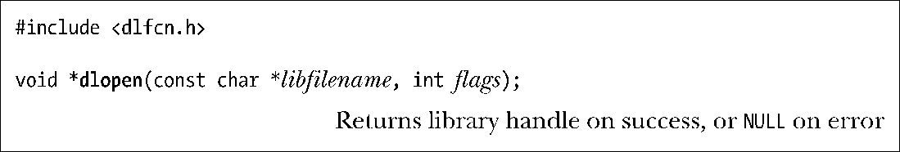

### 42.1.1　打开共享库：dlopen()

dlopen()函数将名为libfilename的共享库加载进调用进程的虚拟地址空间并增加该库的打开引用计数。

如果libfilename包含了一个斜线（/），那么dlopen()会将其解释成一个绝对或相对路径名，否则动态链接器会使用第41.11节中介绍的规则来搜索共享库。

dlopen()在成功时会返回一个句柄，在后续对dlopen API中的函数的调用可以使用该句柄来引用这个库。如果发生了错误（如无法找到库），那么dlopen()会返回NULL。

如果libfilename指定的共享库依赖于其他共享库，那么dlopen()会自动加载那些库。如果有必要的话，这一过程会递归进行。这种被加载进来的库被称为这个库的依赖树。

在同一个库文件中可以多次调用dlopen()，但将库加载进内存的操作只会发生一次（第一次调用），所有的调用都返回同样的句柄值。但dlopen API会为每个库句柄维护一个引用计数，每次调用dlopen()时都会增加引用计数，每次调用dlclose()都会减小引用计数，只有当计数为0时dlclose()才会从内存中删除这个库。

flags参数是一个位掩码，它的取值是RTLD_LAZY和RTLD_NOW中的一个，这两个值的含义分别如下。

##### RTLD_LAZY

只有当代码被执行的时候才解析库中未定义的函数符号。如果需要某个特定符号的代码没有被执行到，那么永远都不会解析该符号。延迟解析只适用于函数引用，对变量的引用会被立即解析。指定RTLD_LAZY标记能够提供与在加载可执行文件的动态依赖列表中的共享库时动态链接器的常规操作对应的行为。

##### RTLD_NOW

在dlopen()结束之前立即加载库中所有的未定义符号，不管是否需要用到这些符号，这种做法的结果是打开库变得更慢了，但能够立即检测到任何潜在的未定义函数符号错误，而不是在后面某个时刻才检测到这种错误。在调试应用程序时这种做法是比较有用的，因为它能够确保应用程序在碰到未解析的符号时立即发生错误，而不是在执行了很长一段时间之后才发生错误。

> 通过将环境变量LD_BIND_NOW设置为一个非空字符串能够强制动态链接器在加载可执行文件的动态依赖列表中的共享库时立即解析所有符号（即类似于RTLD_NOW）。这个环境变量在glibc 2.1.1以及后续的版本中是有效的。设置LD_BIND_NOW会覆盖dlopen() RTLD_LAZY标记的效果。

flags也可以取其他的值，SUSv3规定了下列几种标记。

##### RTLD_GLOBAL

这个库及其依赖树中的符号在解析由这个进程加载的其他库中的引用和通过dlsym()查找时可用。

##### RTLD_LOCAL

与RTLD_GLOBAL相反，如果不指定任何常量，那么就取这个默认值。它规定在解析后续加载的库中的引用时这个库及其依赖树中的符号不可用。

在不指定RTLD_GLOBAL或RTLD_LOCAL时，SUSv3并没有规定一个默认值。大多数UNIX实现与Linux一样，将RTLD_LOCAL作为默认值，但一些实现将RTLD_GLOBAL作为默认值。

Linux还支持几个并没有在SUSv3中进行规定的标记，如下所示。

##### RTLD_NODELETE（自glibc 2.2起）

在dlclose()调用中不要卸载库，即使其引用计数已经变成0了。这意味着在后面重新通过dlopen()加载库时不会重新初始化库中的静态变量。（对于由动态链接器自动加载的库来讲，在创建库时通过指定gcc –Wl,–znodelete选项能够取得类似的效果。）

##### RTLD_NOLOAD（自glibc 2.2起）

不加载库。这个标记有两个目的。第一，可以使用这个标记来检查某个特定的库是否已经被加载到了进程的地址空间中。如果已经加载了，那么dlopen()会返回库的句柄，如果没有加载，那么dlopen()会返回NULL。第二，可以使用这个标记来“提升”已加载的库的标记。如在对之前使用RTLD_LOCAL打开的库调用dlopen()时可以在flags参数中指定RTLD_NOLOAD | RTLD_GLOBAL。

##### RTLD_DEEPBIND（自glibc 2.3.4）

在解析这个库中的符号引用时先搜索库中的定义，然后再搜索已加载的库中的定义。这个标记使得一个库能够实现自包含，即优先使用自己的符号定义，而不是在已加载的其他库中定义的同名全局符号。（这与在41.12节中介绍的–Bsymbolic链接器选项具有类似的效果。）

RTLD_NODELETE和RTLD_NOLOAD标记在Solaris dlopen API中也进行了实现，但提供这个两个标记的UNIX实现很少。RTLD_DEEPBIND标记是Linux特有的。

当将libfilename指定为NULL时dlopen()会返回主程序的句柄。（SUSv3将这种句柄称为“全局符号对象”的句柄。）在后续对dlsym()的调用中使用这个句柄会导致首先在主程序中搜索符号，然后在程序启动时加载的共享库中进行搜索，最后在所有使用了RTLD_GLOBAL标记的动态加载的库中进行搜索。

