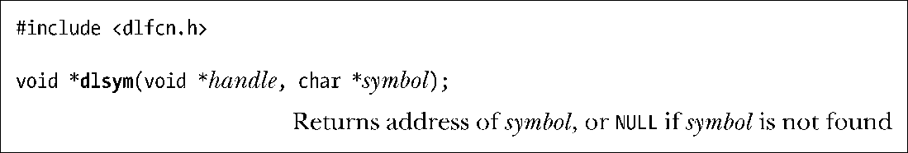
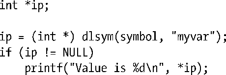
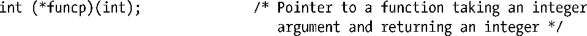
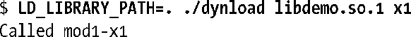
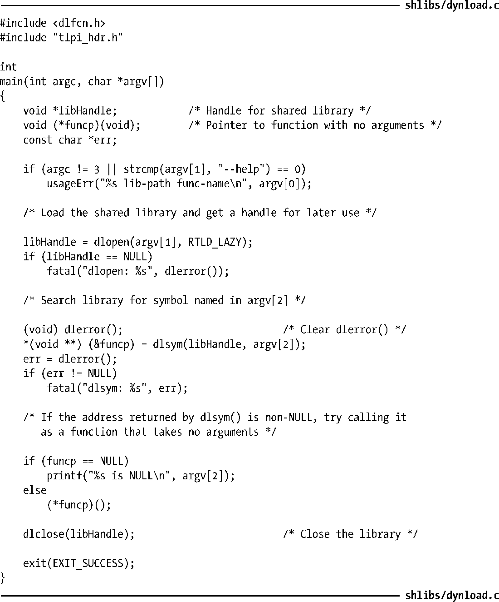

### 42.1.3　获取符号的地址：dlsym()

dlsym()函数在handle指向的库以及该库的依赖树中的库中搜索名为symbol的符号（函数或变量）。

如果找到了symbol，那么dlsym()会返回其地址，否则就返回NULL。handle参数通常是上一个dlopen()调用返回的库句柄，或者它也可以是下面介绍的其中一个所谓的伪句柄。

> dlvsym(handle, symbol, version)与dlsym()类似，但它能够用来在符号版本化的库中搜索版本与在字符串version中指定的版本匹配的符号定义。（第42.3.2节将会介绍符号版本化。）要从<dlfcn.h>中获取这个函数的声明必须要定义_GNU_SOURCE特性测试宏。

dlsym()返回的符号值可能会是NULL，这一点与“找不到符号”的返回是无法区分的。为了弄清楚具体是哪种情况就必须要先调用dlerror()（确保之前的错误字符串已经被清除了），如果在调用dlsym()之后dlerror()返回了一个非NULL值，那么就可以得出发生错误的结论了。

如果symbol是一个变量的名称，那么可以将dlsym()的返回值赋给一个合适的指针类型，并通过反引用该指针来得到变量的值。

如果symbol是一个函数的名称，那么可以使用dlsym()返回的指针来调用该函数。可以将dlsym()返回的值存储到一个类型合适的指针中，如下所示。

但不能简单地将dlsym()的结果赋给此类指针，如下面的例子所示。

其原因是C99标准禁止函数指针和void *之间的赋值操作。这个问题的解决方案是使用下面这样的（稍微有些笨拙）类型转换。

通过dlsym()得到了指向函数的指针之后就能够通过常规的C语法反引用函数指针来调用这个函数了。

读者在将dlsym()的返回值进行赋值时可能会使用下面这段看起来与上述代码等价的代码来取代上面的*(void **)语法。

但gcc –pedantic在碰到上面这段代码时会发出“ANSI C forbids the use of cast expressions as lvalues.”的警告信息。而使用*(void **)语言就不会出现这个警告信息，因为是在向赋值语句中的左值指向的地址赋值。

在很多UNIX实现中可以使用下面这样的类型转换类消除C编译器的警告。

但SUSv3 Technical Corrigendum Number 1中dlsym()的规范指出C99标准仍然要求编译器对此类转换生成警告信息并列举了上面的*(void **)语法。

> SUSv3 TC1指出由于需要用到*(void **)语法，因此标准的后续版本可能会定义一个与dlsym()类似的API来处理数据和函数指针。但SUSv4在这一点上没有发生任何变化。

#### 在dlsym()中使用库伪句柄

dlsym()函数中的handle参数除了能够取由dlopen()调用返回的句柄值之外，还能够取下列伪句柄值。

##### RTLD_DEFAULT

从主程序中开始查找symbol，接着按序在所有已加载的共享库中查找，包括那些通过使用了RTLD_GLOBAL标记的dlopen()调用动态加载的库，这个标记对应于动态链接器所采用的默认搜索模型。

##### RTLD_NEXT

在调用dlsym()之后加载的共享库中搜索symbol，这个标记适用于需要创建与在其他地方定义的函数同名的包装函数的情况。如，在主程序中可能会定义一个malloc()（它可能完成内存分配的簿记工作），而这个函数在调用实际的malloc()之前首先会通过调用func = dlsym(RTLD_NEXT, “malloc”)来获取其地址。

SUSv3并没有要求实现上述列出的伪句柄（甚至没有保留这两个值以供后续之用），并且所有UNIX实现也没有定义上述伪句柄。为了从<dlfcn.h>中获取这些常量的定义必须要定义_GNU_SOURCE特性测试宏。

#### 示例程序

程序清单42-1演示了dlopen API的使用。这个程序接收两个命令行参数：需加载的共享库名称和需执行的库中函数的名称。下面的例子演示了这个程序的使用。

在上述命令的第一个命令中，dlopen()注意到库路径包含了一个斜线，因此将其解释成一个相对路径名（表示一个位于当前工作目录中的库）。在第二个命令中指定了库搜索路径LD_LIBRARY_PATH，动态链接器会根据正常的规则来解释这个搜索路径（同样表示在当前工作目录中查找库）。

程序清单42-1：使用dlopen API

