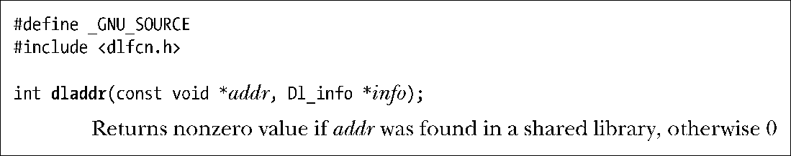
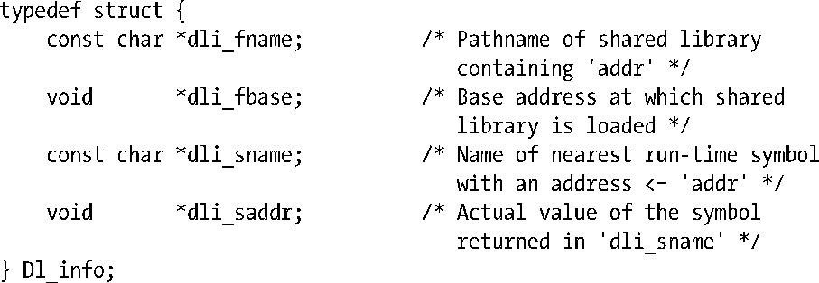

### 42.1.5　获取与加载的符号相关的信息：dladdr()

dladdr()返回一个包含地址addr（通常通过前面的dlsym()调用获得）的相关信息的结构。

info参数是一个指向由调用者分配的结构的指针，其结构形式如下。

Dl_info结构中的前两个字段指定了包含地址addr的共享库的路径名和运行时基地址。最后两个字段返回地址相关的信息。假设addr指向共享库中一个符号的确切地址，那么dli_saddr返回的值与传入的addr值一样。

SUSv3并没有规定dladdr()，所有UNIX实现也都没有提供这个函数。

