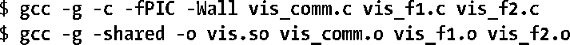
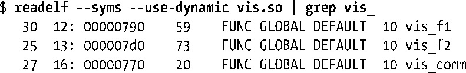
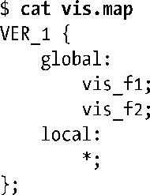
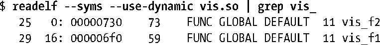

### 42.3.1　使用版本脚本控制符号的可见性

版本脚本的一个用途是控制那些可能会在无意中变成全局可见（即对与该库进行链接的应用程序可见）的符号的可见性。举一个简单的例子，假设需要从三个源文件vis_comm.c、vis_f1.c以及 vis_f2.c中构建一个共享库，这三个源文件分别定义了函数vis_comm()、vis_f1()以及 vis_f2()。vis_comm()函数由vis_f1() 和 vis_f2()调用，但不想被与该库进行链接的应用程序直接使用。再假设使用常规的方式来构建共享库。

如果使用下面的readelf命令来列出该库导出动态符号，那么就会看到下面的输出。

这个共享库导出了三个符号：vis_comm()、vis_f1()以及vis_f2()，但这里需要确保这个库只导出vis_f1()和vis_f2()符号。这种效果可以通过下面的版本脚本来实现。

标识符VER_1是一种版本标签。在42.3.2节对符号版本化的讨论中将会看到一个版本脚本可以包含多个版本节点，每个版本节点以括号（{}）组织起来并且在括号前面设置一个唯一的版本标签。如果使用版本脚本只是为了控制符号的可见性，那么版本标签是多余的，但老版本的ld仍然需要用到这个标签。ld的现代版本允许省略版本标签，如果省略了版本标签的话就认为版本节点拥有一个匿名版本标签并且在这个脚本中不能存在其他版本节点。

在版本节点中，关键词global标记出了以分号分隔的对库之外的程序可见的符号列表的起始位置，关键词local标记出了以分号分隔的对库之外的程序隐藏的符号列表的起始位置。上面的星号（*）说明在符号规范中可以使用掩码模式，所使用的掩码字符与shell文件名匹配中使用的掩码字符是一样的——如*和?。（更多细节请参考glob(7)手册。）在本例中，local规范中的星号表示除了在global段中显式声明的符号之外的所有符号都对外隐藏。如果不这样声明，那么vis_comm()仍然是可见的，因为在默认情况下C全局符号对共享库之外的程序是可见的。

接着可以像下面这样使用版本脚本来构建共享库。

再次使用readelf可以看出vis_comm()不再对外可见了。

