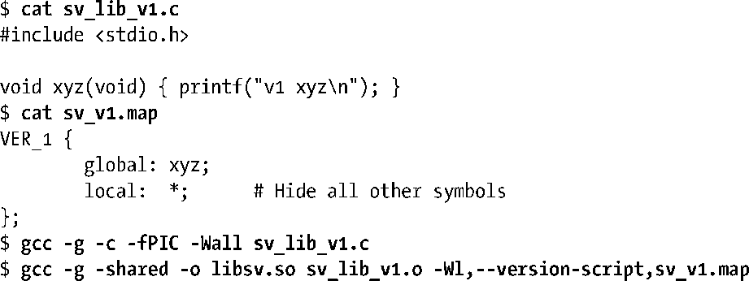
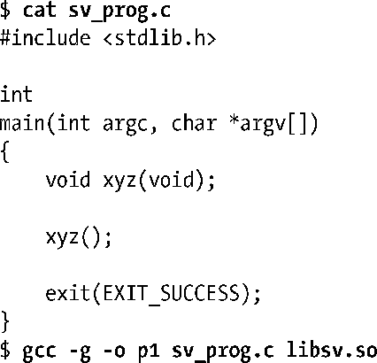
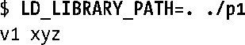
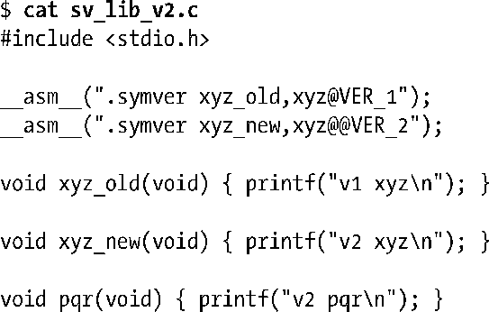
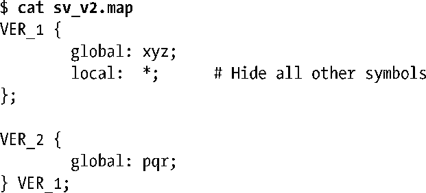
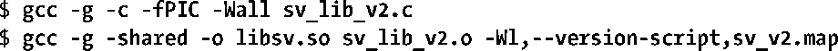
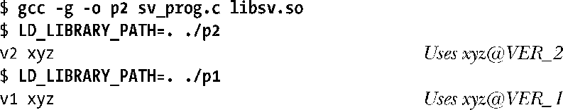
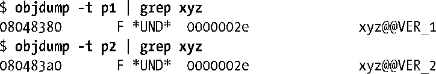

### 42.3.2　符号版本化

符号版本化允许一个共享库提供同一个函数的多个版本。每个程序会使用它与共享库进行（静态）链接时函数的当前版本。这种处理方式的结果是可以对共享库进行不兼容的改动而无需提升库的主要版本号。从极端的角度来讲，符号版本化可以取代传统的共享库主要和次要版本化模型。glibc从2.1开始使用了这种符号版本化技术，因此glibc 2.0以及之前的所有版本都是通过单个主要库版本（libc.so.6）来支持的。

下面通过一个简单的例子来展示符号版本化的用途。首先使用一个版本脚本来创建共享库的第一个版本。

> 在版本脚本中，#开启了一段注释。

（为了使例子尽量简单点，这里没有使用显式的库soname和库主要版本号。）

在这个阶段，版本脚本sv_v1.map只用来控制共享库的符号的可见性，即只导出xyz()，同时隐藏其他所有符号（在这个简短的例子中没有其他符号了）。接着创建一个程序pl来使用这个库。

运行这个程序之后就能看到预期的结果。

现在假设需要修改库中xyz()的定义，但同时仍然需要确保程序pl继续使用老版本的函数。为完成这个任务，必须要在库中定义两个版本的xyz()。

这里两个版本的xyz()是通过函数xyz_old()和xyz_new()来实现的。xyz_old()函数对应于原来的xyz()定义，pl程序应该继续使用这个函数。xyz_new()函数提供了与库的新版本进行链接的程序所使用的xyz()的定义。

修改过的版本脚本（稍后给出）中的两个.symver汇编器指令将这两个函数绑定到了两个不同的版本标签上，下面将使用这个脚本来创建共享库的新版本。第一个指令指示与版本标签VER_1进行链接的应用程序（即程序pl）所使用的xyz()的实现是xyz_old()，与版本标签VER_2进行链接的应用程序所使用的xyz()的实现是xyz_new()。

第二个.symver指令使用@@（不是@）来指示当应用程序与这个共享库进行静态链接时应该使用的xyz()的默认定义。一个符号的.symver指令中应该只有一个指令使用@@标记。

下面是与修改过之后的库对应的版本脚本。

这个版本脚本提供了一个新版本标签VER_2，它依赖于标签VER_1。这种依赖关系是通过下面这行进行标记的。

版本标记依赖表明了相邻两个库版本之间的关系。从语义上来讲，Linux上的版本标签依赖的唯一效果是版本节点可以从它所依赖的版本节点中继承global和local规范。

依赖可以串联起来，这样就可以定义另一个依赖于VER_2的版本节点VER_3并以此类推地定义其他版本节点。

版本标签名本身是没有任何意义的，它们相互之间的关系是通过制定的版本依赖来确定的，因此这里选择名称VER_1和VER_2仅仅为了暗示它们之间的关系。为了便于维护，建议在版本标签名中包含包名和一个版本号。如glibc会使用名为GLIBC_2.0和GLIBC_2.1之类的版本标签名。

VER_2版本标签还指定了将库中的pqr()函数导出并绑定到VER_2版本标签。如果没有通过这种方式来声明pqr()，那么VER_2版本标签从VER_1版本标签继承而来的local规范将会使pqr()对外不可见。还需注意的是如果省略了local规范，那么库中的xyz_old()和xyz_new()符号也会被导出（这通常不是期望发生的事情）。

现在按照以往方式构建库的新版本。

现在创建一个新程序p2，它使用了xyz()的新定义，同时程序p1使用了旧版的xyz()。

可执行文件的版本标签依赖是在静态链接时进行记录的。使用objdump –t可以打印出每个可执行文件的符号表，从而能够显示出两个程序中不同的版本标签依赖。

还可以使用readelf –s获取类似的信息。

> 更多有关符号版本化的信息可以通过使用命令info ld scripts version以及访问http://people.redhat.com/drepper/symbol-versioning来获得。

