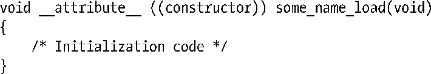
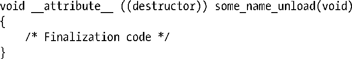

### 42.4　初始化和终止函数

可以定义一个或多个在共享库被加载和卸载时自动执行的函数，这样在使用共享库时就能够完成一些初始化和终止工作了。不管库是自动被加载还是使用dlopen接口（参见42.1节）显式加载的，初始化函数和终止函数都会被执行。

初始化和终止函数是使用gcc的constructor和destructor特性来定义的。在库被加载时需要执行的所有函数都应该定义成下面的形式。

类似地，卸载函数的形式如下。

读者可以根据需要使用其他名字替换函数名some_name_load()和some_name_unload()。

> 使用gcc的constructor和destructor特性还能创建主程序的初始化函数和终止函数。

#### _init()和_fini()函数

用来完成共享库的初始化和终止工作的一项较早的技术是在库中创建两个函数_init()和_fini()。当库首次被进程加载时会执行void _init(void)中的代码，当库被卸载时会执行void _fini(void)函数中的代码。

如果创建了_init()和_fini()函数，那么在构建共享库时必须要指定gcc –nostartfiles选项以防止链接器加入这些函数的默认实现。（如果需要的话可以使用–Wl,–init和–Wl,–fini链接器选项来指定函数的名称。）

有了gcc的constructor和destructor特性之后已经不建议使用_init()和_fini()函数了，因为gcc的constructor和destructor特性允许定义多个初始化和终止函数。

