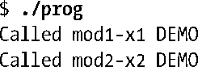
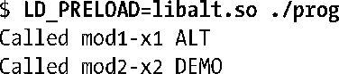

### 42.5　预加载共享库

出于测试的目的，有些时候可以有选择地覆盖一些正常情况下会被动态链接器按照41.11节中介绍的规则找出的函数（以及其他符号）。要完成这个任务可以定义一个环境变量LD_PRELOAD，其值由在加载其他共享库之前需加载的共享库名称构成，其中共享库名称之间用空格或冒号分隔。由于首先会加载这些共享库，因此可执行文件自动会使用这些库中定义的函数，从而覆盖那些动态链接器在其他情况下会搜索的同名函数。如假设有一个程序调用了函数x1()和x2()，并且这两个函数在libdemo库中进行了定义。这样当运行这个程序时会看到下面这样的输出。

（在本例中假设共享库位于其中一个标准目录中，因此无需使用LD_LIBRARY_PATH环境变量。）

接着需要覆盖函数x1()，这可以通过创建另一个包含了不同的x1()定义的共享库libalt.so来完成。在运行这个程序时预加载这个库会得到下面的输出。

从上面的输出可以看出程序调用了libalt.so中定义的x1()，但libalt.so并没有定义x2()，因此对x2()的调用仍然会调用libdemo.so中定义的x2()函数。

LD_PRELOAD环境变量控制着进程级别的预加载行为。或者可以使用/etc/ld.so.preload文件来在系统层面完成同样的任务，该文件列出了以空格分隔的库列表。（LD_PRELOAD指定的库将在加载/etc/ld.so.preload指定的库之前加载。）

出于安全原因，set-user-ID和set-group-ID程序忽略了LD_PRELOAD。

