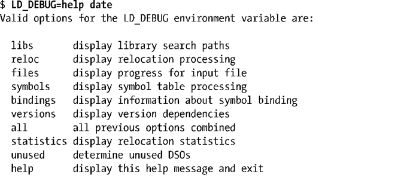
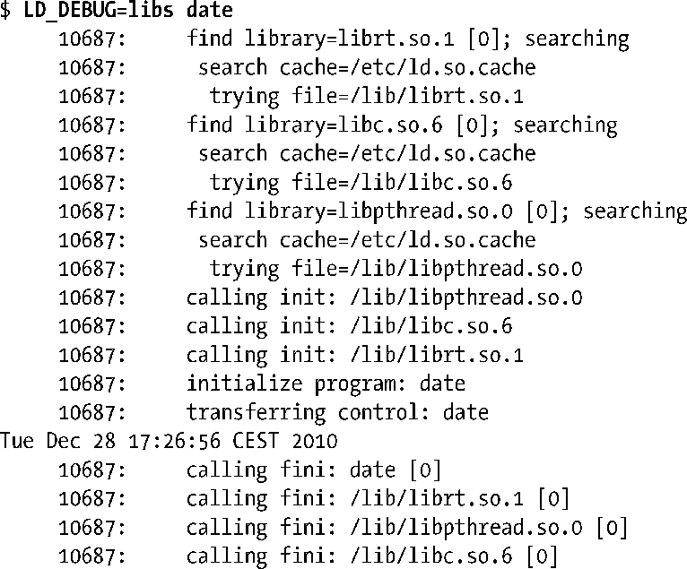

### 42.6　监控动态链接器：LD_DEBUG

有些时候需要监控动态链接器的操作以弄清楚它在搜索哪些库，这可以通过LD_DEBUG环境变量来完成。通过将这个变量设置为一个（或多个）标准关键词可以从动态链接器中得到各种跟踪信息。

如果将help赋给LD_DEBUG，那么动态链接器会输出有关LD_DEBUG的帮助信息，而指定的命令不会被执行。

> 要将调试信息输出到一个文件中而不是标准输出中，则可以使用LD_DEBUG_OUTPUT环境变量指定一个文件名。

当请求与跟踪库搜索相关的信息时会产生很多输出，下面的例子对输出进行了删减。

每一行开头处的10687是指所跟踪的进程的进程ID，当监控多个进程（如父进程和子进程）时会用到这个值。

在默认情况下，LD_DEBUG的输出会被写到标准错误上，但可以将一个路径名赋给环境变量LD_DEBUG_OUTPUT来将输出重定向到其他地方。

如果需要的话可以给LD_DEBUG赋多个选项，各个选项之间用逗号分隔（不能出现空格）。symbols选项（跟踪动态链接器的符号解析）的输出特别多。

LD_DEBUG对于由动态链接器隐式加载的库和使用dlopen()动态加载的库都有效。

出于安全的原因，在set-user-ID和set-setgroup-ID程序中将会忽略LD_DEBUG（自glibc 2.2.5起）。

