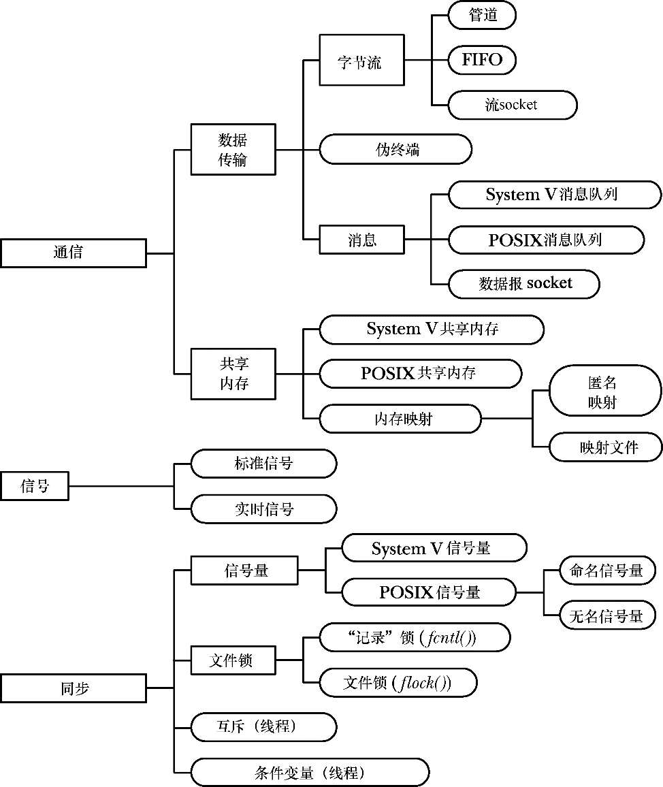

### 43.1　IPC工具分类

图43-1总结了UNIX系统上各种通信和同步工具，并根据功能将它们分成了三类。

+ 通信：这些工具关注进程之间的数据交换。
+ 同步：这些进程关注进程和线程操作之间的同步。
+ 信号：尽管信号的主要作用并不在此，但在特定场景下仍然可以将它作为一种同步技术。更罕见的是信号还可以作为一种通信技术：信号编号本身是一种形式的信息，并且可以在实时信号上绑定数据（一个整数或指针）。第20章到第22章对信号进行了介绍。

尽管其中一些工具关注的是同步，但通用术语进程间通信（IPC）通常指代所有这些工具。

从图43-1中可以看出，通常几个工具会提供类似的IPC功能，之所以会这样是出于下列原因。

+ 不同的工具在不同的UNIX实现上各自进行演化，随后被移植到了其他UNIX系统上。如FIFO首先是在System V上实现的，而（流）socket是首先是在BSD上实现的。
+ 新工具被开发出来用于弥补之前类似的工具存在的不足。如POSIX IPC工具（消息队列、信号量以及共享内存）是对较早的System V IPC工具的改进。

图43-1中被分成一组的工具在一些场景中会提供完全不同的功能。如流socket可以用来在网络上通信，而FIFO则只能用来在同一机器上的进程间进行通信。

<b class="my_markdown">图43-1：UNIX IPC工具分类</b>

