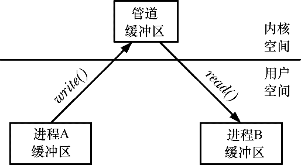

### 43.2　通信工具

图43-1中列出的各种通信工具允许进程间相互交换数据。（这些工具还可以用来在同一个进程中不同线程之间交换数据，但很少需要这样做，因为线程之间可以通过共享全局变量来交换信息。）

可以将通信工具分成两类。

+ 数据传输工具：区分这些工具的关键因素是写入和读取的概念。为了进行通信，一个进程将数据写入到IPC工具中，另一个进程从中读取数据。这些工具要求在用户内存和内核内存之间进行两次数据传输：一次传输是在写入的时候从用户内存到内核内存，另一次传输是在读取的时候从内核内存到用户内存。（图43-2展示了管道在这一场景中的用法。）

<b class="my_markdown">图43-2：使用管道在两个进程间交换数据</b>

+ 共享内存：共享内存允许进程通过将数据放到由进程间共享的一块内存中以完成信息的交换。（内核通过将每个进程中的页表条目指向同一个RAM分页来实现这一功能，如图49-2所示。）一个进程可以通过将数据放到共享内存块中使得其他进程读取这些数据。由于通信无需系统调用以及用户内存和内核内存之间的数据传输，因此共享内存的速度非常快。

#### 数据传输

可以进一步将数据传输工具分成下列类别。

+ 字节流：通过管道、FIFO以及数据报socket交换的数据是一个无分隔符的字节流。每个读取操作可能会从IPC工具中读取任意数量的字节，不管写者写入的块的大小是什么。这个模型参考了传统的UNIX“文件是一个字节序列”模型。
+ 消息：通过System V消息队列、POSIX消息队列以及数据报socket交换的数据是以分隔符分隔的消息。每个读取操作读取由写者写入的一整条消息，无法只读取部分消息，而把剩余部分留在IPC工具中，也无法在一个读取操作中读取多条消息。
+ 伪终端：伪终端是一种在特殊情况下使用的通信工具，在64章将会介绍有关伪终端的详细信息。

数据传输工具和共享内存之间的差别包括以下几个方面。

+ 尽管一个数据传输工具可能会有多个读取者，但读取操作是具有破坏性的。读取操作会消耗数据，其他进程将无法获取所消耗的数据。

> 在socket中可以使用MSG_PEEK标记来执行非破坏性读取（参见61.3节）。UDP（Internet domain datagram）socket允许将一条消息广播或组播到多个接收者处（参见61.12节）。

+ 读取者和写者进程之间的同步是原子的。如果一个读取者试图从一个当前不包含数据的数据传输工具中读取数据，那么在默认情况下读取操作会被阻塞直至一些进程向该工具写入了数据。

#### 共享内存

大多数现代UNIX系统提供了三种形式的共享内存：System V共享内存、POSIX共享内存以及内存映射。在后面介绍这些工具的章节中将会描述它们之间的差别（特别是在54.5节中）。

下面是使用共享内存时的注意点。

+ 尽管共享内存的通信速度更快，但速度上的优势是用来弥补需要对在共享内存上发生的操作进行同步的不足的。如当一个进程正在更新共享内存中的一个数据结构时，另一个进程就不应该试图读取这个数据结构。在共享内存中，信号量通常用来作为同步方法。
+ 放入共享内存中的数据对所有共享这块内存的进程可见。（这与上面数据传输工具中介绍的破坏性读取语义不同。）

