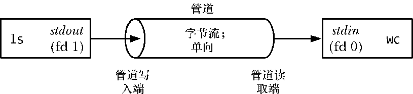

### 44.1　概述

每个shell用户都对在命令中使用管道比较熟悉，如下面这个统计一个目录中文件的数目的命令所示。

为执行上面的命令，shell创建了两个进程来分别执行ls和wc。（这是通过使用fork()和exec()来完成的，第24章和第27章分别对这两个函数进行了介绍。）图44-1展示了这两个进程是如何使用管道的。

<b class="my_markdown">图44-1：使用管道连接两个进程</b>

除了说明管道的用法之外，图44-1的另外一个目的是阐明管道这个名称的由来。可以将管道看成是一组铅管，它允许数据从一个进程流向另一个进程。

在图44-1中有一点值得注意的是两个进程都连接到了管道上，这样写入进程（ls）就将其标准输出（文件描述符为1）连接到了管道的写入端，读取进程（wc）就将其标准输入（文件描述符为0）连接到管道的读取端。实际上，这两个进程并不知道管道的存在，它们只是从标准文件描述符中读取数据和写入数据。shell必须要完成相关的工作，在44.4节中将会介绍shell是如何完成这些工作的。

下面几个段落将会介绍管道的几个重要特征。

#### 一个管道是一个字节流

当讲到管道是一个字节流时意味着在使用管道时是不存在消息或消息边界的概念的。从管道中读取数据的进程可以读取任意大小的数据块，而不管写入进程写入管道的数据块的大小是什么。此外，通过管道传递的数据是顺序的——从管道中读取出来的字节的顺序与它们被写入管道的顺序是完全一样的。在管道中无法使用lseek()来随机地访问数据。

如果需要在管道中实现离散消息的概念，那么就必须要在应用程序中完成这些工作。虽然这是可行的（参见44.8节），但如果碰到这种需求的话最好使用其他IPC机制，如消息队列和数据报socket，本书在后面几个章节中就会介绍它们。

#### 从管道中读取数据

试图从一个当前为空的管道中读取数据将会被阻塞直到至少有一个字节被写入到管道中为止。如果管道的写入端被关闭了，那么从管道中读取数据的进程在读完管道中剩余的所有数据之后将会看到文件结束（即read()返回0）。

#### 管道是单向的

在管道中数据的传递方向是单向的。管道的一段用于写入，另一端则用于读取。

在其他一些UNIX实现上——特别是那些从System V Release 4演化而来的系统——管道是双向的（所谓的流管道）。双向管道并没有在任何UNIX标准中进行规定，因此即使在提供了双向管道的实现上最好也避免依赖这种语义。作为替代方案，可以使用UNIX domain流socket对（通过使用57.5节中介绍的socketpair()系统调用来创建），它提供了一种标准的双向通信机制，并且其语义与流管道是等价的。

#### 可以确保写入不超过PIPE_BUF字节的操作是原子的

如果多个进程写入同一个管道，那么如果它们在一个时刻写入的数据量不超过PIPE_BUF字节，那么就可以确保写入的数据不会发生相互混合的情况。

SUSv3要求PIPE_BUF至少为_POSIX_PIPE_BUF（512）。一个实现应该定义PIPE_BUF（在<limits.h>中）并/或允许调用fpathconf(fd,_PC_PIPE_BUF)来返回原子写入操作的实际上限。不同UNIX实现上的PIPE_BUF不同，如在FreeBSD 6.0其值为512字节，在Tru64 5.1上其值为4096字节，在Solaris 8上其值为5120字节。在Linux上，PIPE_BUF的值为4096。

当写入管道的数据块的大小超过了PIPE_BUF字节，那么内核可能会将数据分割成几个较小的片段来传输，在读者从管道中消耗数据时再附加上后续的数据。（write()调用会阻塞直到所有数据被写入到管道为止。）当只有一个进程向管道写入数据时（通常的情况），PIPE_BUF的取值就没有关系了。但如果有多个写入进程，那么大数据块的写入可能会被分解成任意大小的段（可能会小于PIPE_BUF字节），并且可能会出现与其他进程写入的数据交叉的现象。

只有在数据被传输到管道的时候PIPE_BUF限制才会起作用。当写入的数据达到PIPE_BUF字节时，write()会在必要的时候阻塞直到管道中的可用空间足以原子地完成操作。如果写入的数据大于PIPE_BUF字节，那么write()会尽可能地多传输数据以充满整个管道，然后阻塞直到一些读取进程从管道中移除了数据。如果此类阻塞的write()被一个信号处理器中断了，那么这个调用会被解除阻塞并返回成功传输到管道中的字节数，这个字节数会少于请求写入的字节数（所谓的部分写入）。

> 在Linux 2.2上，向管道写入任意数量的数据都是原子的，除非写入操作被一个信号处理器中断了。在Linux 2.4以及后续的版本上，写入数据量大于PIPE_BUF字节的所有操作都可能会与其他进程的写入操作发生交叉。（在版本号为2.2和2.4的内核中，实现管道的内核代码存在很大的差异。）

#### 管道的容量是有限的

管道其实是一个在内核内存中维护的缓冲器，这个缓冲器的存储能力是有限的。一旦管道被填满之后，后续向该管道的写入操作就会被阻塞直到读者从管道中移除了一些数据为止。

SUSv3并没有规定管道的存储能力。在早于2.6.11的Linux内核中，管道的存储能力与系统页面的大小是一致的（如在x86-32上是4096字节），而从Linux 2.6.11起，管道的存储能力是65,536字节。其他UNIX实现上的管道的存储能力可能是不同的。

一般来讲，一个应用程序无需知道管道的实际存储能力。如果需要防止写者进程阻塞，那么从管道中读取数据的进程应该被设计成以尽可能快的速度从管道中读取数据。

> 从理论上来讲，没有任何理由可以支持存储能力较小的管道无法正常工作这个结论，哪怕管道的存储能力只有一个字节。使用较大的缓冲器的原因是效率：每当写者充满管道时，内核必须要执行一个上下文切换以允许读者被调度来消耗管道中的一些数据。使用较大的缓冲器意味着需执行的上下文切换次数更少。
> 从Linux 2.6.35开始就可以修改一个管道的存储能力了。Linux特有的fcntl(fd, F_SETPIPE_SZ, size)调用会将fd引用的管道的存储能力修改为至少size字节。非特权进程可以将管道的存储能力修改为范围在系统的页面大小到/proc/sys/fs/pipe-max-size中规定的值之内的任何一个值。pipe-max-size的默认值是1048576字节。特权（CAP_SYS_RESOURCE）进程可以覆盖这个限制。在为管道分配空间时，内核可能会将size提升为对实现来讲更加便捷的某个值。fcntl(fd, F_GETPIPE_SZ)调用返回为管道分配的实际大小。

