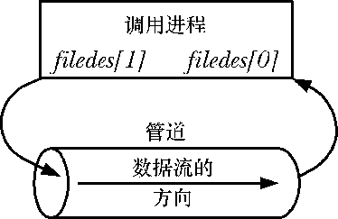
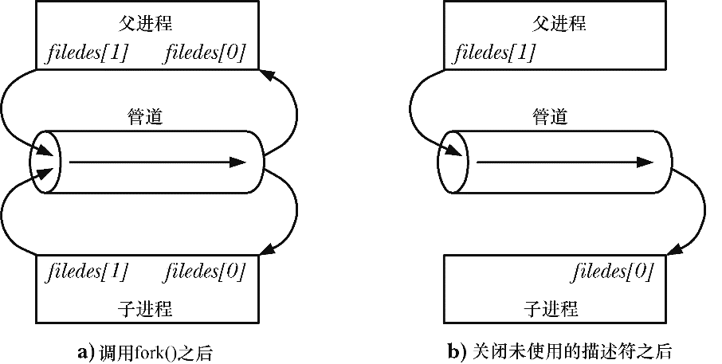
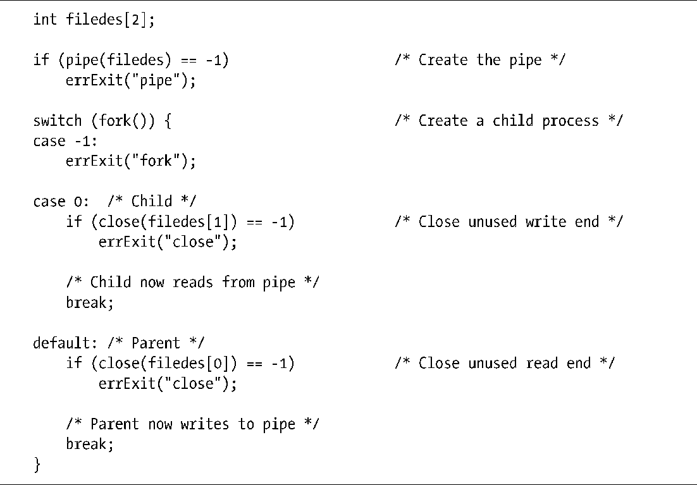
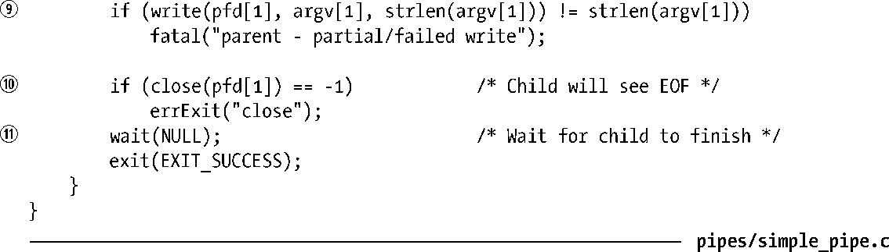

### 44.2　创建和使用管道

pipe()系统调用创建一个新管道。

成功的pipe()调用会在数组filedes中返回两个打开的文件描述符：一个表示管道的读取端（filedes[0]），另一个表示管道的写入端（filedes[1]）。

与所有文件描述符一样，可以使用read()和write()系统调用来在管道上执行I/O。一旦向管道的写入端写入数据之后立即就能从管道的读取端读取数据。管道上的read()调用会读取的数据量为所请求的字节数与管道中当前存在的字节数两者之间较小的那个（但当管道为空时阻塞）。

也可以在管道上使用stdio函数（printf()、scanf()等），只需要首先使用fdopen()获取一个与filedes中的某个描述符对应的文件流即可（参见13.7节）。但在这样做的时候需要清楚在44.6节中介绍的stdio缓冲问题。

> ioctl(fd, FIONREAD, &cnt)调用返回文件描述符fd所引用的管道或FIFO中未读取的字节数。其他一些实现也提供了这个特性，但SUSv3并没有对此进行规定。

图44-2给出了使用pipe()创建完管道之后的情况，其中调用进程通过文件描述符引用了管道的两端。

<b class="my_markdown">图44-2：在创建完管道之后处理文件描述符</b>

在单个进程中管道的用途不多（在63.5.2节中将会介绍一种用途）。一般来讲都是使用管道让两个进程进行通信。为了让两个进程通过管道进行连接，在调用完pipe()之后可以调用fork()。在fork()期间，子进程会继承父进程的文件描述符的副本（参见24.2.1节），这样就会出现图44-3中左边那样的情形。

<b class="my_markdown">图44-3：设置管道来将数据从父进程传输到子进程</b>

虽然父进程和子进程都可以从管道中读取和写入数据，但这种做法并不常见。因此，在fork()调用之后，其中一个进程应该立即关闭管道的写入端的描述符，另一个则应该关闭读取端的描述符。如，如果父进程需要向子进程传输数据，那么它就会关闭管道的读取端的描述符filedes[0]，而子进程就会关闭管道的写入端的描述符filedes[1]，这样就出现了图44-3中右边那样的情形。程序清单44-1给出了创建这个管道的代码。

程序清单44-1：使用管道将数据从父进程传输到子进程所需的步骤

让父进程和子进程都能够从同一个管道中读取和写入数据这种做法并不常见的一个原因是如果两个进程同时试图从管道中读取数据，那么就无法确定哪个进程会首先读取成功——两个进程竞争数据了。要防止这种竞争情况的出现就需要使用某种同步机制。但如果需要双向通信则可以使用一种更加简单的方法：创建两个管道，在两个进程之间发送数据的两个方向上各使用一个。（如果使用这种技术，那么就需要考虑死锁的问题了，因为如果两个进程都试图从空管道中读取数据或尝试向已满的管道中写入数据就可能会发生死锁。）

虽然可以有多个进程向单个管道中写入数据，但通常只存在一个写者。（在44.3节中将会给出一个使用多个写者向一个管道写入数据的例子。）相反，在有些情况下让FIFO拥有多个写者是比较有用的，在44.8节中将会给出一个这样的例子。

> 从2.6.27内核开始，Linux支持一个全新的非标准系统调用pipe2()。这个系统调用执行的任务与pipe()一样，但支持额外的参数flags，这个参数可以用来修改系统调用的行为。这个系统调用支持两个标记，一个是O_CLOEXEC，它会导致内核为两个新的文件描述符启用close-on-exec标记（FD_CLOEXEC）。这个标记之所以有用的原因与在4.3.1节中介绍的open() O_CLOEXEC标记有用的原因一样。另一个是O_NONBLOCK标记，它会导致内核将底层的打开的文件描述符标记为非阻塞，这样后续的I/O操作会是非阻塞的。这样就能够在不调用fcntl()的情况下达到同样的效果了。

#### 管道允许相关进程间的通信

目前为止本章已经介绍了如何使用管道来让父进程和子进程之间进行通信，其实管道可以用于任意两个（或更多）相关进程之间的通信，只要在创建子进程的系列fork()调用之前通过一个共同的祖先进程创建管道即可。（这就是本章开头部分所讲的“相关进程”的含义。）如管道可用于一个进程和其孙子进程之间的通信。第一个进程创建管道，然后创建子进程，接着子进程再创建第一个进程的孙子进程。管道通常用于两个兄弟进程之间的通信——它们的父进程创建了管道，然后创建两个子进程。这就是在构建管道线时shell所做的工作。

> 管道只能用于相关进程之间的通信这个说法存在一种例外情况。通过UNIX domain socket（在61.13.3节中将会简要介绍的一项技术）传递一个文件描述符使得将管道的一个文件描述符传递给一个非相关进程成为可能。

#### 关闭未使用管道文件描述符

关闭未使用管道文件描述符不仅仅是为了确保进程不会耗尽其文件描述符的限制——这对于正确使用管道是非常重要的。下面介绍为何必须要关闭管道的读取端和写入端的未使用文件描述符。

从管道中读取数据的进程会关闭其持有的管道的写入描述符，这样当其他进程完成输出并关闭其写入描述符之后，读者就能够看到文件结束（在读完管道中的数据之后）。

如果读取进程没有关闭管道的写入端，那么在其他进程关闭了写入描述符之后，读者也不会看到文件结束，即使它读完了管道中的所有数据。相反，read()将会阻塞以等待数据，这是因为内核知道至少还存在一个管道的写入描述符打开着，即读取进程自己打开了这个描述符。从理论上来讲，这个进程仍然可以向管道写入数据，即使它已经被读取操作阻塞了。如read()可能hiu被一个向管道写入数据的信号处理器中断。（这是现实世界中的一种场景，读者在63.5.2节中将会看到。）

写入进程关闭其持有的管道的读取描述符是出于不同的原因。当一个进程试图向一个管道中写入数据但没有任何进程拥有该管道的打开着的读取描述符时，内核会向写入进程发送一个SIGPIPE信号。在默认情况下，这个信号会杀死一个进程。但进程可以捕获或忽略该信号，这样就会导致管道上的write()操作因EPIPE错误（已损坏的管道）而失败。收到SIGPIPE信号或得到EPIPE错误对于标示出管道的状态是有用的，这就是为何需要关闭管道的未使用读取描述符的原因。

> 注意：对被SIGPIPE处理器中断的write()的处理是特殊的。通常，当write()（或其他“慢”系统调用）被一个信号处理器中断时，这个调用会根据是否使用sigaction() SA_RESTART标记安装了处理器而自动重启或因EINTR错误而失败（参见21.5节）。对SIGPIPE的处理不同是因为自动重启write()或简单标示出write()被一个处理器中断了是毫无意义的（意味着需要手工重启write()）。不管是何种处理方式，后续的write()都不会成功，因为管道仍然处于被损坏的状态。

如果写入进程没有关闭管道的读取端，那么即使在其他进程已经关闭了管道的读取端之后写入进程仍然能够向管道写入数据，最后写入进程会将数据充满整个管道，后续的写入请求会被永远阻塞。

关闭未使用文件描述符的最后一个原因是只有当所有进程中所有引用一个管道的文件描述符被关闭之后才会销毁该管道以及释放该管道占用的资源以供其他进程复用。此时，管道中所有未读取的数据都会丢失。

#### 示例程序

程序清单44-2中的程序演示了如何将管道用于父进程和子进程之间的通信。这个例子演示了前面提及的管道的字节流特性——父进程在一个操作中写入数据，子进程一小块一小块地从管道中读取数据。

主程序调用pipe()创建管道①，然后调用fork()创建一个子进程②。在fork()调用之后，父进程关闭了其持有的管道的读取端的文件描述符⑧并将通过程序的命令行参数传递进来的字符串写到管道的写入端⑨。父进程接着关闭管道的读取端⑩并调用wait()等待子进程终止⑪。在关闭了所持有的管道的写入端的文件描述符③之后，子进程进入了一个循环，在这个循环中从管道读取④数据块并将它们写到⑥标准输出中。当子进程碰到管道的文件结束时⑤就退出循环⑦，并写入一个结尾换行字符以及关闭所持有的管道的读取端的描述符，最后终止。

下面是运行程序清单44-2中的程序时可能看到的输出。

程序清单44-2：在父进程和子进程间使用管道通信

