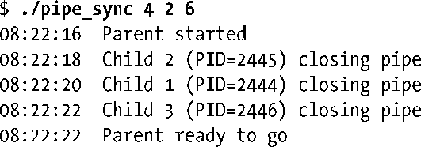
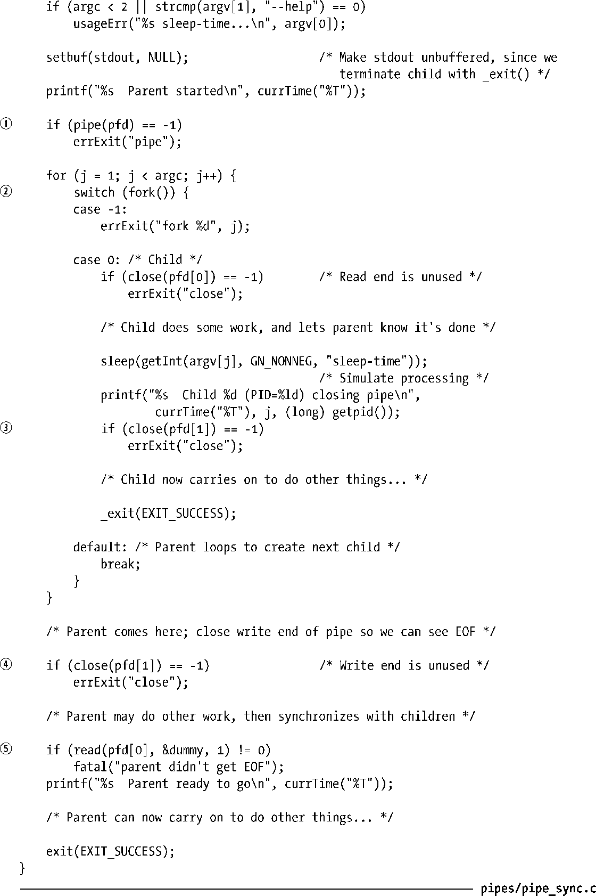

### 44.3　将管道作为一种进程同步的方法

在24.5节中介绍了如何使用信号来同步父进程和子进程的动作以防止出现竞争条件。也可以使用管道来取得类似的结果，如程序清单44-3中给出的骨架程序所示。这个程序创建了多个子进程（每个命令行参数对应一个子进程），每个子进程都完成某个动作，在本例中则是睡眠一段时间。父进程等待直到所有子进程完成了自己的动作为止。

为了执行同步，父进程在创建子进程②之前构建了一个管道①。每个子进程会继承管道的写入端的文件描述符并在完成动作之后关闭这些描述符③。当所有子进程都关闭了管道的写入端的文件描述符之后，父进程在管道上的read()⑤就会结束并返回文件结束（0）。这时，父进程就能够做其他工作了。（注意在父进程中关闭管道的未使用写入端④对于这项技术的正常运转是至关重要的，否则父进程在试图从管道中读取数据时会被永远阻塞。）

下面是使用程序清单44-3中的程序创建三个分别睡眠4、2和6秒的子进程时所看到的输出。

程序清单44-3：使用管道同步多个进程

与前面使用信号来同步相比，使用管道同步具备一个优势：它可以同来协调一个进程的动作使之与多个其他（相关）进程匹配。而多个（标准）信号无法排队的事实使得信号不适用于这种情形。（相反，信号的优势是它可以被一个进程广播到进程组中的所有成员处。）

其他同步结构也是可行的（如使用多个管道）。此外，还可以对这项技术进行扩展，即不关闭管道，每个子进程向管道写入一条包含其进程ID和一些状态信息的消息。或者每个子进程可以向管道写入一个字节。父进程可以计数和分析这些消息。这种方法考虑到了子进程意外终止而不是显式地关闭管道的情形。

