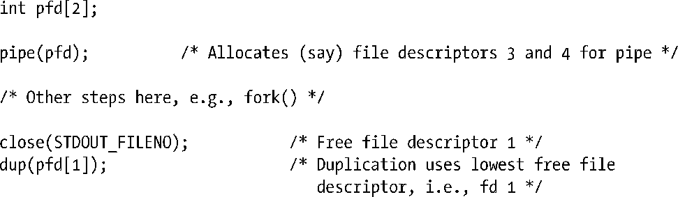
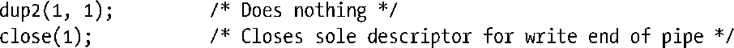
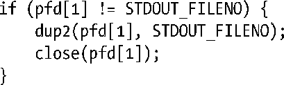
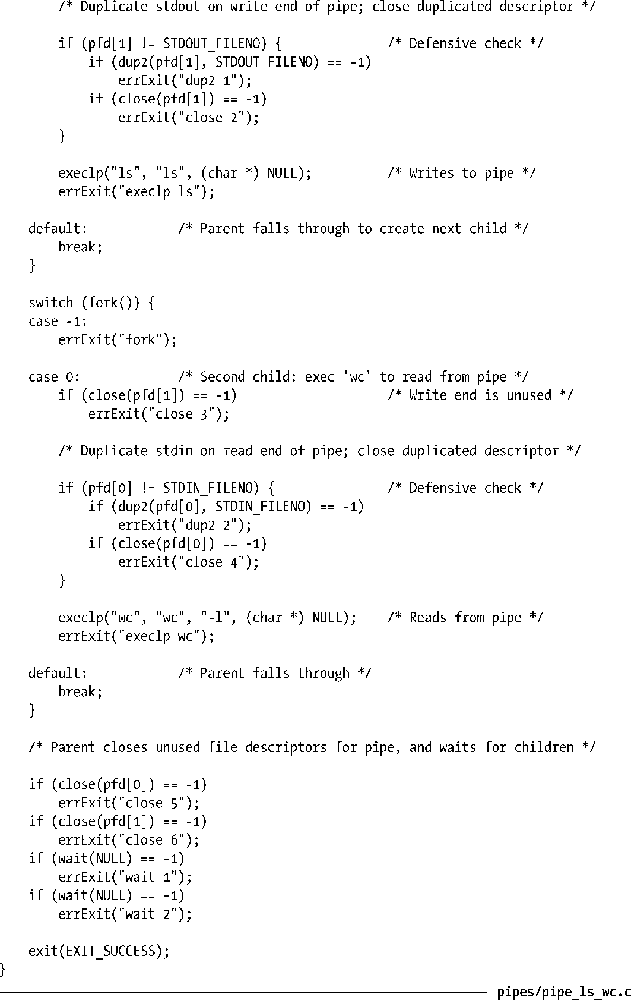
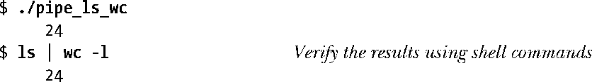

### 44.4　使用管道连接过滤器

当管道被创建之后，为管道的两端分配的文件描述符是可用描述符中数值最小的两个。由于在通常情况下，进程已经使用了描述符0、1和2，因此会为管道分配一些数值更大的描述符。那么如何形成图44-1中给出的情形呢，使用管道连接两个过滤器（即从stdin读取和写入到stdout的程序）使得一个程序的标准输出被定向到管道中，而另一个程序的标准输入则从管道中读取？特别是如何在不修改过滤器本身的代码的情况下完成这项工作呢？

这个问题的答案是使用在5.5节中介绍的技术，即复制文件描述符。一般来讲会使用下面的系列调用来获得预期的结果。

上面这些调用的最终结果是进程的标准输出被绑定到了管道的写入端。而对应的一组调用可以用来将进程的标准输入绑定到管道的读取端上。

注意，上面这些调用假设已经为进程打开了文件描述符0、1和2。（shell通常能够确保为它执行的每个程序都打开了这三个描述符。）如果在执行上面的调用之前文件描述符0已经被关闭了，那么就会错误地将进程的标准输入绑定到管道的写入端上。为避免这种情况的发生，可以使用dup2()调用来取代对close()和dup()的调用，因为通过这个函数可以显式地指定被绑定到管道一端的描述符。

在复制完pfd[1]之后就拥有两个引用管道的写入端的文件描述符了：描述符1和pfd[1]。由于未使用的管道文件描述符应该被关闭，因此在dup2()调用之后需要关闭多余的描述符。

前面给出的代码依赖于标准输出在之前已经被打开这个事实。假设在pipe()调用之前，标准输入和标准输出都被关闭了。那么在这种情况下，pipe()就会给管道分配这两个描述符，即pfd[0]的值可能为0，pfd[1]的值可能为1。其结果是前面的dup2()和close()调用将下面的代码等价。

因此按照防御性编程实践的要求最好将这些调用放在一个if语句中，如下所示。

#### 示例程序

程序清单44-4使用本节介绍的技术实现了图44-1中给出的结构。在构建完一个管道之后，这个程序创建了两个子进程。第一个子进程将其标准输出绑定到管道的写入端，然后执行ls。第二个子进程将其标准输入绑定到管道的写入端，然后执行wc。

程序清单44-4：使用管道连接ls和wc

当执行程序清单44-4中的程序时会看到下面的输出。

