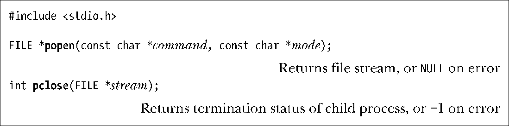
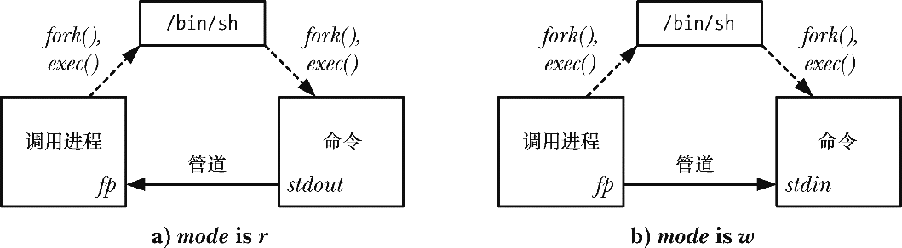
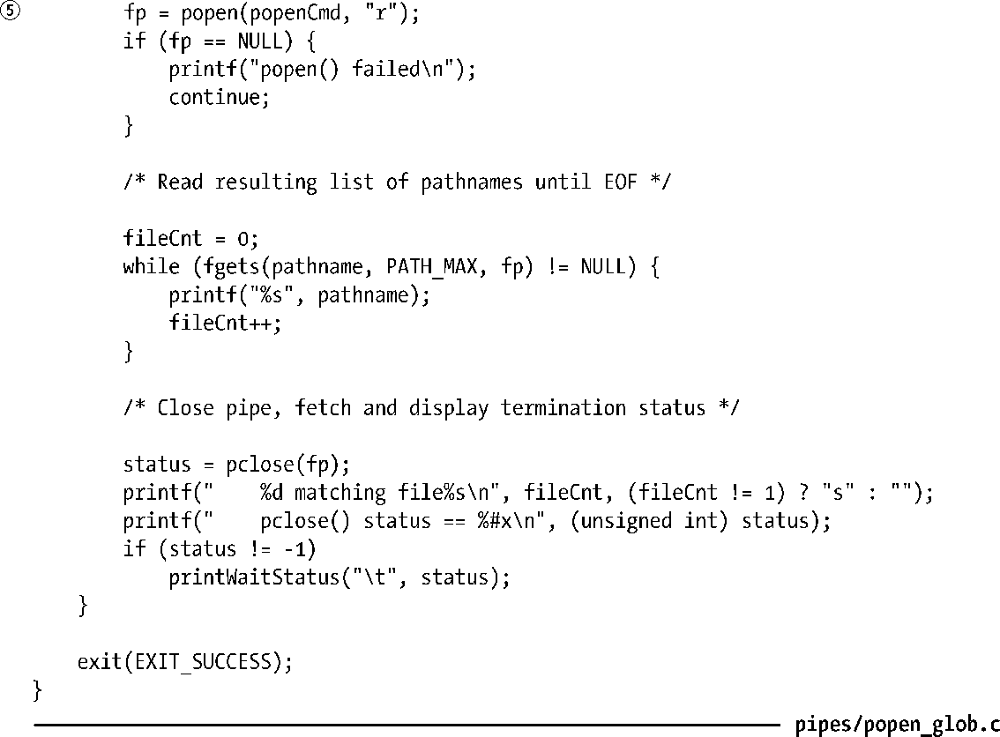
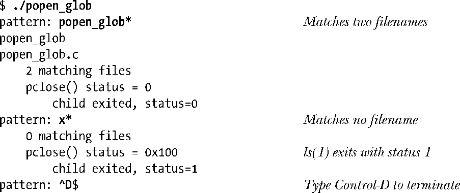
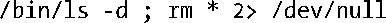

### 44.5　通过管道与shell命令进行通信：popen()

管道的一个常见用途是执行shell命令并读取其输出或向其发送一些输入。popen()和pclose()函数简化了这个任务。

popen()函数创建了一个管道，然后创建了一个子进程来执行shell，而shell又创建了一个子进程来执行command字符串。mode参数是一个字符串，它确定调用进程是从管道中读取数据（mode是r）还是将数据写入到管道中（mode是w）。（由于管道是单向的，因此无法在执行的command中进行双向通信。）mode的取值确定了所执行的命令的标准输出是连接到管道的写入端还是将其标准输入连接到管道的读取端，如图44-4所示。

<b class="my_markdown">图44-4：进程关系是popen()中管道的使用概述</b>

popen()在成功时会返回可供stdio库函数使用的文件流指针。当发生错误时（如mode不是r或w，创建管道失败，或通过fork()创建子进程失败），popen()会返回NULL并设置errno以标示出发生错误的原因。

在popen()调用之后，调用进程使用管道来读取command的输出或使用管道向其发送输入。与使用pipe()创建的管道一样，当从管道中读取数据时，调用进程在command关闭管道的写入端之后会看到文件结束；当向管道写入数据时，如果command已经关闭了管道的读取端，那么调用进程会收到SIGPIPE信号并得到EPIPE错误。

一旦I/O结束之后可以使用pclose()函数关闭管道并等待子进程中的shell终止。（不应该使用fclose()函数，因为它不会等待子进程。）pclose()在成功时会返回子进程中shell的终止状态（参见26.1.3节）（即shell所执行的最后一条命令的终止状态，除非shell是被信号杀死的）。与system()（参见27.6节）一样，如果无法执行shell，那么pclose()会返回一个值就像是子进程中的shell通过调用_exit(127)来终止一样。如果发生了其他错误，那么pclose()返回−1。其中可能发生的一个错误是无法取得终止状态，本章稍后就会介绍可能会发生这种情况的原因。

当执行等待以获取子进程中shell的状态时，SUSv3要求pclose()与system()一样，即在内部的waitpid()调用被一个信号处理器中断之后自动重启该调用。

一般来讲，在27.6节中描述的有关system()的规范同样适用于popen()。使用popen()更加方便一些，它会构建管道、执行描述符复制、关闭未使用的描述符并帮助开发人员处理fork()和exec()的所有细节。此外，shell处理针对的是命令。这种便捷性所牺牲的是效率，因为至少需要创建两个额外的进程：一种用于shell，一个或多个用于shell执行的命令。与system()一样，在特权进程中永远都不应该使用popen()。

虽然system()和popen()以及pclose()之间存在很多相似之处，但也存在显著的差异。这些差异源自这样一个事实，即使用system()时shell命令的执行是被封装在单个函数调用中的，而使用popen()时，调用进程是与shell命令并行运行的，然后会调用pclose()。具体的差异包括以下两个方面。

+ 由于调用进程与被执行的命令是并行运行的，因此SUSv3要求popen()不忽略SIGINT和SIGQUIT信号。如果这些信号是从键盘产生的，那么它们会被发送到调用进程和被执行的命令中。之所以这样是因为两个进程位于同一个进程组中，而由终端产生的信号是会像34.5节中描述的那样被发送到（前台）进程组中的所有成员的。
+ 由于调用进程在执行popen()和执行pclose()之间可能会创建其他子进程，因此SUSv3要求popen()不能阻塞SIGCHLD信号。这意味着如果调用进程在pclose()调用之前执行了一个等待操作，那么它就能够取得由popen()创建的子进程的状态。这样当后面调用popen()时，它就会返回−1，同时将errno设置为ECHILD，表示pclose()无法取得子进程的状态。

#### 示例程序

程序清单44-5演示了popen()和pclose()的用法。这个程序重复读取一个文件名通配符模式②，然后使用popen()获取将这个模式传入ls命令之后的结果⑤。（在较早的UNIX实现上会使用类似的技术执行文件名生成任务，这种技术也被称为通配globbing，它在引入glob()库函数之前就已经存在了。）

程序清单44-5：使用popen()通配文件名模式

下面的shell会话演示了程序清单44-5中给出的程序的用法。在本例中首先提供了一个匹配两个文件名的模式，然后又给出了一个与任何文件名都不匹配的模式。

这里需要对程序清单44-5中通配命令的构建①④稍微解释一下。真正执行模式匹配的是shell。ls命令仅仅用来列出匹配的文件名，每一个行列出一个。读者可以尝试使用echo命令，但当模式与所有文件名都不匹配时这种做法会出现非预期的结果，然后shell就会保持模式不变，而echo会简单地打印出模式。相反，如果传递给ls的文件名不存在，那么它就会在stderr（通过将stderr重定向到/dev/null来丢弃写入这个描述符中的数据）上打印出一条错误消息，而不会在stdout上打印出任何消息，并且最后的退出状态为1。

还需要注意程序清单44-5中程序所做的输入检测③。之所以这样做是为了防止非法输入引起popen()执行一个预期之外的shell命令。假设忽略了这些检测，并且用户输入了下面的输入。

程序会将下面的命令传递给popen()，其结果是损失惨重。

在使用popen()（或system()）执行根据用户输入构建的shell命令的程序中永远都需要做输入检测。（应用程序可以选择另一种方法，即将那些无需检测的字符放在引号中，这样shell就不会对那些字符进行特殊处理了。）

