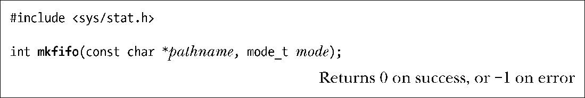
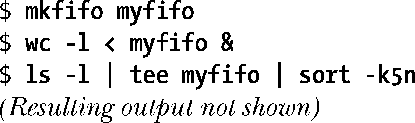
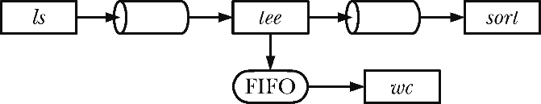

### 44.7　FIFO

从语义上来讲，FIFO与管道类似，它们两者之间最大的差别在于FIFO在文件系统中拥有一个名称，并且其打开方式与打开一个普通文件是一样的。这样就能够将FIFO用于非相关进程之间的通信（如客户端和服务器）。

一旦打开了FIFO，就能在它上面使用与操作管道和其他文件的系统调用一样的I/O系统调用了（如read()、write()和close()）。与管道一样，FIFO也有一个写入端和读取端，并且从管道中读取数据的顺序与写入的顺序是一样的。FIFO的名称也由此而来：先入先出。FIFO有时候也被称为命名管道。

与管道一样，当所有引用FIFO的描述符都被关闭之后，所有未被读取的数据会被丢弃。

使用mkfifo命令可以在shell中创建一个FIFO。

pathname是创建的FIFO的名称，–m选项用来指定权限mode，其工作方式与chmod命令一样。

当在FIFO（或管道）上调用fstat()和stat()函数时它们会在stat结构的st_mode字段中返回一个类型为S_IFIFO的文件（参见15.1节）。当使用ls –l列出文件时，FIFO文件在第一列的类型为p，ls –F会在FIFO路径名后面附加上一个管道符（|）。

mkfifo()函数创建一个名为pathname的全新的FIFO。

mode参数指定了新FIFO的权限。这些权限是通过将表15-4中的常量取OR来指定的。与往常一样，这些权限会按照进程的umask值（参见15.4.6节）来取掩码。

> 以前创建FIFO使用的是mknod(pathname,S_IFIFO, 0)系统调用。POSIX.1-1990规定了mkfifo()，它更加简单，并且消除了mknod()具备的通用性，这种通用性允许创建各种类型的文件，包括设备文件。（SUSv3规定了mknod()，但并没有详细规定，它只定义了这个函数的用途是创建FIFO。）大多数UNIX实现提供了mkfifo()，它是构建于mknod()之上的一个库函数。

一旦FIFO被创建，任何进程都能够打开它，只要它能够通过常规的文件权限检测（参见15.4.3节）。

打开一个FIFO具备一些不寻常的语义。一般来讲，使用FIFO时唯一明智的做法是在两端分别设置一个读取进程和一个写入进程。这样在默认情况下，打开一个FIFO以便读取数据（open() O_RDONLY标记）将会阻塞直到另一个进程打开FIFO以写入数据（open() O_WRONLY标记）为止。相应地，打开一个FIFO以写入数据将会阻塞直到另一个进程打开FIFO以读取数据为止。换句话说，打开一个FIFO会同步读取进程和写入进程。如果一个FIFO的另一端已经打开（可能是因为一对进程已经打开了FIFO的两端），那么open()调用会立即成功。

在大多数UNIX实现（包括Linux）上，当打开一个FIFO时可以通过指定O_RDWR标记来绕过打开FIFO时的阻塞行为。这样，open()就会立即返回，但无法使用返回的文件描述符在FIFO上读取和写入数据。这种做法破坏了FIFO的I/O模型，SUSv3明确指出以O_RDWR标记打开一个FIFO的结果是未知的，因此出于可移植性的原因，开发人员不应该使用这项技术。对于那些需要避免在打开FIFO时发生阻塞的需求，open()的O_NONBLOCK标记提供了一种标准化的方法来完成这个任务（参见44.9节）。

> 在打开一个FIFO时避免使用O_RDWR标记还有另外一个原因。当采用那种方式调用open()之后，调用进程在从返回的文件描述符中读取数据时永远都不会看到文件结束，因为永远都至少存在一个文件描述符被打开着以等待数据被写入FIFO，即进程从中读取数据的那个描述符。

#### 使用FIFO和tee(1)创建双重管道线

shell管道线的其中一个特征是它们是线性的，管道线中的每个进程都读取前一个进程产生的数据并将数据发送到其后一个进程中。使用FIFO就能够在管道线中创建子进程，这样除了将一个进程的输出发送给管道线中的后面一个进程之外，还可以复制进程的输出并将数据发送到另一个进程中。要完成这个任务需要使用tee命令，它将其从标准输入中读取到的数据复制两份并输出：一份写入到标准输出，另一份写入到通过命令行参数指定的文件中。

将传给tee命名的file参数设置为一个FIFO可以让两个进程同时读取tee产生的两份数据。下面的shell会话演示了这种用法，它创建了一个名为myfifo的FIFO，然后在后台启动一个wc命令，该命令会打开FIFO以读取数据（这个操作会阻塞直到有进程打开FIFO写入数据为止），接着执行一条管道线将ls的输出发送给tee，tee会将输出传递给管道线中的下一个命令sort，同时还会将输出发送给名为myfifo的FIFO。（sort的–k5n选项会导致ls的输出按照第五个以空格分隔的字段的数值升序排序。）

从图表上来看，上面的命令创建了图44-5中给出的情形。

<b class="my_markdown">图44-5：使用FIFO和tee(1)创建双重管道线</b>

> tee程序之所以这样命名是因为其外形。可以将tee看成是功能与管道类似的一个实体，但它存在一个额外的分支发送一份输出的副本。从图表上来看，其形状像是一个大写字母T（参见图44-5）。除了上面描述的用途之外，tee对于管道线调试和保存复杂管道线中某些中间节点的输出结果也是非常有用的。

