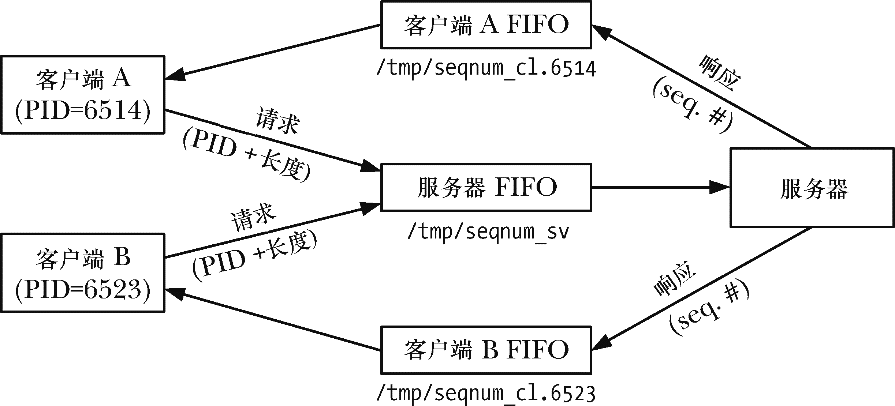
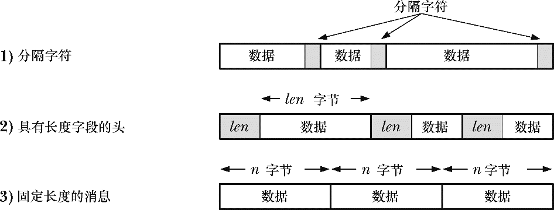
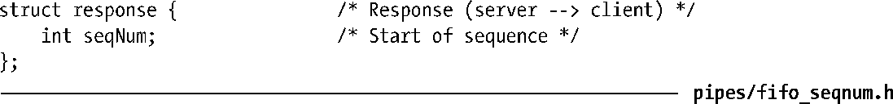
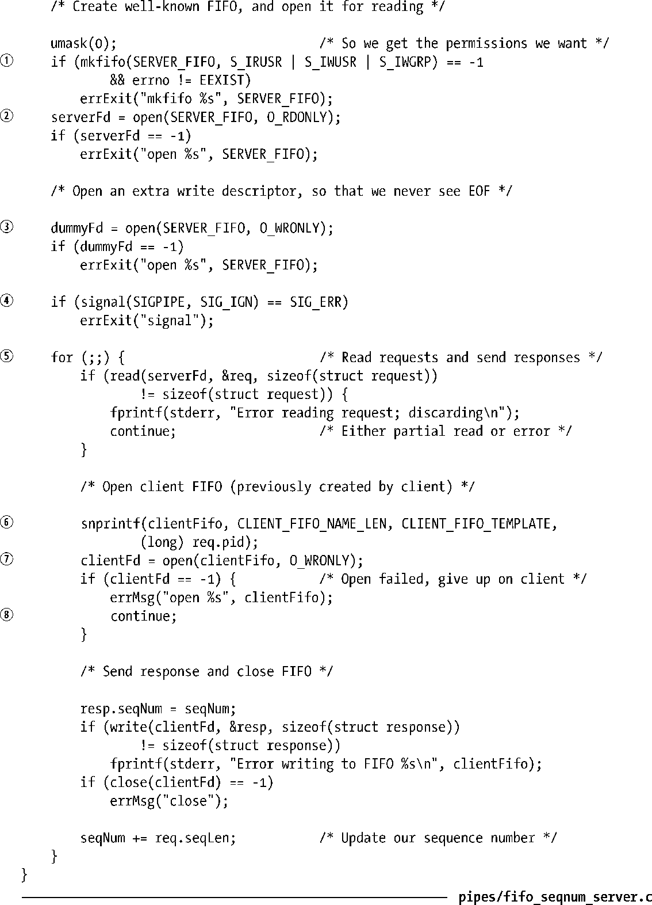
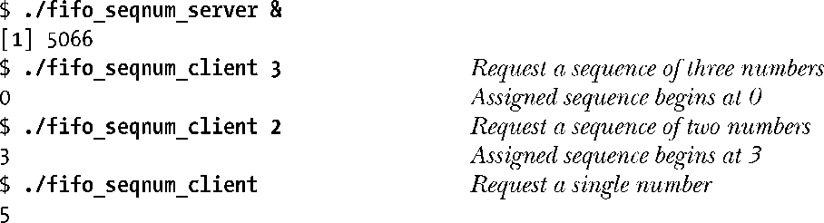
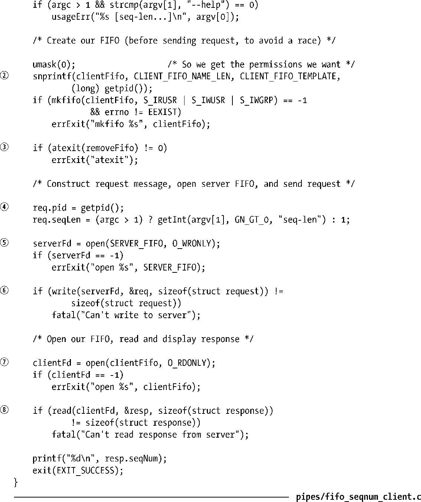

### 44.8　使用管道实现一个客户端/服务器应用程序

本节将介绍一个简单的使用FIFO进行IPC的客户端/服务器应用程序。服务器提供的（简单）服务是向每个发送请求的客户端赋一个唯一的顺序数字。在对这个应用程序进行讨论的过程中将会介绍与服务器设计有关的一些概念和技术。

#### 应用程序概述

在这个示例应用程序中，所有客户端使用一个服务器FIFO来向服务器发送请求。头文件（程序清单44-6）定义了众所周知的名称（/tmp/seqnum_sv），服务器的FIFO将使用这个名称。这个名称是固定的，因此所有客户端知道如何联系到服务器。（在这个示例应用程序中将会在/tmp目录中创建FIFO，这样在大多数系统上都能够在不修改程序的情况下方便地运行这个程序。但正如在38.7节中指出的那样，在一个像/tmp这样的公共可写的目录中创建文件可能会导致各种安全隐患，因此现实世界中的应用程序不应该使用这种目录。）

> 在客户端-服务器应用程序中将会不断地碰到一个概念，即服务器用来使服务对客户端可见的众所周知的地址或名称。对于客户端如何知道在何处联系服务器这个问题来讲，使用众所周知的地址是一种解决方案。另一种可能的解决方案是提供某种名称服务器，服务器可以将它们的服务的名称注册到名称服务器上。然后每个客户端联系名称服务器以获取服务的位置。这个解决方案允许灵活地配置服务器的位置，而付出的代价则是需要进行额外的编程。当然，客户端和服务器需要知道到何处联系名称服务器，它位于一个众所周知的地址。

无法使用单个FIFO向所有客户端发送响应，因为多个客户端在从FIFO中读取数据时会相互竞争，这样就可能会出现各个客户端读取到了其他客户端的响应消息，而不是自己的响应消息。因此每个客户端需要创建一个唯一的FIFO，服务器使用这个FIFO来向该客户端递送响应，并且服务器需要知道如何找出各个客户端的FIFO。解决这个问题的一种方式是让客户端生成自己的FIFO路径名，然后将路径名作为请求消息的一部分传递给服务器。或者客户端和服务器可以约定一个构建客户端FIFO路径名的规则，然后客户端可以将构建自己的路径名所需的相关信息作为请求的一部分发送给服务器。本例中将会使用后面一种解决方案。每个客户端的FIFO是从一个由包含客户端的进程ID的路径名构成的模板（CLIENT_FIFO_TEMPLATE）中构建而来的。在生成过程中包含进程ID可以很容易地产生一个对各个客户端唯一的名称。

图44-6展示了这个应用程序如何使用FIFO来完成客户端和服务器进程之间的通信。

<b class="my_markdown">图44-6：在单服务器、多客户端应用程序中使用FIFO</b>

头文件（程序清单44-6）定义了客户端发送给服务器的请求消息的格式和服务器发送给客户端的响应消息的格式。

记住管道和FIFO中的数据是字节流，消息之间是没有边界的。这意味着当多条消息被递送到一个进程中时，如本例中的服务器，发送者和接收者必须要约定某种规则来分隔消息。这可以使用多种方法。

+ 每条消息使用诸如换行符之类的分隔字符结束。（使用这项技术的一个例子是程序清单59-1中的readLine()函数。）这样就必须要保证分隔字符不会出现在消息中或者当它出现在消息中时必须要采用某种规则进行转义。例如，如果使用换行符作为分隔符，那么字符\加上换行可以用来表示消息中一个真实的换行符，而\则可以用来表示一个真实的\。这种方法的一个不足之处是读取消息的进程在从FIFO中扫描数据时必须要逐个字节地分析直到找到分隔符为止。
+ 在每条消息中包含一个大小固定的头，头中包含一个表示消息长度的字段，该字段指定了消息中剩余部分的长度。这样读取进程就需要首先从FIFO中读取头，然后使用头中的长度字段来确定需读取的消息中剩余部分的字节数。这种方法能够高效地读取任意大小的消息，但一旦不合规则（如错误的length字段）的消息被写入到管道中之后问题就出来了。
+ 使用固定长度的消息并让服务器总是读取这个大小固定的消息。这种方法的优势在于简单性。但它对消息的大小设置了一个上限，意味着会浪费一些通道容量（因为需要对较短的消息进行填充以满足固定长度）。此外，如果其中一个客户端意外地或故意发送了一条长度不对的消息，那么所有后续的消息都会出现步调不一致的情况，并且在这种情况下服务器是难以恢复的。

图44-7展示了这三种技术。注意不管使用这三种技术中的哪种，每条消息的总长度必须要小于PIPE_BUF字节以防止内核对消息进行拆分，从而造成与其他写者发送的消息错乱的情况的发生。

<b class="my_markdown">图44-7：分隔字节流中的消息</b>

> 在正文描述的三种技术中，所有客户端发送的所有消息都会被放在一个通道（FIFO）中。另一种方法是为每条消息使用一个连接。发送者打开通信通道，发送消息，然后关闭通道。读取进程在碰到文件结束时就知道达到消息结尾了。如果多个写者都打开了一个FIFO，那么这种方法就不可行了，因为读取在其中一个写者关闭FIFO之后不会看到文件结束。但当使用流socket时这种方法就变得可行了，因为服务器进程会为每个进入的客户端连接创建一个唯一的通信通道。

在本章的示例应用程序中将使用上面介绍的第三种技术，即每个客户端向服务器发送的消息的长度是固定的。程序清单44-6中的request结构定义了消息。每个发送给服务器的请求都包含了客户端的进程ID，这样服务器就能够构建客户端用来接收响应的FIFO的名称了。请求中还包含了一个seqLen字段，它指定了应该为这个客户端分配的序号的数量。服务器向客户端发送的响应消息由一个字段seqNum构成，它是为这个客户端分配的一组序号的起始值。

程序清单44-6：fifo_seqnum_server.c和fifo_seqnum_client.c的头文件

#### 服务器程序

程序清单44-7是服务器的代码。这个服务器按序完成了下面的工作。

+ 创建服务器的众所周知的FIFO①并打开FIFO以便读取②。服务器必须要在客户端之前运行，这样服务器FIFO在客户端试图打开它之前就已经存在了。服务器的open()调用将会阻塞直到第一个客户端打开了服务器的FIFO的另一端以写入数据为止。
+ 再次打开服务器的FIFO③，这次是为了写入数据。这个调用永远不会被阻塞，因为之前已经因需读取而打开FIFO了。第二个打开操作是为了确保服务器在所有客户端关闭了FIFO的写入端之后不会看到文件结束。
+ 忽略SIGPIPE信号④，这样如果服务器试图向一个没有读者的客户端FIFO写入数据时不会收到SIGPIPE信号（默认会杀死进程），而是会从write()系统调用中收到一个EPIPE错误。
+ 进入一个循环从每个进入的客户端请求中读取数据并响应⑤。要发送响应，服务器需要构建客户端FIFO的名称⑥，然后打开这个FIFO⑦。
+ 如果服务器在打开客户端FIFO时发生了错误，那么就丢弃那个客户端的请求⑧。

这是一种迭代式服务器，这种服务器会在读取和处理完当前客户端之后才会去处理下一个客户端。当每个客户端请求的处理和响应都能够快速完成时采用这种迭代式服务器设计是合理的，因为不会对其他客户端请求的处理产生延迟。另一种设计方法是并发式服务器，在这种设计中主服务器进程使用单独的子进程（或线程）来处理各个客户端的请求。第60章将会深入介绍服务器设计。

程序清单44-7：使用FIFO的迭代式服务器

#### 客户端程序

程序清单44-8是客户端的代码。客户端按序完成了下面的工作。

+ 创建一个FIFO以从服务器接收响应②。这项工作是在发送请求之前完成的，这样才能确保FIFO在服务器试图打开它并向其发送响应消息之前就已经存在了。
+ 构建一条发给服务器的消息，消息中包含了客户端的进程ID和一个指定了客户端希望服务器赋给它的序号长度的数字（从可选的命令行参数中获取）④。（如果没有提供命令行参数，那么默认的序号长度是1。）
+ 打开服务器FIFO⑤并将消息发送给服务器⑥。
+ 打开客户端FIFO⑦，然后读取和打印服务器的响应⑧。

另一个需要注意的地方是通过atexit()③建立的退出处理器①，它确保了当进程退出之后客户端的FIFO会被删除。或者可以在客户端FIFO的open()调用之后立即调用unlink()。在那个时刻这种做法是能够正常工作的，因为它们都执行了阻塞的open()调用，服务器和客户端各自持有了FIFO的打开着的文件描述符，而从文件系统中删除FIFO名称不会对这些描述符以及它们所引用的打开着的文件描述符产生影响。

下面是运行这个客户端和服务器程序时看到的输出。

程序清单44-8：序号服务器的客户端

