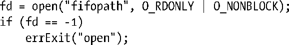
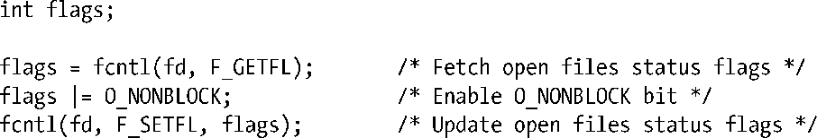
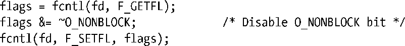

### 44.9　非阻塞I/O

前面曾经提过当一个进程打开一个FIFO的一端时，如果FIFO的另一端还没有被打开，那么该进程会被阻塞。但有些时候阻塞并不是期望的行为，而这可以通过在调用open()时指定O_NONBLOCK标记来实现。

如果FIFO的另一端已经被打开，那么O_NONBLOCK对open()调用不会产生任何影响——它会像往常一样立即成功地打开FIFO。只有当FIFO的另一端还没有被打开的时候O_NONBLOCK标记才会起作用，而具体产生的影响则依赖于打开FIFO是用于读取还是用于写入的。

+ 如果打开FIFO是为了读取，并且FIFO的写入端当前已经被打开，那么open()调用会立即成功（就像FIFO的另一端已经被打开一样）。
+ 如果打开FIFO是为了写入，并且还没有打开FIFO的另一端来读取数据，那么open()调用会失败，并将errno设置为ENXIO。

为读取而打开FIFO和为写入而打开FIFO时O_NONBLOCK标记所起的作用不同是有原因的。当FIFO的另一个端没有写者时打开一个FIFO以便读取数据是没有问题的，因为任何试图从FIFO读取数据的操作都不会返回任何数据。但当试图向没有读者的FIFO中写入数据时将会导致SIGPIPE信号的产生以及write()返回EPIPE错误。

表44-1对打开FIFO的语义进行了总结，包括上面介绍的O_NONBLOCK标记的作用。

<b class="my_markdown">表44-1：在FIFO上调用open()的语义</b>

| open()类型 | open()的结果 |
| :-----  | :-----  | :-----  | :-----  |
| 打开的目的 | 额外标记 | FIFO另一端的打开操作 | FIFO另一端的关闭操作 |
| 读取 | 无（阻塞） | 立即成功 | 阻塞 |
| O_NONBLOCK | 立即成功 | 立即成功 |
| 写入 | 无（阻塞） | 立即成功 | 阻塞 |
| O_NONBLOCK | 立即成功 | 失败（ENXIO） |

在打开一个FIFO时使用O_NONBLOCK标记存在两个目的。

+ 它允许单个进程打开一个FIFO的两端。这个进程首先会在打开FIFO时指定O_NONBLOCK标记以便读取数据，接着打开FIFO以便写入数据。
+ 它防止打开两个FIFO的进程之间产生死锁。

当两个或多个进程中每个进程都因等待对方完成某个动作而阻塞时会产生死锁。图44-8给出了两个进程发生死锁的情形。各个进程都因等待打开一个FIFO以便读取数据而阻塞。如果各个进策划那个都可以执行其第二个步骤（打开另一个FIFO以便写入数据）的话就不会发生阻塞。这个特定的死锁问题是通过颠倒进程Y中的步骤1和步骤2并保持进程X中两个步骤的顺序不变来解决，反之亦然。但在一些应用程序中进行这样的调整可能并不容易。相反，可以通过在为读取而打开FIFO时让其中一个进程或两个进程都指定O_NONBLOCK标记来解决这个问题。

<b class="my_markdown">图44-8：打开两个FIFO的进程之间的死锁</b>

#### 非阻塞read()和write()

O_NONBLOCK标记不仅会影响open()的语义，而且还会影响——因为在打开的文件描述中这个标记仍然被设置着——后续的read()和write()调用的语义。下一节将会对这些影响进行描述。

有些时候需要修改一个已经打开的FIFO（或另一种类型的文件）的O_NONBLOCK标记的状态，具体存在这个需求的场景包括以下几种。

+ 使用O_NONBLOCK打开了一个FIFO但需要让后续的read()和write()调用在阻塞模式下运作。
+ 需要启用从pipe()返回的一个文件描述符的非阻塞模式。更一般地，可能需要更改从除open()调用之外的其他调用中——如每个由shell运行的新程序中自动被打开的三个标准描述符的其中一个或socket()返回的文件描述符——取得的任意文件描述符的非阻塞状态。
+ 出于一些应用程序的特殊需求，需要切换一个文件描述符的O_NONBLOCK设置的开启和关闭状态。

当碰到上面的需求时可以使用fcntl()启用或禁用打开着的文件的O_NONBLOCK状态标记。通过下面的代码（忽略的错误检查）可以启用这个标记。

通过下面的代码可以禁用这个标记。

