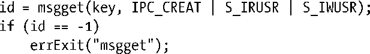
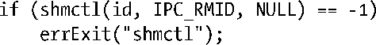

### 45.1　概述

表45-1对使用System V IPC对象需用到的头文件和系统调用进行了总结。

一些实现要求在包含表45-1中的头文件之前先包含<sys/types.h>。一些较早的UNIX实现可能还要求包含<sys/ipc.h>。（没有哪个UNIX规范要求这些头文件。）

<b class="my_markdown">表45-1：System V IPC对象编程接口总结</b>

| 接　　口 | 消 息 队 列 | 信　号　量 | 共 享 内 存 |
| :-----  | :-----  | :-----  | :-----  | :-----  | :-----  |
| 头文件 | <sys/msg.h> | <sys/sem.h> | <sys/shm.h> |
| 关联数据结构 | msqid_ds | semid_ds | shmid_ds |
| 创建/打开对象 | msgget() | semget() | shmget() + shmat() |
| 关闭对象 | （无） | （无） | shmdt() |
| 控制操作 | msgctl() | semctl() | shmctl() |
| 执行IPC | msgsnd()——写入消息 | semop()——测试/调整信号量 | 访问共享区域中的内存 |
| msgrcv()——接收消息 |

> 在大多数部署Linux的硬件架构上，系统调用ipc(2)是所有System V IPC操作到内核的入口，表45-1中列出的所有调用实际上都被实现为位于这个系统调用之上的库函数。（这个约定的两个例外情况是Alpha和IA-64，在这两个架构上，表中列出的调用被实现成了各个系统调用。）这个不太常见的方法是System V IPC在一开始被实现成可载入的内核模块的杰作。尽管在大多数Linux架构上它们实际上是库函数，但在本章中会将表45-1中列出的函数称为系统调用。只有C库的实现人员才需要使用ipc(2)ipc(2)，在任何其他应用程序中使用这个调用将会使应用程序变得不可移植。

#### 创建和打开一个System V IPC对象

每种System V IPC机制都有一个相关的get系统调用（msgget()、semget()或shmget()），它与文件上的open()系统调用类似。给定一个整数key（类似于文件名），get调用完成下列某个操作。

+ 使用给定的key创建一个新IPC对象并返回一个唯一的标识符来标识该对象。
+ 返回一个拥有给定的key的既有IPC对象的标识符。

本章将第二种做法（宽松地）称为打开一个既有IPC对象。在这种情况下，get调用所做的事情是将一个数字（key）转换称为另一个数字（标识符）。

> 在System V IPC的上下文中的对象与面向对象程序设计中的对象毫无关系。这个术语仅仅用来将System V IPC机制与文件区分开来。尽管文件和System V IPC对象之间存在几点类似之处，但与标准的UNIX文件I/O模型相比，IPC对象的用法在几个重要方面都存在差异，这也是System V IPC机制之所以复杂的一个原因。

IPC标识符与文件描述符类似，在后续所有引用该IPC对象的系统调用中都需要用到它。但这两者之间存在一个重要的语义上的差别。文件描述符是一个进程特性，而IPC标识符则是对象本身的一个属性并且对系统全局可见。所有访问同一对象的进程使用同样的标识符。这意味着如果知道一个IPC对象已经存在，那么可以跳过get调用，只要能够通过某种机制来获知对象的标识符即可。例如，创建对象的进程可能会将标识符写入一个可供其他进程读取的文件。

下面的例子展示了如何创建一个System V消息队列。

与所有的get调用一样，key是第一个参数，标识符是函数的返回结果。传递给get调用的最后一个参数（flags）使用与文件一样的掩码常量（表15-4）指定了新对象上的权限。在上面的例子中只给对象的所有者赋予了在队列中读取和写入消息的权限。

进程的umask（参见15.4.6节）对新创建的IPC对象上的权限是不适用的。

> 一些UNIX实现为IPC权限定义了下面的位掩码常量：MSG_R、MSG_W、SEM_R、SEM_A、SHM_R以及SHM_W。它们对应于各个IPC机制的所有者（用户）的读取和写入权限。要获取对应的组和其他用户的权限位掩码则可以将这些常量右移3位和6位。SUSv3并没有规定这些常量，它使用了与文件一样的位掩码，并且没有在glibc头中对这些常量进行定义。

所有需访问同一个IPC对象的进程在执行get调用时会指定同样的key以获取该对象的同一个标识符。在45.2节中将会介绍如何为应用程序选择一个key。

如果没有与给定的key对应的IPC对象存在并且在flags参数中指定了IPC_CREAT（与open()的O_CREAT标记类似），那么get调用会创建一个新的IPC对象。如果不存在相应的IPC对象并且没有指定IPC_CREAT（并且没有像45.2节中描述的那样将key指定为IPC_PRIVATE），那么get调用会失败并返回ENOENT错误。

一个进程可以通过指定IPC_EXCL标记（类似于open()的O_EXCL标记）来确保它是创建IPC对象的进程。如果指定了IPC_EXCL并且与给定key对应的IPC对象已经存在，那么get调用会失败并返EEXIST错误。

#### IPC对象删除和对象持久

各种System V IPC机制的ctl系统调用（msgctl()、semctl()、shmctl()）在对象上执行一组控制操作，其中很多操作是特定于某种IPC机制的，但有一些是适用于所有的IPC机制的，其中一个就是IPC_RMID控制操作，它可以用来删除一个对象。如使用下面的调用可以删除一个共享内存对象。

对于消息队列和信号量来讲，IPC对象的删除是立即生效的，对象中包含的所有信息都会被销毁，不管是否有其他进程仍然在使用该对象。（这也是System IPC对象的操作与文件的操作不相似的其中一个地方。在18.3节中曾经讲过如果删除了指向文件的最后一个链接，那么实际上只有当所有引用该文件的打开着的文件描述符都被关闭之后才会删除该文件。）

共享内存对象的删除的操作是不同的。在shmctl(id,IPC_RMID, NULL)调用之后，只有当所有使用该内存段的进程与该内存段分离之后（使用shmdt()）才会删除该共享内存段。（这一点与文件删除更加接近。）

System V IPC对象具备内核持久性。一旦被创建之后，一个对象就一直存在直到它被显式地删除或系统被关闭。System V IPC对象的这个属性是非常有用的。因为一个进程可以创建一个对象、修改其状态、然后退出并使得在后面某个时刻启动的进程可以访问这个对象。但这种属性也是存在缺点的，其原因如下。

+ 系统对每种类型的IPC对象的数量是有限制的。如果没有删除不用的对象，那么应用程序最终可能会因达到这个限制而发生错误。
+ 在删除一个消息队列或信号量对象时，多进程应用程序可能难以确定哪个进程是最后一个需要访问对象的进程，从而导致难以确定何时可以安全地删除对象。这里的问题是这些对象是无连接的——内核不会记录哪个进程打开了对象。（共享内存段不存在这个缺点，因为它们的删除操作的语义不同。）

