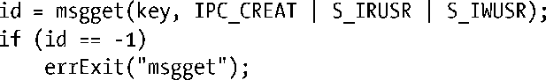

### 45.2　IPC Key

System V IPC key是一个整数值，其数据类型为key_t。IPC get调用将一个key转换成相应的整数IPC标识符。这些调用能够确保如果创建的是一个新IPC对象，那么对象能够得到一个唯一的标识符，如果指定了一个既有对象的key，那么总是会取得该对象的（同样的）标识符。（在内部，内核会像45.5节中描述的那样为各种IPC机制维护着一个数据结构将key映射成标识符。）

那么如何产生唯一的key呢——一种确保不会偶然地取得其他应用程序所使用的一个既有IPC对象的标识符？这个问题存在三种解决方案。

+ 随机地选取一个整数值作为key值，这些整数值通常会被放在一个头文件中，所有使用IPC对象的程序都需要包含这个头文件。这个方法的难点在于可能会无意中选取了一个已被另一个应用程序使用的值。
+ 在创建IPC对象的get调用中将IPC_PRIVATE常量作为key的值，这样就会导致每个调用都会创建一个全新的IPC对象，从而确保每个对象都拥有一个唯一的key。
+ 使用ftok()函数生成一个（接近唯一）key。

IPC_PRIVATE和ftok()是通常采用的技术。

#### 使用IPC_PRIVATE产生一个唯一的key

在创建一个新IPC对象时必须要像下面这样将key指定为IPC_PRIVATE。

在上面的代码中无需指定IPC_CREAT和IPC_EXCL标记。

这项技术对于父进程在执行fork()之前创建IPC对象从而导致子进程继承IPC对象标识符的多进程应用程序是特别有用的。在客户端-服务器应用程序中（即那些包含非相关进程的应用程序）也可以使用这项技术，但客户端必须要通过某种机制获取由服务器创建的IPC对象的标识符（反之亦然）。如在创建完一个IPC对象之后，服务器可以将这个标识符写入一个将会被客户端读取的文件中。

#### 使用ftok()产生一个唯一的key

ftok()（file to key）函数返回一个适合在后续对某个System V IPC get系统调用进行调用时使用的key值。

key值是使用实现定义的算法根据提供的pathname和proj值生成的。SUSv3要求如下。

+ 算法只使用proj的最低的8个有效位。
+ 应用程序必须要确保pathname引用一个可以应用stat()的既有文件（否则ftok()会返回−1）。
+ 如果将引用同一个文件（即i-node）不同的路径名（链接）传递给了ftok()并且指定了同样的proj值，那么函数必须要返回同样的key值。

换句话说，ftok()使用i-node号来生成key值，而并没有使用文件名来生成key值。（由于ftok()算法依赖于i-node号，因此在应用程序的生命周期中不应该将文件删除和重新创建，因为重新创建文件时很有可能会分配到一个不同的i-node号。）proj的目的仅仅是允许从同一个文件中生成多个key，这对于需创建同种类型的多个IPC对象的应用程序来讲是有用的。以前，proj参数的类型为char，并且在调用ftok()通常传入的也是char值。

> SUSv3并没有规定当proj的值为0时ftok()的行为。在AIX 5.1上，当proj为0时ftok()返回−1。在Linux上，这个值没有特殊的含义，但可移植的应用程序应该避免将proj值设置为0，因为还有255个值可用呢。

通常，传递给ftok()的pathname会引用构成应用程序或由应用程序创建的文件或目录之一，协同运行的进程会将同样的pathname传递给ftok()。

在Linux上，ftok()返回的key是一个32位的值，它通过取proj参数的最低8个有效位、包含该文件所属的文件系统的设备的设备号（即次要设备号）的最低8个有效位以及pathname所引用的文件的i-node号的最低16个有效位组合而成。（后两项信息通过在pathname上调用stat()获得。）

glibc ftok()的算法与其他UNIX实现所采用的算法类似，它们都存在一个类似的限制：两个不同的文件可能会产生同样的key值（可能性非常小）。之所以会发生这种情况是因为不同文件系统上的两个文件的i-node号的最低有效位可能会相同，并且两个不同的磁盘设备（位于具备多个磁盘控制器的系统上）可能会拥有同样的次要设备号。但在实践中，不同的应用程序产生同样的key值的可能性非常非常小以至于使用ftok()产生key已经是一项可靠的技术了。

ftok()的典型用法如下所示。

