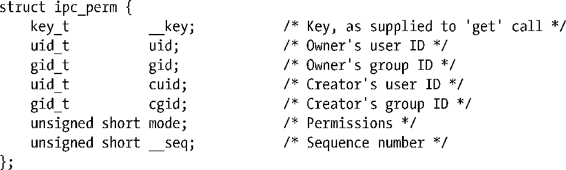

### 45.3　关联数据结构和对象权限

内核为System V IPC对象的每个实例都维护着一个关联数据结构。这个数据结构的形式因IPC机制（消息队列、信号量、或共享内存）的不同而不同，它是在各个IPC机制（参见表45-1）对应的头文件中进行定义的。在后续的章节中将会详细介绍各种机制的关联数据结构的细节信息。

一个IPC对象的关联数据结构会在通过相应的get系统调用创建对象时进行初始化。对象一旦被创建之后，程序就可以通过指定IPC_STAT操作类型使用合适的ctl系统调用来获取这个数据结构的一个副本。使用IPC_SET操作能够修改这个数据结构中的部分数据。

除了各种IPC对象特有的数据之外，所有三种IPC机制的关联数据结构都包含一个子结构ipc_perm，它保存了用于确定对象之上的权限的信息。

SUSv3要求ipc_perm结构中除__key和__seq字段之外的所有其他字段都要具备。大多数UNIX实现都提供了相应的字段。

uid和gid字段指定了IPC对象的所有权。cuid和cgid字段保存着创建该对象的进程的用户ID和组ID。一开始，相应的用户和创建者ID字段的值是一样的，它们都源自调用进程的有效ID。创建者ID是不可变的，而所有者ID则可以通过IPC_SET操作进行修改。下面的代码演示了如何修改共享内存段的uid字段（关联数据结构的类型是shmid_ds）。

ipc_perm子结构的mode字段保存着IPC对象的权限掩码。这些权限是使用在创建该对象的get系统调用中指定的flags参数的低9位初始化的，但后面使用IPC_SET操作则可以修改这个字段的值。

与文件一样，权限被分成了三类——owner（也称为user）、group以及other——并且可以为各个类别指定不同的权限。但IPC对象的权限模型与文件权限模型存在一些显著差别。

+ 对于IPC对象来讲只有读和写权限有意义。（对于信号量来讲，写权限通常被称为修改（alter）权限。）执行权限是没有意义的，在执行大多数访问检测时通常会忽略这个权限。
+ 权限检测会根据进程的有效用户ID、有效组ID以及辅助组ID来进行。（这与Linux上文件系统权限检测不同，它使用的是进程的文件系统ID，具体可参考9.5节。）

IPC对象上的进程权限分配的准确规则如下。

1．如果进程是特权进程（CAP_IPC_OWNER），那么所有权限都会被赋予IPC对象。

2．如果进程的有效用户ID与IPC对象的所有者或创建者ID匹配，那么会将对象的owner（user）的权限赋予进程。

3．如果进程的有效用户ID或任意一个辅助组ID与IPC对象的所有者组ID或创建者组ID匹配，那么会将对象的group的权限赋予进程。

4．否则会将对象的other的权限赋予进程。

> 在内核代码中，只有当一个进程没有通过其他测试被赋予所需的权限时才会去测试该进程是否是一个特权进程。之所以这样做是为了避免不必要地设置ASU进程记录标记，该标记用于指示进程是否使用超级用户权限（参见28.1节）。
> 注意IPC_PRIVATE key值的使用和IPC_EXCL标记的存在不会影响进程对IPC对象的访问，这种访问权限只由对象的所有者和权限来确定。

如何解释一个对象的读和写权限以及是否需要这些权限依赖于对象的类型以及所执行的操作。

当需获取一个既有IPC对象的标识符而执行一个get调用时会进行初次权限检测以确定在flags参数中指定的权限与既有对象上的权限是否匹配。如果不匹配，那么get调用会失败并返回EACCES错误。（除非特别指出，在下面列出的所有权限被拒绝的例子中都会返回这个错误码。）为说明问题，考虑同一组中的两个不同用户，其中一个用户使用了下面的调用创建了一个消息队列。

当第二个用户尝试使用下面的调用获取这个消息队列的标识符时会失败，因为用户没有在消息队列上的写权限。

第二个用户可以通过将msgget()调用的第二个参数指定为0来绕过这种检测，这样就只有当程序试图执行一个需要IPC对象上的写权限的操作（如使用msgsnd()写入一条消息）时才会发生错误。

> get调用代表了忽略执行权限的一种情况。尽管这种权限对于IPC对象来讲没有意义，但如果在一个既有对象上的get调用中要求执行权限，那么就会检测进程是否具备这个权限。

其他常见操作所需的权限如下所述。

+ 从对象中获取信息（如从消息队列中读取一条消息，获取一个信号量的值，或因读取而附上一个共享内存段）需要读权限。
+ 更新对象中的信息（如向消息队列写入一条消息，修改一个信号量的值，或因写入而附上一个共享内存段）需要写权限。
+ 获取一个IPC对象的关联数据结构的副本（IPC_STAT ctl操作）需要读权限。
+ 删除一个IPC对象（IPC_RMID ctl操作）或修改其关联数据结构（IPC_SET ctl操作）不需要读或写权限，相反，调用进程必须是特权进程（CAP_SYS_ADMIN）或有效用户ID与对象的所有者用户ID或创建者用户ID匹配（否则返回错误EPERM）。

> 可以设置一个IPC对象的权限使得所有者或创建者不能再使用IPC_STAT获取包含对象权限信息的关联数据结构（这意味着使用45.6节中介绍的ipcs(1)命令无法打印出这个对象），但仍然可以使用IPC_SET修改它们。

其他各种机制特有的操作需要读或写权限或CAP_IPC_OWNER能力。在后面章节中讨论各种操作时将会介绍它们所需的权限。

