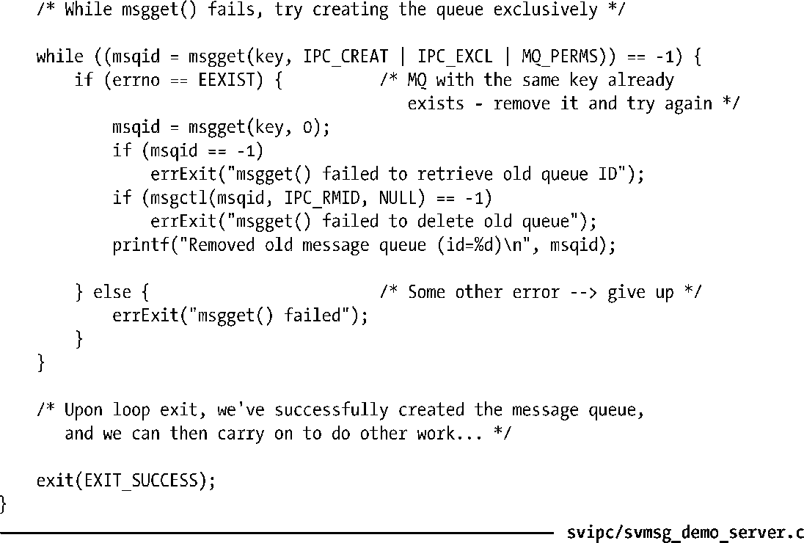

### 45.4　IPC标识符和客户端/服务器应用程序

在客户端/服务器应用程序中，服务器通常会创建System V IPC对象，而客户端则仅仅需要访问它们。换句话说，服务器在执行get调用时需要指定IPC_CREAT标记，而客户端在get调用中则会省略这个标记。

假设一个客户端参与了服务器的一个延伸会话，其中每个进程会执行多个IPC操作（如交换多条消息、一组信号量操作、或多次更新共享内存）。如果服务器进程崩溃或故意停止然后重启会发生什么情况呢？这时，盲目地重用由前一个服务器进程创建的IPC对象是毫无意义的，因为新服务器进程不清楚与IPC对象的当前状态相关的历史信息。（如消息队列中可能存在客户端因响应老的服务器进程之前发送的一条消息而发出的第二个请求。）

在这种情况下，服务器唯一可做的事情可能就是丢弃所有既有的客户端、删除由上一个服务器进程创建的IPC对象、创建IPC对象的新实例。新启动的服务器首先会通过在get调用中同时指定IPC_CREAT和IPC_EXCL标记创建一个IPC对象来处理服务器的上一个实例非正常终止的情况。如果get调用因具备指定key的对象已存在而失败，那么服务器就认为老的服务器进程之前创建了该对象，因此它会使用IPC_RMID ctl操作删除这个对象，然后再次执行一个get调用来创建对象。（这组步骤可能会与其他诸如确保另一个服务器进程当前不在运行之类的步骤组合起来使用，具体可参见55.6节。）程序清单45-1给出了一个消息队列可能需要执行的步骤。

程序清单45-1：清理服务器中的IPC对象

尽管重新启动的服务器会重新创建IPC对象，但如果在创建新IPC对象时将同样的key传递给get调用，那么总是会生成同样的标识符。读者可以从客户端的角度来考虑一下这个问题的解决方案。如果服务器重新创建的IPC对象使用了同样的标识符，那么客户端就无法知道服务器已经重启并且IPC对象已经不包含预期的历史信息了。

为解决这个问题，内核采用了一个算法（下一节描述），通常能够确保在创建新IPC对象时，对象会得到一个不同的标识符，即使传入的key是一样的。其结果是所有与老的服务器进程连接的客户端在使用旧的标识符时会从相关的IPC系统调用中收到一个错误。

> 程序清单45-1中的解决方案并没有完全解决在使用System V共享内存时识别出服务器重启的问题，因为共享内存对象只有在所有进程都与其虚拟地址空间分离之后才会被删除。但共享内存对象通常与System V信号量组合使用，而它们则会在IPC_RMID操作中立即被删除。这意味着客户端在试图访问被删除的信号量对象时能够知道服务器重启这件事情。

