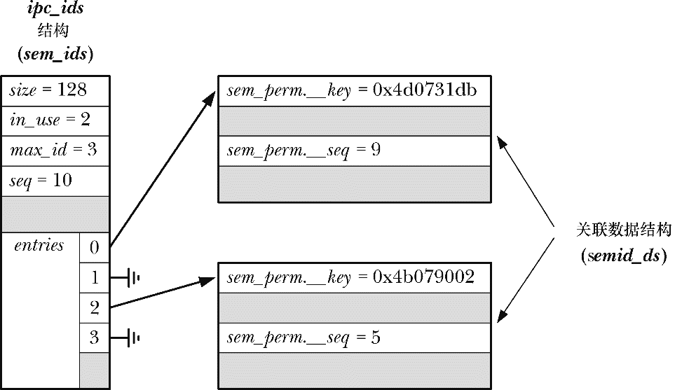

### 45.5　System V IPC get调用使用的算法

图45-1给出了内核内部使用的一些表示System V IPC对象（本例中是信号量，但细节方面与其他IPC机制类似）相关信息的结构，包括用于计算IPC key的字段。对于每种IPC机制（共享内存、消息队列、或信号量），内核都会维护一个关联的ipc_ids结构，它记录着该IPC机制的所有实例的各种全局信息，包括一个大小会动态变化的指针数组entries，数组中的每个元素指向一个对象实例的关联数据结构（在信号量中是semid_ds结构）。entries数组的当前大小记录在size字段中，max_id字段记录着当前使用中的元素的最大下标。

<b class="my_markdown">图45-1：用于表示System V IPC（信号量）对象的内核数据结构</b>

在执行一个IPC get调用时，Linux所采用的算法近似如下（其他系统使用了类似的算法）。

**1．** 在关联数据结构列表（entries数组中的元素指向的结构）中搜索key字段与get调用中指定的参数匹配的结构。

（a）如果没有找到匹配的结构并且没有指定IPC_CREAT，那么返回ENOENT错误。

（b）如果找到了一个匹配的结构，但同时指定了IPC_CREAT和IPC_EXCL，那么返回EEXIST错误。

（c）否则在找到一个匹配的结构的情况下跳过下面的步骤。

**2．** 如果没有找到匹配的结构并且指定了IPC_CREAT，那么会分配一个新的与所采用的机制对应的关联数据结构（在图45-1中是semid_ds）并对其进行初始化。在这个操作中还会更新ipc_ids结构中的各个字段，并且可能还会重新设定entries数组的大小。指向新结构的指针会被放在entries中第一个未被占用的位置处。在这个初始化的过程中包含两个子步骤。

（a）传递给get调用的key值被复制到新分配的结构的xxx_perm.__key字段中。

（b）ipc_ids结构中seq字段的当前值被复制到关联数据结构的xxx_perm.__seq字段中，将seq字段的值加1。

**3．** 使用下面的公式计算IPC对象的标识符。

在用于计算IPC标识符的公式中，index表示对象实例在entries数组中的下标，SEQ_MULTIPLIER是一个值为32768的常数（内核源文件include/linux/ipc.h中的IPCMNI）。如在图45-1中，key值为0x4b079002的信号量生成的标识符为(2 + 5 * 32768) = 163842。

对于get调用所采用的算法需要注意下列几点。

+ 即使使用同样的key创建了一个新IPC对象也几乎可以肯定对象被分配到的标识符是不同的，因为标识符的计算是根据保存在关联数据结构中的seq字段的值来进行的，而在同种类型的对象的创建过程中都会递增这个值。

> 内核所采用的算法在seq的值达到(INT_MAX / IPCMNI)——即2147483647 / 32768 = 65535——时会将seq的值重置为0。因此如果在系统运行期间已经创建了65535个对象，那么新IPC对象可能会与之前的对象拥有同样的标识符，从而导致新对象会重用之前的对象在entries数组中的位置（即在系统运行期间必须要释放之前的对象）。但发生这种情况的可能性非常小。

+ 算法为entries数组的每个下标都生成一组不同的标识符值。
+ 由于常量IPCMNI为每种类型的System V对象的数量设定了一个上限，因此算法确保所有既有IPC对象都拥有一个唯一的标识符。
+ 给定一个标识符值，使用下面这个等式可以快速计算出它在entries数组中对应的下标。

能够快速地执行这种计算对于那些接收IPC对象标识符的IPC系统调用（即表45-1中除get调用的其他调用）的高效执行来讲是有必要的。

顺便提一下，当一个进程在执行一个IPC系统调用（如msgctl()、semop()、或shmat()）时传入了一个与既有对象不匹配的标识符，那么就会导致两个错误的发生。如果entries中相应下标处是空的，那么将会导致EINVAL错误的发生。如果下标指向了一个关联数据结构，但存储在该结构中的序号导致不会产生同样的标识符值，那么就假设这个数组下标指向的旧对象已经被删除了，该下标会被重用。通过错误EIDRM可以诊断出这种情况的发生。

