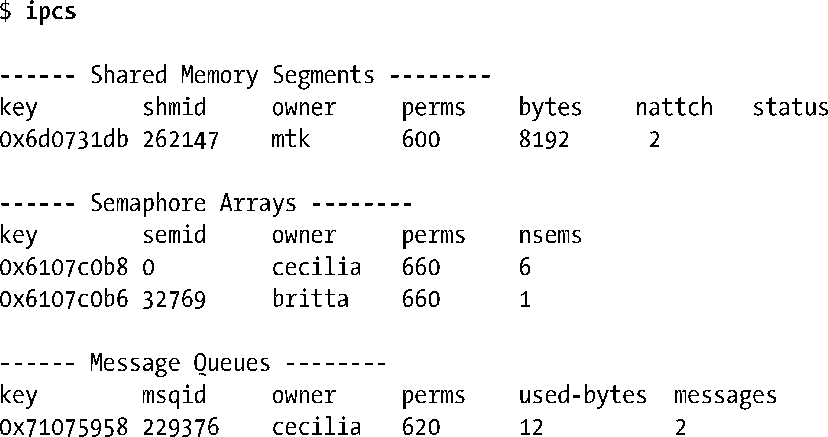

### 45.6　ipcs和ipcrm命令

ipcs和ipcrm命令是System V IPC领域中类似于ls和rm文件命令的命令。使用ipcs能够获取系统上IPC对象的信息。在默认情况下，ipcs会显示出所有对象，如下面的例子所示。

在Linux上，ipcs(1)只显示出拥有读权限的IPC对象的信息，而不管是否拥有这些对象。在一些UNIX实现上，ipcs的行为与它在Linux上的行为一样，但在其他实现上，ipcs会显示出所有对象，不管当前用户是否拥有这些对象上的读权限。

在默认情况下，ipcs会显示出每个对象的key、标识符、所有者以及权限（用一个八进制数字表示），后面跟着对象所特有的信息。

+ 对于共享内存，ipcs会显示出共享内存区域的大小、当前将共享内存区域附加到自己的虚拟地址空间的进程数以及状态标记。状态标记标识出了区域是否被锁进了RAM以防止交换（参见48.7节）以及在所有进程都与该区域分离之后是否已经将其标记为待销毁了。
+ 对于信号量，ipcs会显示出信号集的大小。
+ 对于消息队列，ipcs会显示出队列中数据占据的字节总数以及消息数量。

ipcs(1)手册对各种能够显示IPC对象的其他信息的选项进行了说明。

ipcrm命令删除一个IPC对象。这个命令的常规形式为下面两种形式中的一种。

在上面给出的命令中既可以将一个IPC对象的key指定为参数key，也可以将一个IPC对象的标识符指定为参数id并且使用小写的x替换其大写形式或使用小写的q（用于消息队列）或s（用于信号量）或m（用于共享内存）。因此使用下面的命令可以删除标识符为65538的信号量集。

