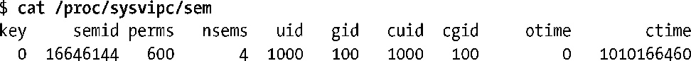

### 45.7　获取所有IPC对象列表

Linux提供了两种获取系统上所有IPC对象列表的非标准方法。

+ /proc/sysvipc目录中的文件会列出所有IPC对象。
+ 使用Linux特有的ctl调用。

本节将会介绍/proc/sysvipc目录中的文件，在46.6节将会对ctl调用进行介绍，并提供一个示例程序来列出系统上所有System V消息队列。

> 其他一些UNIX实现提供了它们自己的用于获取所有IPC标识符列表的非标准方法，如Solaris为此提供了msgids()、semids()以及shmids()系统调用。

/proc/sysvipc目录中三个只读文件提供的信息与通过ipcs获取的信息是一样的。

+ /proc/sysvipc/msg列出所有消息队列及其特性。
+ /proc/sysvipc/sem列出所有信号量集及其特性。
+ /proc/sysvipc/shm列出所有共享内存段及其特性。

与ipcs命令不同，这些文件总是会显示出相应种类的所有对象，不管是否在这些对象上拥有读权限。

下面给出了一个示例/proc/sysvipc/sem文件的内容（为符合版面的要求，这里删除了一些空格）。

这三个/proc/sysvipc文件为程序和脚本提供了一种遍历给定种类的所有既有IPC对象的方法（不可移植）。

> 获取给定种类的所有IPC对象的最佳可移植的做法是解析ipcs(1)的输出。

