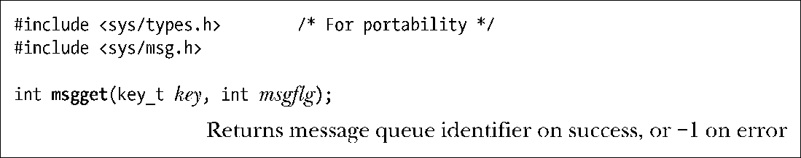
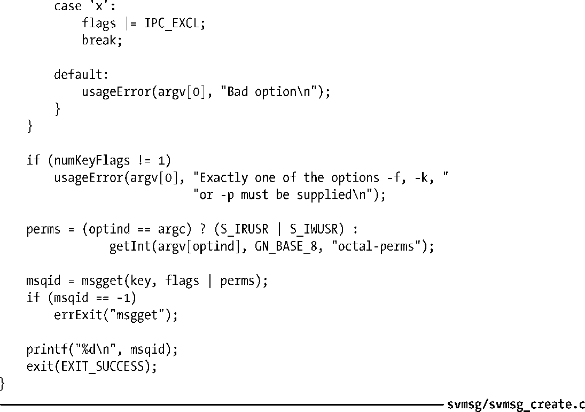

### 46.1　创建或打开一个消息队列

msgget()系统调用创建一个新消息队列或取得一个既有队列的标识符。

key参数是使用45.2节中描述的方法之一生成的一个键（即通常是值IPC_PRIVATE或ftok()返回的一个键）。msgflg参数是一个指定施加于新消息队列之上的权限或检查一个既有队列的权限的位掩码。此外，在msgflg参数中还可以将下列标记中的零个或多个标记取OR（|）以控制msgget()的操作。

##### IPC_CREAT

如果没有与指定的key对应的消息队列，那么就创建一个新队列。

##### IPC_EXCL

如果同时还指定了IPC_CREAT并且与指定的key对应的队列已经存在，那么调用就会失败并返回EEXIST错误。

在45.1节中对这些标记进行了详细描述。

msgget()系统调用首先会在所有既有消息队列中搜索与指定的键对应的队列。如果找到了一个匹配的队列，那么就会返回该对象的标识符（除非在msgflg中同时指定了IPC_CREAT和IPC_EXCL，那样的话就返回一个错误）。如果没有找到匹配的队列并且在msgflg中指定了IPC_CREAT，那么就会创建一个新队列并返回该队列的标识符。

程序清单46-1为msgget()系统调用提供了一个命令行界面。这个程序允许使用命令行选项和参数来指定传递给msgget()调用的key和msgflg参数的所有组合。usageError()函数给出了这个程序所接受的命令格式的细节信息。在成功创建队列之后，这个程序会打印出队列标示符。46.2.2节将会演示这个程序的用法。

程序清单46-1：使用msgget()

