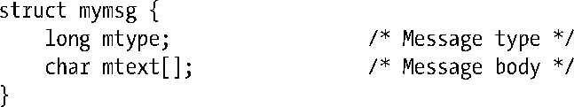

### 46.2　交换消息

msgsnd()和msgrcv()系统调用执行消息队列上的I/O。这两个系统调用接收的第一个参数是消息队列标识符（msqid）。第二个参数msgp是一个由程序员定义的结构的指针，该结构用于存放被发送或接收的消息。这个结构的常规形式如下。

这个定义仅仅简要地说明了消息的第一个部分包含了消息类型，它用一个类型为long的整数来表示，而消息的剩余部分则是由程序员定义的一个结构，其长度和内容可以是任意的，而无需是一个字符数组。因此mgsp参数的类型为void *，这样就允许传入任意结构的指针了。

mtext字段长度可以为零，当对于接收进程来讲所需传递的信息仅通过消息类型就能表示或只需要知道一条消息本身是否存在时，这种做法有时候就变得非常有用了。

