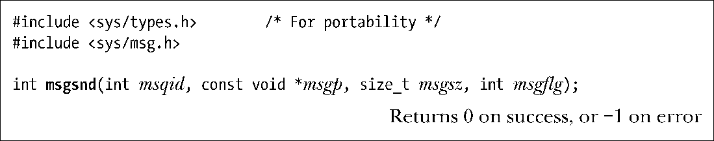
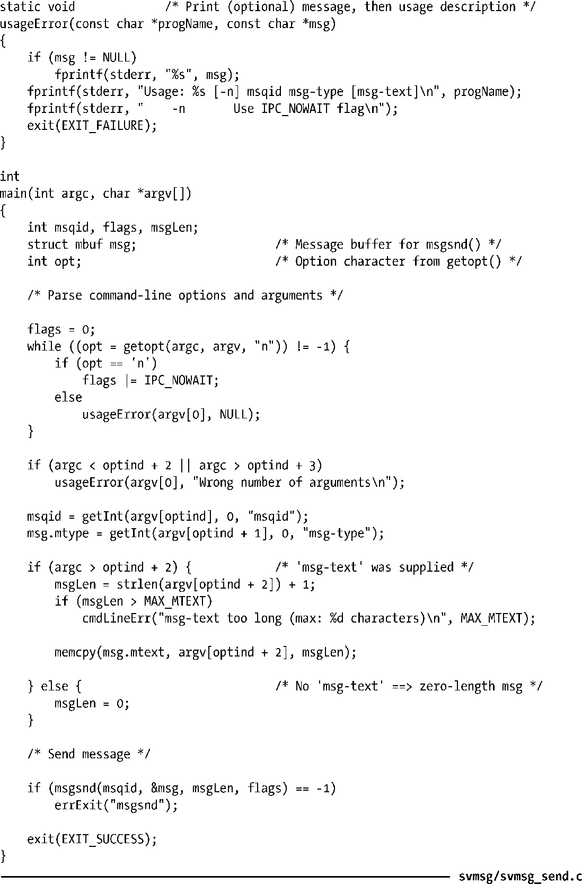

### 46.2.1　发送消息

msgsnd()系统调用向消息队列写入一条消息。

使用msgsnd()发送消息必须要将消息结构中的mtype字段的值设为一个大于0的值（在下一节讨论msgrcv()时会介绍这个值的用法）并将所需传递的信息复制到程序员定义的mtext字段中。msgsz参数指定了mtext字段中包含的字节数。

> 在使用msgsnd()发送消息时并不存在write()所具备的部分写的概念。这也是成功的msgsnd()只需要返回0而不是所发送的字节数的原因。

最后一个参数msgflg是一组标记的位掩码，用于控制msgsnd()的操作，目前只定义了一个这样的标记。

##### IPC_NOWAIT

执行一个非阻塞的发送操作。通常，当消息队列满时，msgsnd()会阻塞直到队列中有足够的空间来存放这条消息。但如果指定了这个标记，那么msgsnd()就会立即返回EAGAIN错误。

当msgsnd()调用因队列满而发生阻塞时可能会被信号处理器中断。当发生这种情况时，msgsnd()总是会返回EINTR错误。（在21.5节中曾指出过msgsnd()系统调用永远不会自动重启，不管在建立信号处理器时是否设置了SA_RESTART标记。）

向消息队列写入消息要求具备在该队列上的写权限。

程序清单46-2为msgsnd()系统调用提供了一个命令行界面。usageError()函数显示了这个程序接受的命令行格式。注意这个程序没有使用msgget()系统调用。（在45.1节中讲过一个进程无需使用get调用来访问一个IPC对象。）相反，这里通过将消息队列标识符设定为命令行参数的值来指定消息队列。在46.2.2节中将会演示这个程序的用法。

程序清单46-2：使用msgsnd()发送一条消息

