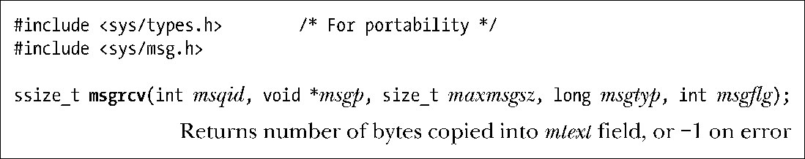
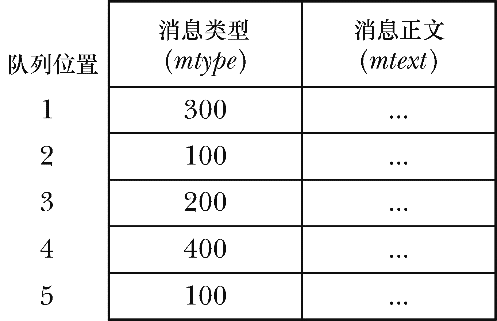
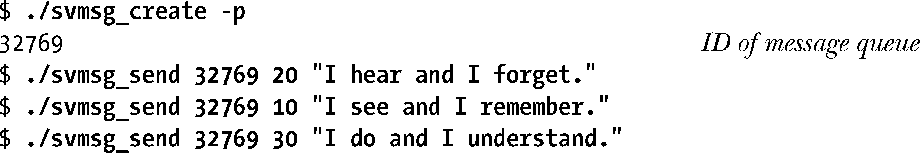
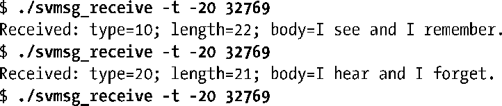
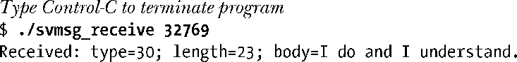
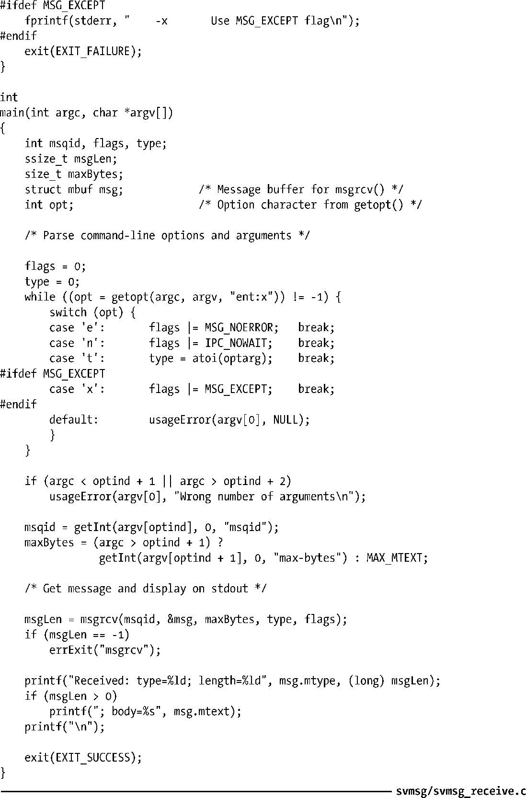

### 46.2.2　接收消息

msgrcv()系统调用从消息队列中读取（以及删除）一条消息并将其内容复制进msgp指向的缓冲区中。

msgp缓冲区中mtext字段的最大可用空间是通过maxmsgsz参数来指定的。如果队列中待删除的消息体的大小超过了maxmsgsz字节，那么就不会从队列中删除消息，并且msgrcv()会返回错误E2BIG。（这是默认行为，可以使用MSG_NOERROR标记来改变这种行为，稍后就会对此进行介绍。）

读取消息的顺序无需与消息被发送的一致。可以根据mtype字段的值来选择消息，而这个选择过程是由msgtyp参数来控制的，具体如下所述。

+ 如果msgtyp等于0，那么会删除队列中的第一条消息并将其返回给调用进程。
+ 如果msgtyp大于0，那么会将队列中第一条mtype等于msgtyp的消息删除并将其返回给调用进程。通过指定不同的msgtyp值，多个进程能够从同一个消息队列中读取消息而不会出现竞争读取同一条消息的情况。比较有用的一项技术是让各个进程选取与自己的进程ID匹配的消息。
+ 如果msgtyp小于0，那么就会将等待消息当成优先队列来处理。队列中mtype最小并且其值小于或等于msgtyp的绝对值的第一条消息会被删除并返回给调用进程。

下面通过一个例子将讲解msgtyp小于0时的情况。假设一个消息队列包含了图46-1中显示的一组消息，接着执行一系列的msgrcv()调用，其形式如下。

这些msgrcv()调用会按照2（类型为100）、5（类型为100）、3（类型为200）、1（类型为300）的顺序读取消息。后续的调用会阻塞，因为剩余的消息的类型（400）超过了300。

msgflg参数是一个位掩码，它的值通过将下列标记中的零个或多个取OR来确定。

##### IPC_NOWAIT

执行一个非阻塞接收。通常如果队列中没有匹配msgtyp的消息，那么msgrcv()会阻塞直到队列中存在匹配的消息为止。指定IPC_NOWAIT标记会导致msgrcv()立即返回ENOMSG错误。（返回EAGAIN错误会使一致性更强一点，因为非阻塞的msgsnd()和FIFO中的非阻塞读取也是返回这个错误，但之所以返回ENOMSG错误是存在历史原因的，SUSv3也要求返回ENOMSG。）

##### MSG_EXCEPT

只有当msgtyp大于0时这个标记才会起作用，它会强制对常规操作进行补足，即将队列中第一条mtype不等于msgtyp的消息删除并将其返回给调用者。这个标记是Linux特有的，只有当定义了_GNU_SOURCE之后才会在<sys/msg.h>中提供这个标记。在图46-1中给出的消息队列上执行一系列形式为msgrcv(id, &msg, maxmsgsz, 100, MSG_EXCEPT)的调用将会按照1、3、4顺序读取消息，之后发生阻塞。

<b class="my_markdown">图46-1：包含不同类型的消息的示例消息队列</b>

##### MSG_NOERROR

在默认情况下，当消息的mtext字段的大小超过了可用空间时（由maxmsgsz参数定义），msgrcv()调用会失败。如果指定了MSG_ NOERROR标记，那么msgrcv()将会从队列中删除消息并将其mtext字段的大小截短为maxmsgsz字节，然后将消息返回给调用者。被截去的数据将会丢失。

msgrcv()成功完成之后会返回接收到的消息的mtext字段的大小，发生错误时则返回−1。

与msgsnd()一样，如果被阻塞的msgrcv()调用被一个信号处理器中断了，那么调用会失败并返回EINTR错误，不管在建立信号处理器时是否设置了SA_RESTART标记。

从消息队列中读取消息需要具备在队列上的读权限。

#### 示例程序

程序清单46-3为msgrcv()系统调用提供了一个命令行界面。usageError()函数显示了这个程序接受的命令行格式。与程序清单46-2中演示msgsnd()的用法的程序一样，这个程序也没有使用msgget()系统调用，相反它需要在命令行参数中传入一个消息队列标识符。

下面的shell会话演示了程序清单46-1、程序清单46-2、程序清单46-3中的程序的用法。这里首先使用IPC_PRIVATE键创建了一个消息队列，然后向队列中写入了三条不同类型的消息。

接着使用程序清单46-3中的程序从队列中读取类型小于或等于20的消息。

上面最后一条命令会阻塞，因为队列中已经没有类型小于或等于20的消息了。因此需要输入Control-C来终止这个命令，然后执行一个从队列中读取任意类型的消息的命令。

程序清单46-3：使用msgrcv()读取一条消息

