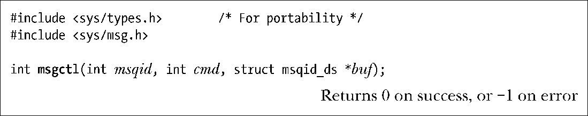
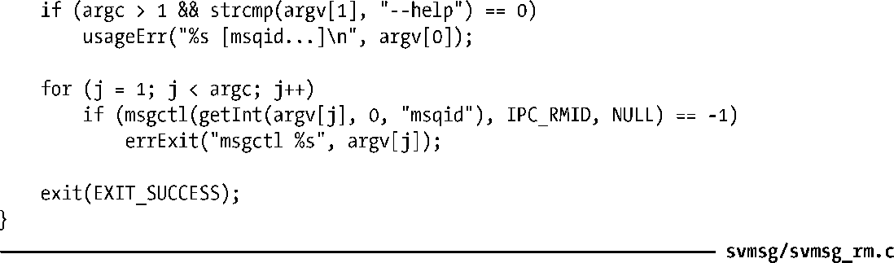

### 46.3　消息队列控制操作

msgctl()系统调用在标识符为msqid的消息队列上执行控制操作。

cmd参数指定了在队列上执行的操作，其取值是下列值中的一个。

##### IPC_RMID

立即删除消息队列对象及其关联的msqid_ds数据结构。队列中所有剩余的消息都会丢失，所有被阻塞的读者和写者进程会立即醒来，msgsnd()和msgrcv()会失败并返回错误EIDRM。这个操作会忽略传递给msgctl()的第三个参数。

##### IPC_STAT

将与这个消息队列关联的msqid_ds数据结构的副本放到buf指向的缓冲区中。在46.4节将会介绍msqid_ds结构。

##### IPC_SET

使用buf指向的缓冲区提供的值更新与这个消息队列关联的msqid_ds数据结构中被选中的字段。

45.3节介绍了更多有关这些操作的细节，包括调用进程所需的特权和权限。46.6节将会介绍cmd可取的其他一些值。

程序清单46-4演示了如何使用msgctl()来删除一个消息队列。

程序清单46-4：删除System V消息队列

