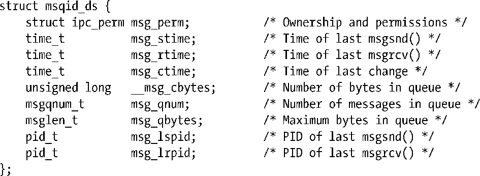
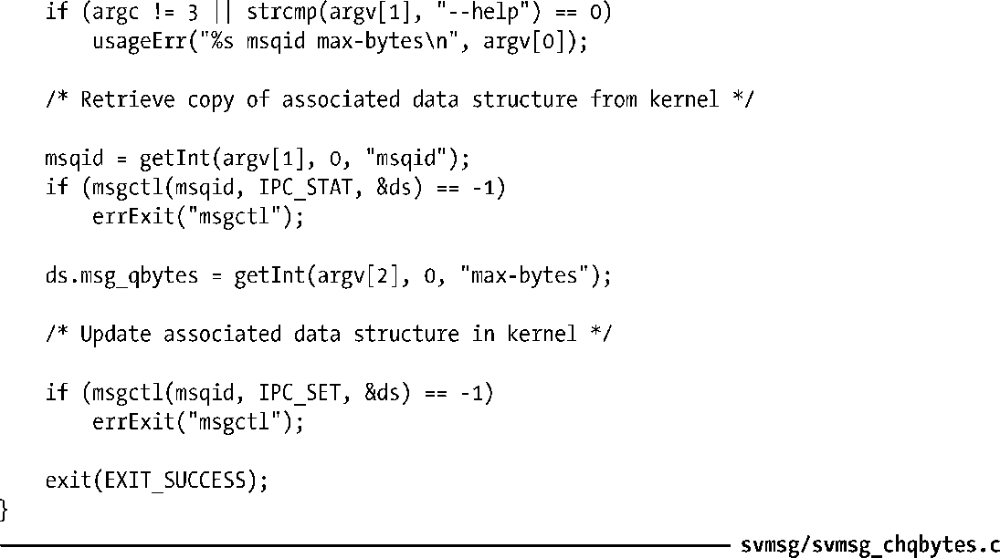

### 46.4　消息队列关联数据结构

每个消息队列都有一个关联的msqid_ds数据结构，其形式如下。

> 名称msqid_ds中的缩写msg会令程序员感到糊涂。只有这一个消息队列接口使用这种拼写方式。

msgqnum_t和msglen_t数据类型——用于定义msg_qnum和msg_qbytes字段的类型——在SUSv3中被规定为无符号整型。

各种消息队列系统调用会隐式地更新msqid_ds结构中的字段，使用msgctl() IPC_SET操作则可以显式地更新其中一些字段。细节信息如下。

##### msg_perm

在创建消息队列之后会按照45.3节中描述的那样初始化这个子结构中的字段。uid、gid以及mode子字段可以通过IPC_SET来更新。

##### msg_stime

在队列被创建之后这个字段会被设置为0；后续每次成功的msgsnd()调用都会将这个字段设置为当前时间。这个字段和msqid_ds结构中其他时间戳字段的类型都是time_t；它们存储自新纪元到现在的秒数。

##### msg_rtime

在消息队列被创建之后这个字段会被设置为0，然后每次成功的msgrcv()调用都会将这个字段设置为当前时间。

##### msg_ctime

当消息队列被创建或成功执行了IPC_SET操作之后会将这个字段设置为当前时间。

##### __msg_cbytes

当消息队列被创建之后会将这个字段设置为0，后续每次成功的msgsnd()和msgrcv()调用都会对这个字段进行调整以反映出队列中所有消息的mtext字段包含的字节数总和。

##### msg_qnum

当消息队列被创建之后会将这个字段设置为0，后续每次成功的msgsnd()调用会递增这个字段的值并且每次成功的msgrcv()调用会递减这个字段的值以便反映出队列中的消息总数。

##### msg_qbytes

这个字段的值为消息队列中所有消息的mtext字段的字节总数定义了一个上限。在队列被创建之后会将这个字段的值初始化为MSGMNB。特权（CAP_SYS_RESOURCE）进程可以使用IPC_SET操作将msg_qbytes的值调整为0字节到INT_MAX（32位平台上是2147483647）字节之间的任意一个值。特权用户可以修改Linux特有的/proc/sys/kernel/msgmnb文件中包含的值以修改所有后续创建的消息队列的初始msg_qbytes设置以及非特权进程后续对msg_qbytes修改时所能设置的上限。46.5节将会介绍更多有关消息队列限制方面的内容。

##### msg_lspid

当队列被创建之后会将这个字段设置为0，后续每次成功的msgsnd()调用会将其设置为调用进程的进程ID。

##### msg_lrpid

当消息队列被创建之后会将这个字段设置为0，后续每次成功的msgrcv()调用会将其设置为调用进程的进程ID。

SUSv3对上面除__msg_cbytes字段之外的所有其他字段都进行了规定。而大多数UNIX实现都提供了一个与__msg_cbytes字段等价的字段。

程序清单46-5演示了如何使用IPC_STAT和IPC_SET操作来修改一个消息队列的msg_qbytes设置。

程序清单46-5：修改一个System V消息队列的msg_qbytes设置

