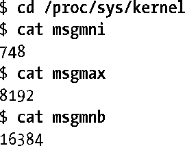
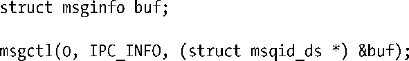

### 46.5　消息队列的限制

大多数UNIX实现会对System V消息队列的操作施加各种各样的限制。下面会对Linux系统上的限制进行介绍并指出其与其他UNIX实现之间的差别。

Linux会对队列操作施加下列限制。括号中列出了限制所影响到的系统调用以及当达到限制时所产生的错误。

##### MSGMNI

这是系统级别的一个限制，它规定了系统中所能创建的消息队列标识符（换句话说是消息队列）的数量。（msgget()，ENOSPC）

##### MSGMAX

这是系统级别的一个限制，它规定了单条消息中最多可写入的字节数（mtext）。（msgsnd()，EINVAL）

##### MSGMNB

一个消息队列中一次最多保存的字节数（mtext）。这个限制是一个系统级别的参数，它用来初始化与消息队列相关联的msqid_ds数据结构的msg_qbytes字段。根据46.4节中的描述可以修改各个队列的msg_qbytes值。如果达到一个队列的msg_qbytes限制，那么msgsnd()会阻塞或在IPC_NOWAIT被设置时返回EAGAIN错误。

一些UNIX实现还定义了下列限制。

##### MSGTQL

这是系统级别的一个限制，它规定了系统中所有消息队列所能存放的消息总数。

##### MSGPOOL

这是系统级别的一个限制，它规定了用来存放系统中所有消息队列中的数据的缓冲池的大小。

尽管Linux没有规定上述限制，但它会根据队列的msg_qbytes限制来限制单个队列中的消息总数。只有当向队列写入长度为零的消息时才会涉及到这个限制，其效果是对向队列可写入的长度为零的消息的数量的限制与对向队列可写入的长度为1字节的消息的数量的限制是一样的。这样就能够防止向队列无限制地写入长度为零的消息。尽管这些消息不包含数据，但每个长度为零的消息都会消耗一小块内存以便系统进行簿记工作。

在系统启动的时候会将消息队列限制设置为默认值。不同版本的内核上的默认值是不同的。（一些发行厂商发行的内核中的默认设置与vanilla内核中的默认设置是不同的。）在Linux上可以通过/proc文件系统中的文件来查看和修改这些限制。表46-1显示了与各个限制对应的/proc文件。下面是一个x86-32系统上Linux 2.6.31内核中的默认限制。

<b class="my_markdown">表46-1：System V消息队列限制</b>

| 限　　制 | 上限值（x86-32） | /proc/sys/kernel中的对应文件 |
| :-----  | :-----  | :-----  | :-----  | :-----  |
| MSGMNI | MSGMAX | MSGMNB | 32768（IPCMNI） | 依赖于可用内存 | 2147483647（INT_MAX） | msgmni | msgmax | msgmnb |

表46-1中的上限值那一列显示了在x86-32架构上每个限制所能达到的最大值。注意尽管可以将MSGMNB限制的值设置为INT_MAX，但在消息队列中载入这么多的数据之前可能会达到其他一些限制（如缺少内存）。

Linux特有的msgctl() IPC_INFO操作能够获取一个类型为msginfo的结构，其中包含了各种消息队列限制的值。

有关IPC_INFO和msginfo结构的细节信息可以在msgctl(2)手册中找到。

