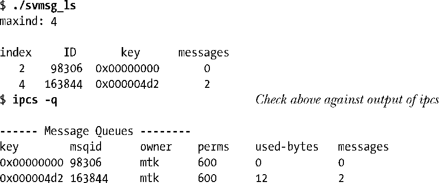
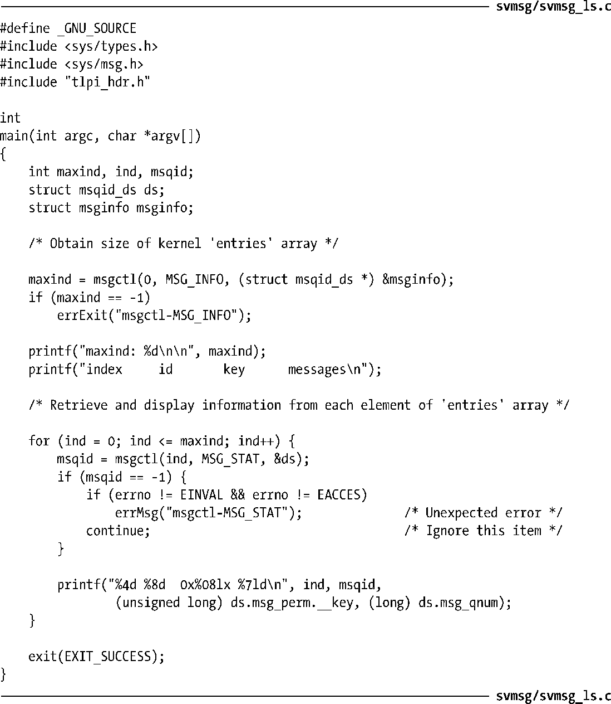

### 46.6　显示系统中所有消息队列

在45.7节中曾讲过一种获取系统中所有IPC对象列表的方法：通过/proc文件系统中的一组文件。下面介绍获取相同信息的第二种方法：通过Linux特有的一组IPC ctl（msgctl()、semctl()以及shmctl()）操作。（ipcs程序使用了这些操作。）这些操作如下。

+ MSG_INFO、SEM_INFO以及SHM_INFO：MSG_INFO操作完成两件事情。第一件事情是它将返回一个结构来详细描述系统上所有消息队列的资源消耗情况。第二件事情是作为ctl调用的函数结果，它将返回指向表示消息队列对象的数据结构的entries数组中最大项的下标（参见图45-1）。SEM_INFO和SHM_INFO操作分别对信号量集合共享内存段执行了类似的任务。要从相应的System V IPC头文件中获取这三个常量的定义就必须要定义_GNU_SOURCE特性测试宏。

> 本书随带的源代码中svmsg/svmsg_info.c文件中给出了一个使用MSG_INFO获取msginfo结构的例子，该结构包含了与所有消息队列对象所消耗的资源相关的信息。

+ MSG_STAT、SEM_STAT以及SHM_STAT：与IPC_STAT操作一样，这些操作获取一个IPC对象的关联数据结构，但它们之间存在两方面的不同。第一，与ctl调用的第一个参数为IPC标识符不同，这些操作的第一个参数是entries数组中的一个下标。第二，如果操作执行成功了，那么作为函数结果，ctl调用会返回与该下标对应的IPC对象的标识符。要从相应的System V IPC头文件中获取这三个常量的定义就必须要定义_GNU_SOURCE特性测试宏。

按照下面的步骤可以列出系统上所有消息队列。

**1．** 使用MSG_INFO操作找到消息队列的entries数组的最大下标（maxind）。

**2．** 执行一个循环，对0到maxind（包含）之间的每一个值都执行一个MSG_STAT操作。在循环过程中忽略因entries数组中的元素为空而发生的错误（EINVAL）以及在数组中元素所引用的对象上不具备相应的权限而发生的错误（EACCES）。

程序清单46-6按照上面的步骤实现了对消息队列的处理。下面的shell会话日志演示了这个程序的用法。

程序清单46-6：显示系统上所有System V消息队列

