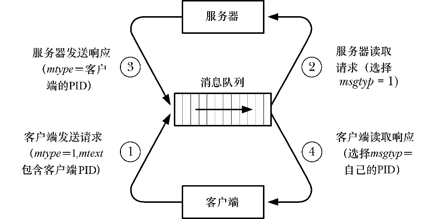

### 46.7　使用消息队列实现客户端-服务器应用程序

在客户端-服务器应用程序设计中使用System V消息队列的方式有很多种，本节将介绍其中两种。

+ 在服务器和客户端之间使用单个消息队列进行双向消息交换。
+ 服务器和各个客户端使用单独的消息队列，服务器上的队列用来接收进入的客户端请求，相应的响应则通过各个客户端队列来发送给客户端。

至于选择何种方法依赖于应用程序的需求，稍后介绍可能会影响到决策的其中一些因素。

#### 服务器和客户端使用一个消息队列

当服务器与客户端之间交换的消息大小较小时使用一个消息队列是合适的，但需要注意以下几点。

+ 由于多个进程可能会同时读取消息，因此必须要使用消息类型（mtype）字段来让各个进程只选择那些发给自己的消息。完成这个任务的一种方法是将客户端的进程ID作为服务器发送给客户端的消息的消息类型。客户端可以将其进程ID作为消息的一部分发送给服务器。此外，发送给服务器的消息也必须要能够使用唯一的消息类型来加以区分，而这可以使用数字1来完成，因为1是永远运行着的init进程的进程ID，客户端进程的进程ID永远都不可能为这个值。（另一种方法是将服务器的进程ID作为消息类型，但客户端要获取这个信息就比较困难了。）图46-2给出了这种计数模型。

<b class="my_markdown">图46-2：在客户端-服务器IPC中使用单个消息队列</b>

+ 消息队列的容量是有限的，而这可能会导致一系列问题的发生。其中一个问题就是多个并行的客户端可能会填满消息队列，从而导致死锁的发生，即所有新客户端都无法提交请求，服务器在写入任何响应时会发生阻塞。另一个问题是行为不良或恶意的客户端可能不会读取服务器的响应，从而导致队列中充满了未被读取的消息，进而阻止了客户端和服务器之间的通信。（使用两个队列——一个用于存放客户端发送给服务器的消息，另一个用于存放服务器发送给客户端的消息——将会解决第一个问题，但无法解决第二个问题。）

#### 一个客户端使用一个消息队列

当需要交换的消息的大小较大或当使用单个消息队列可能会导致发生前面列出的问题时最好为每个客户端都使用一个消息队列（服务器也需要一个队列）。使用这种方法需要注意以下几点。

+ 每个客户端必须要创建自己的消息队列（通常使用IPC_PRIVATE键）并通知服务器队列的标识符，这通常通过将标识符作为客户端发送给服务器的消息的一部分来完成。
+ 系统对消息队列的数量是有限制的（MSGMNI），这个限制的默认值在一些系统上是非常低的。如果同时运行的客户端数量庞大，那么可能就需要提高这个限制的值。
+ 服务器应该允许出现客户端的消息队列不再存在的情况（可能是由于客户端不小心删除了队列）。

下一节将会对为每个客户端使用一个队列这种方法进行深入介绍。

