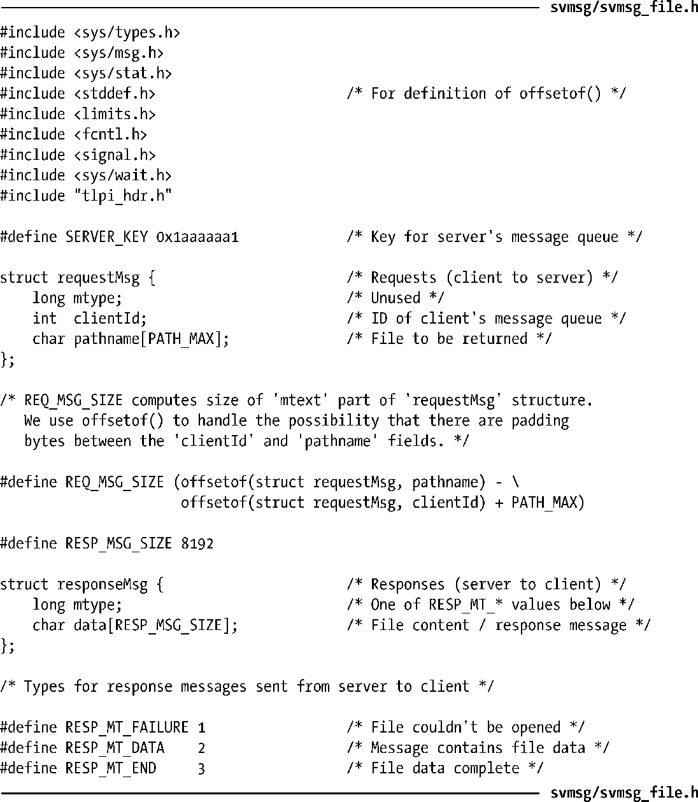
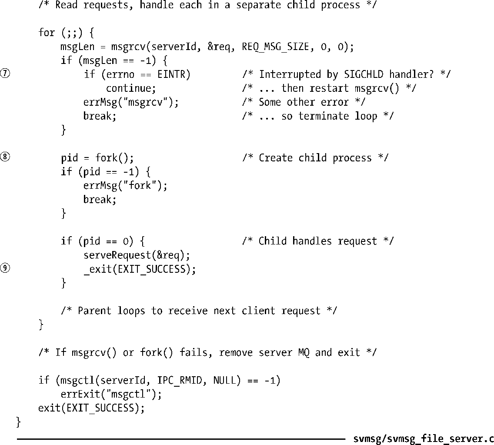
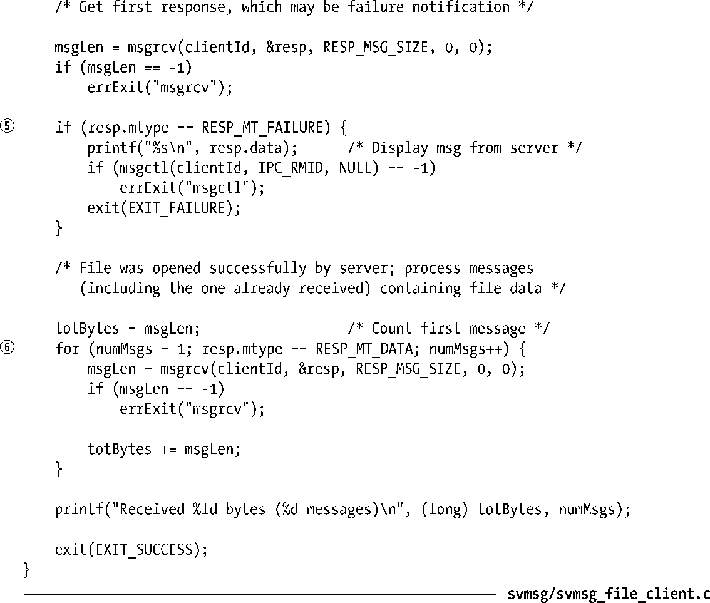
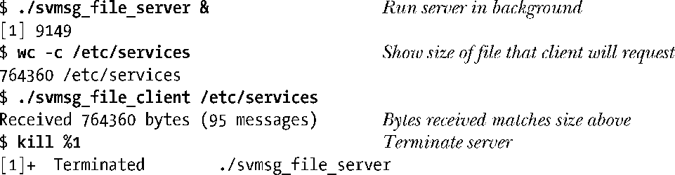

### 46.8　使用消息队列实现文件服务器应用程序

本节将介绍一个为每个客户端使用一个消息队列的客户端/服务器应用程序。这个应用程序是一个简单的文件服务器。客户端向服务器的消息队列发送一个请求消息请求指定名称的文件的内容。服务器将文件的内容作为一系列的消息返回到客户端私有的消息队列中。图46-3概览了该应用程序。

<b class="my_markdown">图46-3：一个客户端使用一个消息队列的客户端/服务器IPC</b>

由于服务器对客户端不做任何鉴权，因此所有使用客户端的用户都能够获取服务器所能访问的所有文件。更复杂一点的服务器会在返回请求的文件之前对客户端完成某种鉴权操作。

#### 公共头文件

程序清单46-7给出了服务器和客户端都需要包含的头文件。这个头文件为服务器的消息队列定义了一个众所周知的键（SERVER_KEY），并且定义了客户端和服务器之间传递的消息的格式。

requestMsg结构定义了客户端发送给服务器的请求格式。在这个结构中，mtext部分由两个字段构成：客户端消息队列的标识符和客户端请求的文件的路径名。常量REQ_MSG_SIZE等于这两个字段大小的总和，它在使用这个结构的msgsnd()调用中是作为msgsz参数使用的。

responseMsg结构定义了服务器返回给客户端的响应消息的格式。响应消息中的mtype字段提供了与消息内容有关的信息，其取值由RESP_MT_*常量规定。

程序清单46-7：svmsg_file_server.c和svmsg_file_client.c的公共头文件

#### 服务器程序

程序清单46-8给出了这个应用程序的服务器程序。有关服务器需要注意以下几点。

+ 服务器被设计成并发地处理请求。并发服务器设计最好像程序清单44-7中所做的那样采用迭代式设计，因为需要避免出现因一个客户端请求一个大文件而导致所有其他客户端请求等待的情况。
+ 每个客户端请求通过创建一个子进程返回请求的文件来完成⑧。同时，主服务器进程等待后续的客户端请求。有关服务器子进程需要注意以下几点。
      + 由于通过fork()创建的子进程会继承父进程栈的一个副本，因此它能够获取主服务器进程读取的请求消息的一个副本。
    + 服务器子进程在处理完相关的客户端请求之后会终止⑨。  
+ 为避免创建僵死进程（参见26.2节），服务器为SIGCHLD建立了一个处理器⑥并在处理器中调用了waitpid()①。
+ 父服务器进程中的msgrcv()调用可能会阻塞，其结果是可能会被SIGCHLD处理器中断。为处理这种情况，需要使用一个循环来完成EINTR错误发生之后的重启操作。
+ 服务器子进程执行serveRequest()函数②，该函数向客户端返回三种消息。mtype为RESP_MT_FAILURE时表示服务器无法打开请求的文件③；RESP_MT_DATA用来表示包含文件数据的一系列消息④；RESP_MT_END（data字段的长度为零）用来表示文件数据传输的结束⑤。

在练习46-4中将会考虑几种改进和扩展服务器程序的方法。

程序清单46-8：一个使用System V消息队列的文件服务器

#### 客户端程序

程序清单46-9给出了这个应用程序的客户端。有关客户端程序需注意以下几点。

+ 客户端使用IPC_PRIVATE键创建一个消息队列②并使用atexit()③建立了一个退出处理器①以确保在客户端退出时删除队列。
+ 客户端将其队列标识符以及所请求的文件的路径名打包在请求中传递给服务器④。
+ 客户端对服务器发送的第一个响应消息即为失败通知（mtype等于RESP_MT_FAILURE），这种情况的处理方式是打印服务器返回的错误消息并退出⑤。
+ 如果成功打开了文件，那么客户端会循环⑥接收包含文件内容的一系列消息（mtype等于RESP_MT_DATA）。整个循环过程在收到文件结束消息（mtype等于RESP_MT_END）之后结束。

这个简单的客户端并没有对由服务器故障而引起的各种情况进行处理。在练习46-5中将会考虑一些改进方案。

程序清单46-9：使用System V消息队列的文件服务器的客户端

下面的shell会话演示了程序清单46-8和程序清单46-9中的程序的使用。

