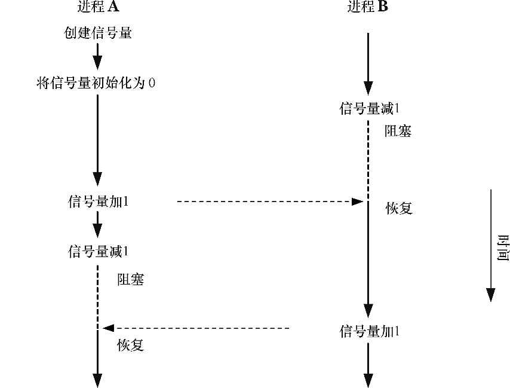

### 第47章　System V信号量

本章将介绍System V信号量。与上一章中介绍的IPC机制不同，System V信号量不是用来在进程间传输数据的。相反，它们用来同步进程的动作。信号量的一个常见用途是同步对一块共享内存的访问以防止出现一个进程在访问共享内存的同时另一个进程更新这块内存的情况。

一个信号量是一个由内核维护的整数，其值被限制为大于或等于0。在一个信号量上可以执行各种操作（即系统调用），包括：

+ 将信号量设置成一个绝对值；
+ 在信号量当前值的基础上加上一个数量；
+ 在信号量当前值的基础上减去一个数量；
+ 等待信号量的值等于0。

上面操作中的后两个可能会导致调用进程阻塞。当减小一个信号量的值时，内核会将所有试图将信号量值降低到0之下的操作阻塞。类似的，如果信号量的当前值不为0，那么等待信号量的值等于0的调用进程将会发生阻塞。不管是何种情况，调用进程会一直保持阻塞直到其他一些进程将信号量的值修改为一个允许这些操作继续向前的值，在那个时刻内核会唤醒被阻塞的进程。图47-1显示了使用一个信号量来同步两个交替将信号量的值在0和1之间切换的进程的动作。

<b class="my_markdown">图47-1　使用信号量同步两个进程</b>

在控制进程的动作方面，信号量本身并没有任何意义，它的意义仅由使用信号量的进程赋予其的关联关系来确定。一般来讲，进程之间会达成协议将一个信号量与一种共享资源关联起来，如一块共享内存区域。信号量还有其他用途，如在fork()之后同步父进程和子进程。（在24.5节中介绍了如何使用信号量来完成同样的任务。）

