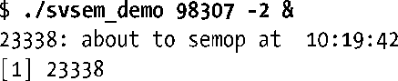
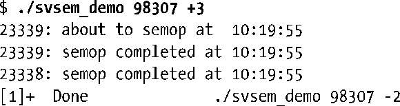
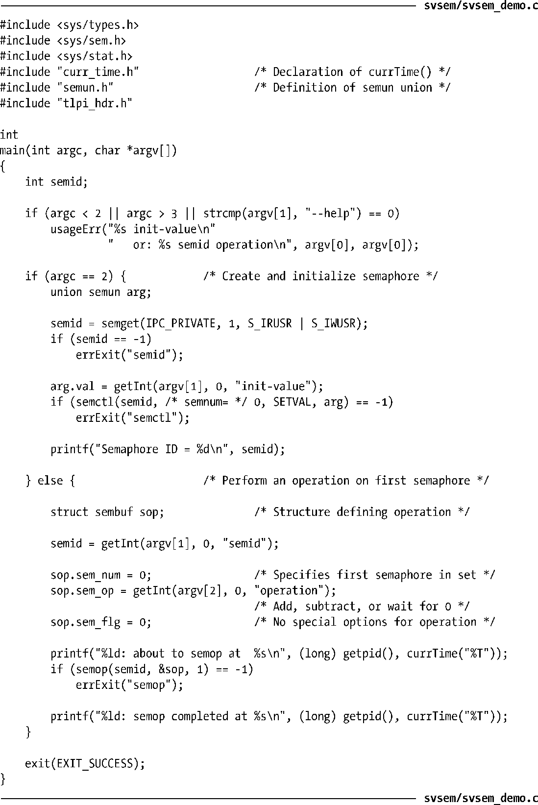

### 47.1　概述

使用System V信号量的常规步骤如下。

+ 使用semget()创建或打开一个信号量集。
+ 使用semctl() SETVAL或SETALL操作初始化集合中的信号量。（只有一个进程需要完成这个任务。）
+ 使用semop()操作信号量值。使用信号量的进程通常会使用这些操作来表示一种共享资源的获取和释放。
+ 当所有进程都不再需要使用信号量集之后使用semctl() IPC_RMID操作删除这个集合。（只有一个进程需要完成这个任务。）

大多数操作系统都为应用程序提供了一些信号量原语。但System V信号量表现出了不同寻常的复杂性，因为它们的分配是以备称为信号量集的组为单位进行的。在使用semget()系统调用创建集合的时候需要指定集合中的信号量数量。虽然在同一时刻通常只操作一个信号量，但通过semop()系统调用可以原子地在同一个集合中的多个信号量之上执行一组操作。

由于System V信号量的创建和初始化是在不同的步骤之后完成的，因此当两个进程同时都试图执行这两个步骤时就会出现竞争条件。要描述清楚这种竞争条件以及如何避免出现这种情况需要先对semctl()进行介绍，然后再对semop()进行介绍，这意味着在掌握完全理解信号量所需的所有细节信息之前还需要对很多材料进行学习。

与此同时，程序清单47-1给出了一个简单的例子，它演示了各种信号量系统调用的用法。这个程序可以在两种模式下运行。

+ 当在命令行参数中传入一个整数时程序会创建一个只包含一个信号量的新信号量集并将信号量值初始化为通过命令行参数传入的值。程序会打印出这个新信号量集的标识符。
+ 当在命令行参数中传入两个整数时程序会将它们看成是（按照顺序）一个既有信号量集的标识符和一个将被加到集合中第一个信号量（序号为0）上的值。程序会在该信号量上执行指定的操作。为了能够监控信号量操作，程序在操作之前和之后都会打印出消息。每条消息都以进程ID打头，这样就可以对这个程序的多个实例所产生的输出进行区分了。

下面的shell会话日志演示了程序清单47-1中的程序的用法。下面首先创建一个信号量并将其初始化为0。

然后执行一个后台命令将信号量值减去2。

这个命令会阻塞，因为无法将信号量的值减到小于0。现在执行一个命令将信号量值加上3。

这个信号量增加操作会立即成功，并且会导致后台命令中的信号量缩减操作能够向前执行，因为在执行该操作之后不会导致信号量值小于0。

程序清单47-1：创建和操作System V信号量

