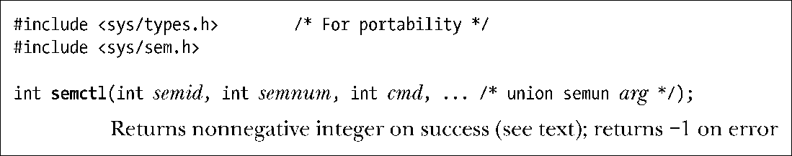
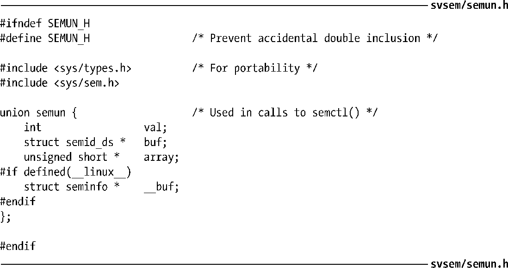

### 47.3　信号量控制操作

semctl()系统调用在一个信号量集或集合中的单个信号量上执行各种控制操作。

semid参数是操作所施加的信号量集的标识符。对于那些在单个信号量上执行的操作，semnum参数标识出了集合中的具体信号量。对于其他操作则会忽略这个参数，并且可以将其设置为0。cmd参数指定了需执行的操作。

一些特定的操作需要向semctl()传入第四个参数，在本节余下的部分中将这个参数命名为arg。这个参数是一个union，程序清单47-2给出了其定义。在程序中必须要显式地定义这个union。程序清单47-2中的示例程序通过包含这个头文件来完成这个任务。

> 虽然将semun union的定义放在标准头文件中是比较明智的做法，但SUSv3要求程序员显式地定义这个union。然而，一些UNIX实现在<sys/sem.h>中提供了这个定义。glibc较早以前的版本（2.0以下，包括2.0）也提供了这个定义。为了与SUSv3保持一致，glibc最近的版本并没有提供这个定义，并且通过将<sys/sem.h>中的_SEM_SEMUN_UNDEFINED宏的值定义为1来表明这个事实（即使用glibc编译的应用程序可以通过测试这个宏来确定程序自己是否需要定义semun union）。

程序清单47-2：semun union的定义

SUSv2和SUSv3规定semctl()的最后一个参数是可选的。但一些（主要是较早之前的）UNIX实现（以及glibc的早期版本）将semctl()的原型定义如下。

这意味着第四个参数是必需的，即使在那些不需要用到这个参数的情况下也是如此（如下面描述的IPC_RMID和GETVAL操作）。为使程序能够完全可移植，在那些无需最后一个参数的semctl()调用中需要传入一个哑参数。

在本节余下的部分中将介绍通过cmd参数可指定的各种控制操作。

#### 常规控制操作

下面的操作与可应用于其他类型的System V IPC对象上的操作是一样的。所有这些操作都会忽略semnum参数。45.3节提供了有关这些操作的更多细节，包括调用进程所需的特权和权限。

##### IPC_RMID

立即删除信号量集及其关联的semid_ds数据结构。所有因在semop()调用中等待这个集合中的信号量而阻塞的进程都会立即被唤醒，semop()会报告错误EIDRM。这个操作无需arg参数。

##### IPC_STAT

在arg.buf指向的缓冲器中放置一份与这个信号量集相关联的semid_ds数据结构的副本。47.4节将对semid_ds结构进行介绍。

##### IPC_SET

使用arg.buf指向的缓冲器中的值来更新与这个信号量集相关联的semid_ds数据结构中选中的字段。

#### 获取和初始化信号量值

下面的操作可以获取或初始化一个集合中的单个或所有信号量的值。获取一个信号量的值需具备在信号量上的读权限，而初始化该值则需要修改（写）权限。

##### GETVAL

semctl()返回由semid指定的信号量集中第semnum个信号量的值。这个操作无需arg参数。

##### SETVAL

将由semid指定的信号量集中第semnum个信号量的值初始化为arg.val。

##### GETALL

获取由semid指向的信号量集中所有信号量的值并将它们放在arg.array指向的数组中。程序员必须要确保该数组具备足够的空间。（通过由IPC_STAT操作返回的semid_ds数据结构中的sem_nsems字段可以获取集合中的信号量数量。）这个操作将忽略semnum参数。程序清单47-3给出了一个使用GETALL操作的例子。

##### SETALL

使用arg.array指向的数组中的值初始化semid指向的集合中的所有信号量。这个操作将忽略semnum参数。程序清单47-4演示了SETALL操作的用法。

如果存在一个进程正在等待在由SETVAL或SETALL操作所修改的信号量上执行一个操作并且对信号量所做的变更将允许该操作继续向前执行，那么内核就会唤醒该进程。

使用或SETALL修改一个信号量的值会在所有进程中清除该信号量的撤销条目。在47.8节中将会对信号量撤销条目予以介绍。

注意GETVAL和GETALL返回的信息在调用进程使用它们时可能已经过期了。所有依赖由这些操作返回的信息保持不变这个条件的程序都可能会遇到检查时（time-of-check）和使用时（time-of-use）的竞争条件（参见38.6）。

#### 获取单个信号量的信息

下面的操作返回（通过函数结果值）semid引用的集合中第semnum个信号量的信息。所有这些操作都需要在信号量集合中具备读权限，并且无需arg参数。

##### GETPID

返回上一个在该信号量上执行semop()的进程的进程ID；这个值被称为sempid值。如果还没有进程在该信号量上执行过semop()，那么就返回0。

##### GETNCNT

返回当前等待该信号量的值增长的进程数；这个值被称为semncnt值。

##### GETZCNT

返回当前等待该信号量的值变成0的进程数；这个值被称为semzcnt值。

与上面介绍的GETVAL和GETALL操作一样，GETPID、GETNCNT以及GETZCNT操作返回的信息在调用进程使用它们时可能已经过期了。

程序清单47-3演示了这三个操作的用法。

