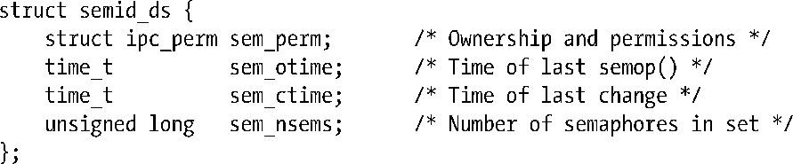
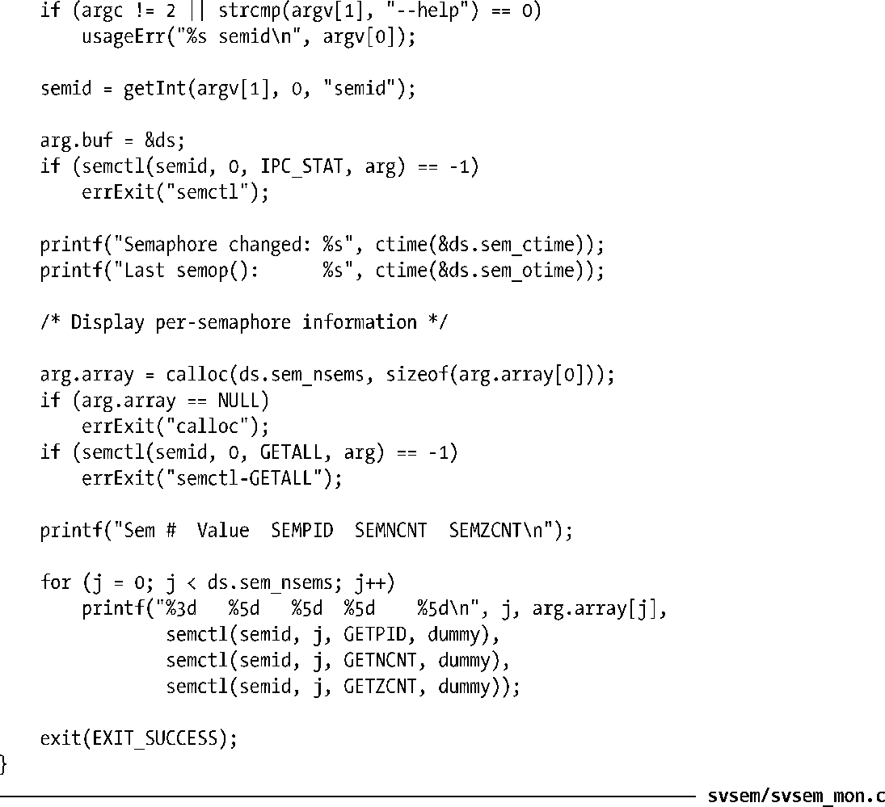
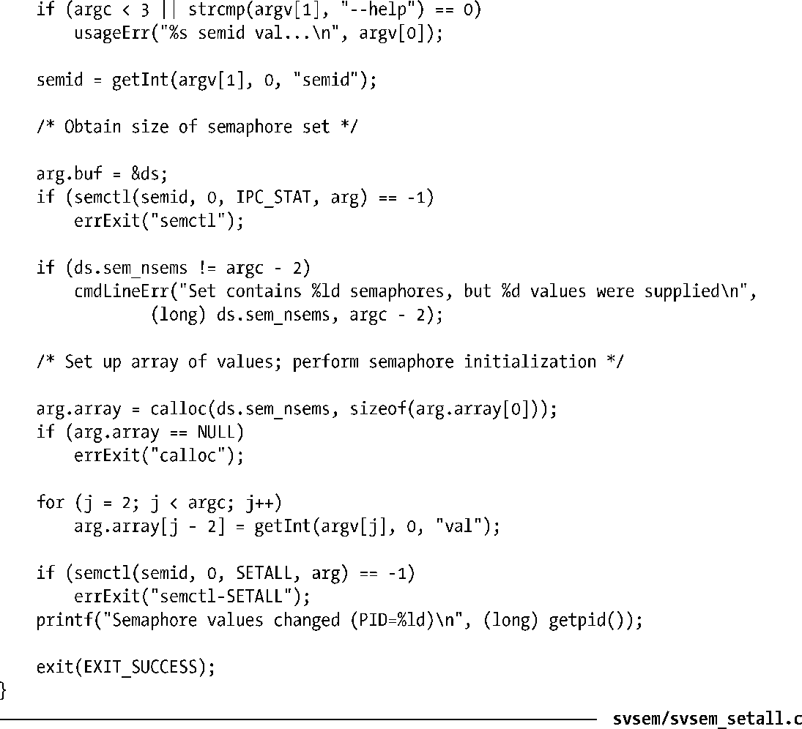

### 47.4　信号量关联数据结构

每个信号量集都有一个关联的semid_ds数据结构，其形式如下。

> SUSv3要求实现定义上面的semid_ds结构中给出的所有字段。其他一些UNIX实现包含了额外的非标准字段。在Linux 2.4以及之后的版本上，sem_nsems字段的类型为unsigned long。SUSv3将这个字段的类型规定为unsigned short，并且在Linux 2.2以及大多数其他UNIX实现上也是这么定义的。

各种信号量系统调用会隐式地更新semid_ds结构中的字段，使用semctl() IPC_SET操作能够显式地更新sem_perm字段中的特定子字段，其细节信息如下。

##### sem_perm

在创建信号量集时按照45.3中所描述的那样初始化这个子结构中的字段。通过IPC_SET能够更新uid、gid以及mode子字段。

##### sem_otime

在创建信号量集时会将这个字段设置为0，然后在每次成功的semop()调用或当信号量值因SEM_UNDO操作而发生变更时将这个字段设置为当前时间（参见47.8节）。这个字段和sem_ctime的类型为time_t，它们存储自新纪元到现在的秒数。

##### sem_ctime

在创建信号量时以及每个成功的IPC_SET、SETALL和SETVAL操作执行完毕之后将这个字段设置为当前时间。（在一些UNIX实现上，SETALL和SETVAL操作不会修改sem_ctime。）

##### sem_nsems

在创建集合时将这个字段的值初始化为集合中信号量的数量。

本节后面将介绍两个使用semid_ds数据结构和一些在47.3节中描述的semctl()操作的例子。在47.6节中将演示这两个程序的用法。

#### 监控一个信号量集

程序清单47-3使用了各种semctl()操作来显示标识符为命令行参数值的既有信号量集的信息。这个程序首先显示了semid_ds数据结构中的时间字段，然后显示了集合中各个信号量的当前值及其sempid、semncnt和semzcnt值。

程序清单47-3：一个信号量监控程序

#### 初始化一个集合中的所有信号量

程序清单47-4为初始化一个既有集合中的所有信号量提供了一个命令行界面。第一个命令行参数是待初始化的信号量集的标识符。剩下的命令行参数指定了每个信号量所初始化的值（参数的数量必须要与集合中信号量的数量一致）。

程序清单47-4：使用SETALL操作初始化一个System V信号量集

