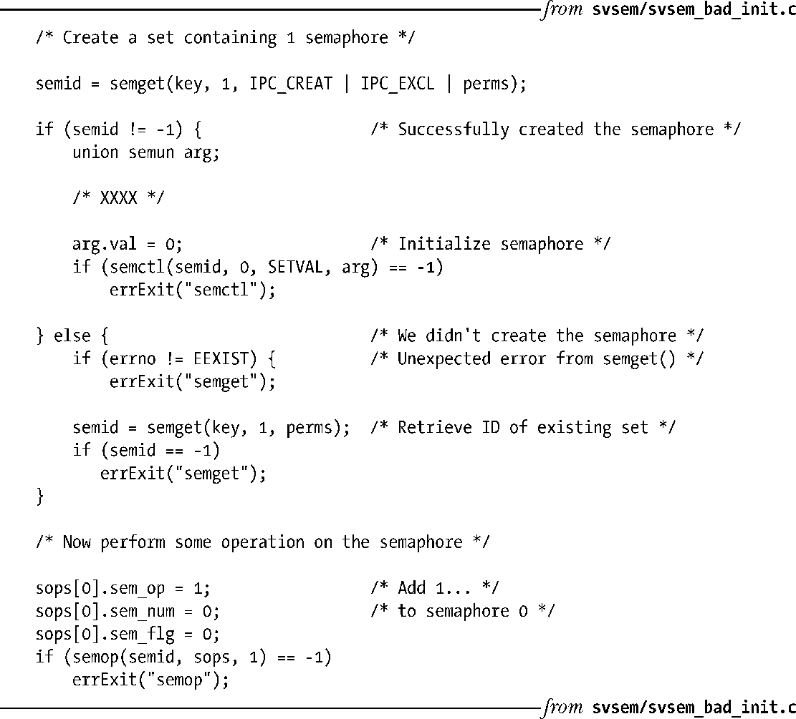
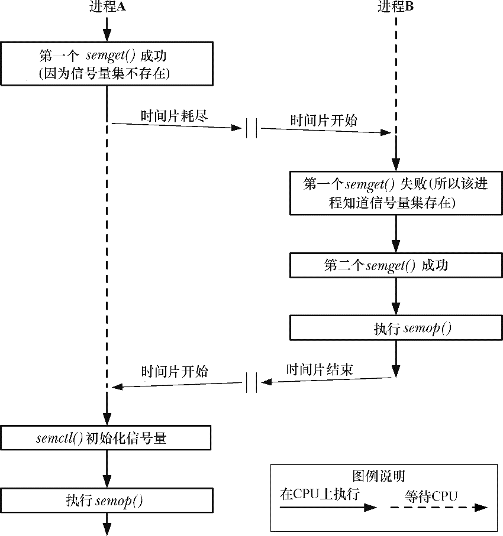
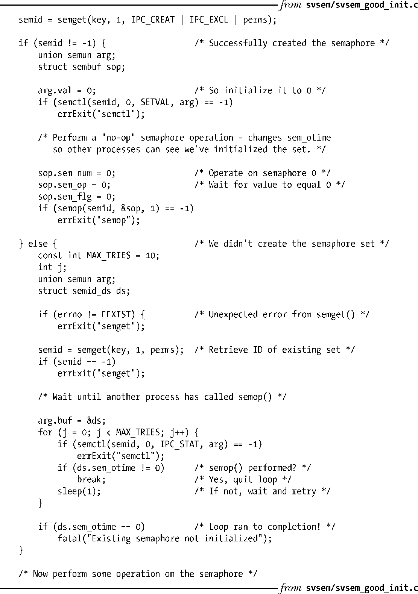

### 47.5　信号量初始化

根据SUSv3的要求，实现无需对由semget()创建的集合中的信号量值进行初始化。相反，程序员必须要使用semctl()系统调用显式地初始化信号量。（在Linux上，semget()返回的信号量实际上会被初始化为0，但为取得移植性就不能依赖于此。）前面曾经提及过，信号量的创建和初始化必须要通过单独的系统调用而不是单个原子步骤来完成的事实可能会导致在初始化一个信号量时出现竞争条件。本节将详细介绍竞争的本质并考虑一种基于[Stevens, 1999]提出的思想来避免出现这种情况的方法。

假设一个应用程序由多个地位平等的进程构成，这些进程使用一个信号量来协调相互之间的动作。由于无法保证哪个进程会首先使用信号量（这就是地位平等的含义），因此每个进程都必须要做好在信号量不存在时创建和初始化信号量的准备。基于此，可以考虑使用程序清单47-5中给出的代码。

程序清单47-5：错误地初始化了一个System V信号量

程序清单47-5中的代码存在的问题是如果两个进程同时执行，如果第一个进程的时间片在代码中标记为XXXX处期满，那么就可能会出现图47-2中给出的顺序。这个顺序之所以存在问题有两个原因。首先，进程B在一个未初始化的信号量（即其值是一个任意值）上执行了一个semop()。其次，进程A中的semctl()调用覆盖了进程B所做出的变更。

<b class="my_markdown">图47-2：两个进程竞争初始化同一个信号量</b>

这个问题的解决方案依赖于一个现已成为标准的特性，即与这个信号量集相关联的semid_ds数据结构中的sem_otime字段的初始化。在一个信号量集首次被创建时，sem_otime字段会被初始化为0，并且只有后续的semop()调用才会修改这个字段的值。因此可以利用这个特性来消除上面描述的竞争条件，即只需要插入额外的代码来强制第二个进程（即没有创建信号量的那个进程）等待直到第一个进程既初始化了信号量又执行了一个更新sem_otime字段但不修改信号量的值的semop()调用为止。程序清单47-6给出了修改之后的代码。

> 遗憾的是，正文中描述的初始化问题的解决方案无法在所有UNIX实现上正常工作。在一些现代BSD衍生版中，semop()不会更新sem_otime字段。

程序清单47-6：初始化一个System V信号量

使用程序清单47-6中给出的技术的各种变体能够确保一个集合中的多个信号量正确地被初始化以及一个信号量被初始化为一个非零值。

并不是所有应用程序都需要使用这个及其负责的解决方案来解决竞争问题。如果能够确保一个进程在其他进程使用信号量之前创建和初始化信号量就无需使用这个解决方案。如父进程在创建与其共享信号量的子进程之前先创建和初始化信号量。在这种情况中，让第一个进程在调用完semget()之后执行一个semctl() SETVALSETALL操作就足够了。

