### 47.6　信号量操作

semop()系统调用在semid标识的信号量集中的信号量上执行一个或多个操作。

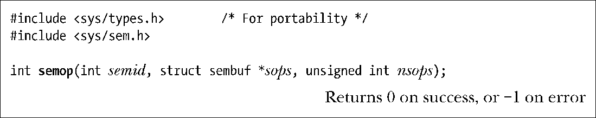
sops参数是一个指向数组的指针，数组中包含了需要执行的操作，nsops参数给出了数组的大小（数组至少需包含一个元素）。操作将会按照在数组中的顺序以原子的方式被执行。sops数组中的元素是形式如下的结构。

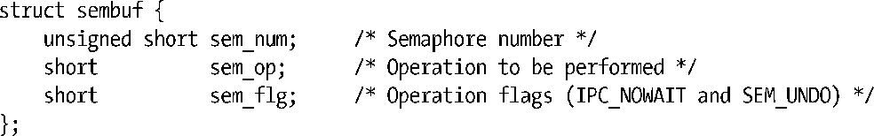
sem_num字段标识出了在集合中的哪个信号量上执行操作。sem_op字段指定了需执行的操作。

+ 如果sem_op大于0，那么就将sem_op的值加到信号量值上，其结果是其他等待减小信号量值的进程可能会被唤醒并执行它们的操作。调用进程必须要具备在信号量上的修改（写）权限。
+ 如果sem_op等于0，那么就对信号量值进行检查以确定它当前是否等于0。如果等于0，那么操作将立即结束，否则semop()就会阻塞直到信号量值变成0为止。调用进程必须要具备在信号量上的读权限。
+ 如果sem_op小于0，那么就将信号量值减去sem_op。如果信号量的当前值大于或等于sem_op的绝对值，那么操作会立即结束。否则semop()会阻塞直到信号量值增长到在执行操作之后不会导致出现负值的情况为止。调用进程必须要具备在信号量上的修改权限。

从语义上来讲，增加信号量值对应于使一种资源变得可用以便其他进程可以使用它，而减小信号量值则对应于预留（互斥地）进程需使用的资源。在减小一个信号量值时，如果信号量的值太低——即其他一些进程已经预留了这个资源——那么操作就会被阻塞。

当semop()调用阻塞时，进程会保持阻塞直到发生下列某种情况为止。

+ 另一个进程修改了信号量值使得待执行的操作能够继续向前。
+ 一个信号中断了semop()调用。发生这种情况时会返回EINTR错误。（在21.5节中指出过semop()在被一个信号处理器中断之后是不会自动重启的。）
+ 另一个进程删除了semid引用的信号量。发生这种情况时semop()会返回EIDRM错误。

在特定信号量上执行一个操作时可以通过在相应的sem_flg字段中指定IPC_NOWAIT标记来防止semop()阻塞。此时，如果semop()本来要发生阻塞的话就会返回EAGAIN错误。

尽管通常一次只会操作一个信号量，但也可以通过一个semop()调用在一个集合中的多个信号量上执行操作。这里需要指出的关键一点是这组操作的执行是原子的，即semop()要么立即执行所有操作，要么就阻塞直到能够同时执行所有操作。

> 尽管作者所知晓的系统上的semop()都按照数组中顺序来执行操作，但一些系统仍然通过文档显式地规定了这种行为，并且一些应用程序也依赖于这种行为。SUSv4在文中显式地规定了这种行为。

程序清单47-7演示了如何使用semop()在一个集合中的三个信号量上执行操作。根据信号量的当前值不同，在信号量0和2之上的操作可能无法立即往前执行。如果无法立即执行在信号量0上的操作，那么所有请求的操作都不会被执行，semop()会被阻塞。另一方面，如果可以立即执行在信号量0上的操作，但无法立即执行在信号量2上的操作，那么——由于指定了IPC_NOWAIT标记——所有请求的操作都不会被执行，并且semop()会立即返回EAGAIN错误。

semtimedop()系统调用与semop()执行的任务一样，但它多了一个timeout参数，通过这个参数可以指定调用所阻塞的时间上限。

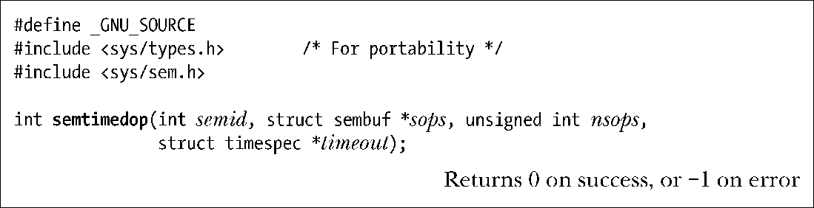
timeout参数是一个指向timespec结构（参见23.4.2节）的指针，通过这个结构能够将一个时间间隔表示为秒数和纳秒数。如果在信号量操作完成之前所等待的时间已经超过了规定的时间间隔，那么semtimedop()会返回EAGAIN错误。如果将timeout指定为NULL，那么semtimedop()就与semop()完全一样了。

与使用setitimer()和semop()相比，semtimedop()系统调用提供了一种更加高效的方式来为信号量操作设定一个超时时间。对于那些需要经常执行此类操作的应用程序（特别是一些数据库系统）来讲，这种方式所带来的性能上的提升是非常显著的。但SUSv3并没有规定semtimedop()，并且只有其他一些UNIX实现提供了这个函数。

> semtimedop()系统调用作为一个新特性出现在了Linux 2.6上，后来又被移回了Linux 2.4，从内核2.4.22开始就存在这个函数了。

程序清单47-7：使用semop()在多个System V信号量上执行操作

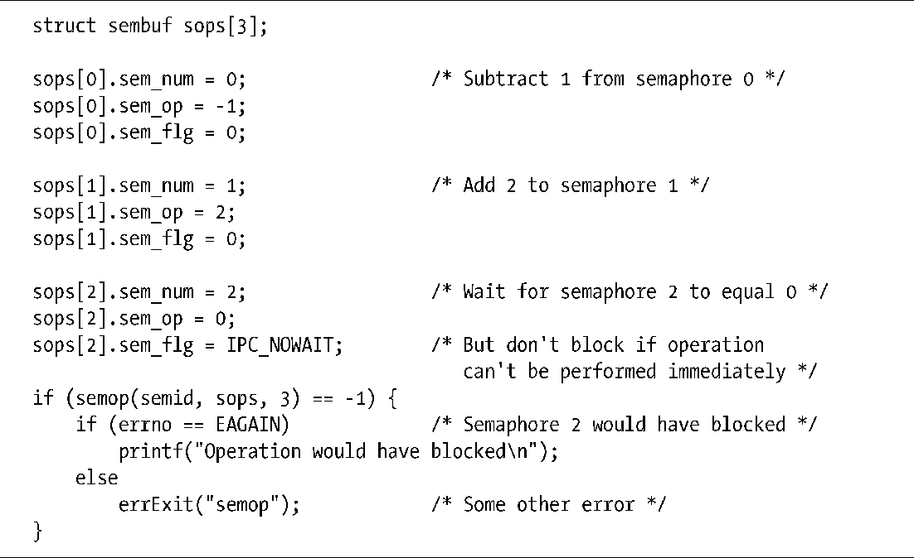
#### 示例程序

程序清单47-8为semop()系统调用提供了一个命令行界面。这个程序接收的第一个参数是操作所施加的信号量集的标识符。

剩余的命令行参数指定了在单个semop()调用中需要执行的一组信号量操作。单个命令行参数中的操作使用逗号分隔。每个操作的形式为下面中的一个。

+ semnum+value：将value加到第semnum个信号量上。
+ semnum-value：从第semnum个信号量上减去value。
+ semnum=0：测试第semnum信号量以确定它是否等于0。

在每个操作的最后可以可选地包含一个n、一个u或同时包含两者。字母n表示在这个操作的sem_flg值中包含IPC_NOWAIT。字母u表示在sem_flg中包含SEM_UNDO。（在47.8节中将会对SEM_UNDO标记进行介绍。）

下面的命令行在标识符为0的信号量集上执行了两个semop()调用。

第一个命令行参数规定semop()调用等待直到第一个信号量值等于0为止。第二个参数规定semop()调用从信号量0中减去1以及从信号量1中减去2。信号量0上的操作的sem_flg为0，信号量1上的操作的sem_flg是IPC_NOWAIT。

程序清单47-8：使用semop()执行System V信号量操作

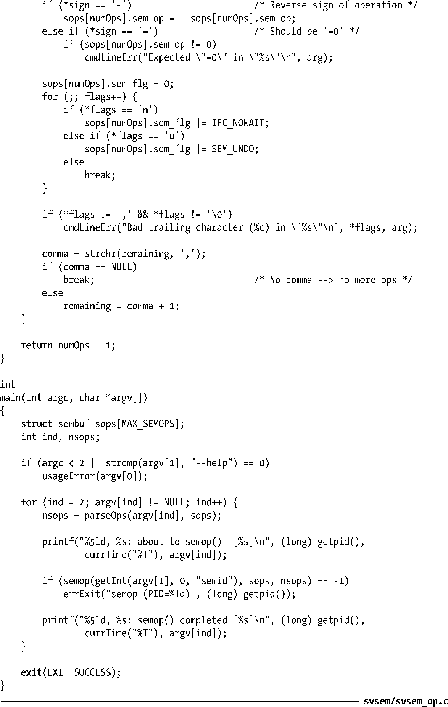

使用程序清单47-8中的程序以及本章中给出的其他程序可以研究System V信号量的操作，如下面的shell会话所示。下面首先使用一个进程创建了一个包含两个信号量的信号量集并将这两个信号量的值分别初始化为1和0。

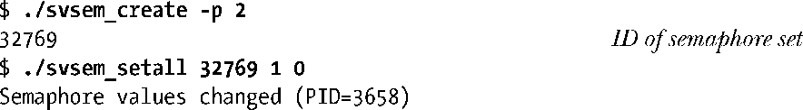
> 本章并没有给出svsem/svsem_create.c程序的代码，读者可以在本章随带的源代码中找到这个程序的代码。这个程序在信号量上执行的功能与程序清单46-1中的程序在消息队列上执行的功能一样，即它创建了一个信号量集。唯一值得注意的差别是svsem_create.c额外接收了一个参数，该参数规定了所创建的信号量集的大小。

接下来在后台启动三个程序清单47-8中给出的程序实例来在信号量集上执行semop()操作。程序会在执行每个信号量操作之前和之后都打印出消息。这些消息包括时间（这样就能够看到每个操作何时开始和何时结束）和进程ID（这样就能够跟踪程序的多个实例的操作）。第一个命令要求将两个信号量值都减去1。

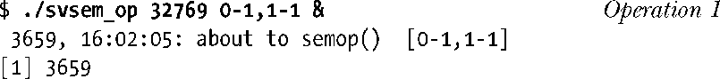
从上面的输出中可以看出这个程序打印出了一条消息，指出就要执行semop()操作了，但并没有打印出更多的消息，这是因为semop()调用被阻塞了。这个调用之所以被阻塞是因为信号量1的值为0。

接着执行一个命令要求将信号量1的值减去1。

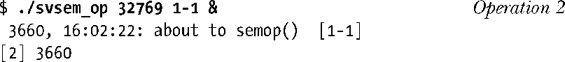
这个命令也会阻塞。接着执行一个命令等待信号量0的值等于0。

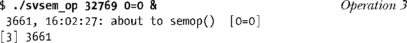
这个命令再次阻塞了，这是因为信号量0的值当前为1。

现在使用程序清单47-3中的程序来检查信号量集。

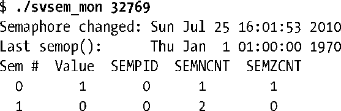
在一个信号量集被创建之后，其关联semid_ds数据结构的sem_otime字段会被初始化为0。日历时间值0对应于新纪元的起点（参见10.1节），并且ctime()会将这个值显示为1 AM, 1 January 1970，这是因为本地时区为Central Europe，它比UTC早一个小时。

更仔细地检查一下输出可以发现信号量0的semncnt值为1，这是因为操作1正在等待减小信号量值，而semzcnt值为1，这是因为操作3正在等待这个信号量的值等于0。信号量1的semncnt值为2，它反映出了操作1和操作2正在等于减小这个信号量值的事实。

接着在信号量集上尝试执行一个非阻塞操作。这个操作等于信号量0的值等于0。由于无法立即执行这个操作，因此semop()会返回EAGAIN错误。

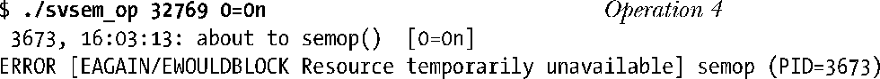
现在向信号量1加上1。这会导致之前两个被阻塞的操作（1和3）能够继续往前执行。

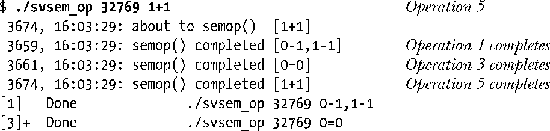
当使用监控程序来观察信号量集的状态时可以发现其关联semid_ds数据结构的sem_otime字段已经被更新了，并且两个信号量的sempid值也被更新了。此外，还可以看出信号量1的semncnt值为1，这是因为操作2仍然被阻塞着，它等待减小这个信号量的值。

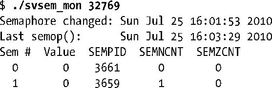
从上面的输出中可以看出sem_otime字段的值已经被更新过了。此外，还可以看出最近操作信号量0的进程的进程ID为3661（操作3），最近操作信号量1的进程的进程ID为3659（操作1）。

最后删除信号量集。这将会导致仍被阻塞的操作2返回EIDRM错误。

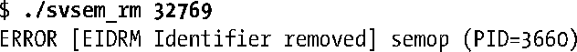
> 本章并没有给出svsem/svsem_rm.c程序的源代码，读者可以在本章附带的源代码中找到这个程序的代码。这个程序删除通过命令行参数指定的信号量集。

