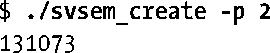
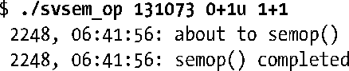
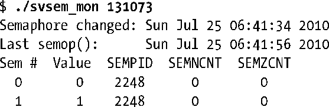

### 47.8　信号量撤销值

假设一个进程在调整完一个信号量值（如减小信号量值使之等于0）之后终止了，不管是有意终止还是意外终止。在默认情况下，信号量值将不会发生变化。这样就可能会给其他使用这个信号量的进程带来问题，因为它们可能因等待这个信号量而被阻塞着——即等待已经被终止的进程撤销对信号量所做的变更。

为避免这种问题的发生，在通过semop()修改一个信号量值时可以使用SEM_UNDO标记。当指定这个标记时，内核会记录信号量操作的效果，然后在进程终止时撤销这个操作。不管进程是正常终止还是非正常终止，撤销操作都会发生。

内核无需为所有使用SEM_UNDO的操作都保存一份记录。只需要记录一个进程在一个信号量上使用SEM_UNDO操作所作出的调整总和即可，它是一个被称为semadj（信号量调整）的整数。当进程终止之后，所有需要做的就是从信号量的当前值上减去这个总和。

> 自Linux 2.6起，当指定了CLONE_SYSVSEM标记之后使用clone()创建的进程（线程）会共享semadj值。之所以这样做是为了与POSIX线程的实现保持一致。NPTL线程实现在pthread_create()的实现中使用了CLONE_SYSVSEM。

当使用semctl() SETVAL或SETALL操作设置一个信号量值时，所有使用这个信号量的进程中相应的semadj会被清空（即设置为0）。这样做是合理的，因为直接设置一个信号量的值会破坏与semadj中维护的历史记录相关联的值。

通过fork()创建的子进程不会继承其父进程的semadj值，因为对于子进程来讲撤销其父进程的信号量操作毫无意义。另一方面，semadj值会在exec()中得到保留。这样就能在使用SEM_UNDO调整一个信号量值之后通过exec()执行一个不操作该信号量的程序，同时在进程终止时原子地调整该信号量。（这项技术可以允许另一个进程发现这个进程何时终止。）

#### SEM_UNDO的效果举例

下面的shell会话日志显示了在两个信号量上执行操作的效果：一个操作使用了SEM_UNDO标记，另一个没有使用。下面首先创建一个包含两个信号量的集合。

接着执行一个命令在两个信号量上都加上1，然后终止。信号量0上的操作指定了SEM_UNDO标记。

现在使用程序清单47-3中的程序检查信号量的状态。

从上面输出的最后两行中的信号量值可以看出信号量0上的操作被撤销了，但信号量1上的操作没有被撤销。

#### SEM_UNDO的限制

最后需要指出的是，SEM_UNDO其实并没有其一开始看起来那样有用，原因有两个。一个原因是由于修改一个信号量通常对应于请求或释放一些共享资源，因此仅仅使用SEM_UNDO可能不足以允许一个多进程应用程序在一个进程异常终止时恢复。除非进程终止会原子地将共享资源的状态返回到一个一致的状态（在很多情况下是不可能的），否则撤销一个信号量操作可能不足以允许应用程序恢复。

第二个影响SEM_UNDO的实用性的因素是在一些情况下，当进程终止时无法对信号量进行调整。考虑下面应用于一个初始值为0的信号量上的操作。

**1．** 进程A将信号量值增加2，并为该操作指定了SEM_UNDO标记。

**2．** 进程B将信号量值减去1，因此信号量的值将变成1。

**3．** 进程A终止。

此时就无法完全撤销进程A在第一步中的操作中所产生的效果，因为信号量的值太小了。解决这个问题的潜在方法有三种。

+ 强制进程阻塞直到能够完成信号量调整。
+ 尽可能地减小信号量的值（即减到0）并退出。
+ 退出，不执行任何信号量调整操作。

第一个解决方案是不可行的，因为它可能会导致一个即将终止的进程永远阻塞。Linux采用了第二种解决方案。其他一些UNIX实现采纳了第三种解决方案。SUSv3并没有规定一个实现应该采用哪种解决方案。

> 试图将一个信号量值提升到其许可的最大值32767（第47.10节描述的SEMVMX限制）的撤销操作也会导致异常行为的发生。在这种情况下，内核总是会执行这个调整，从而（非法地）导致信号量的值大于SEMVMX。

