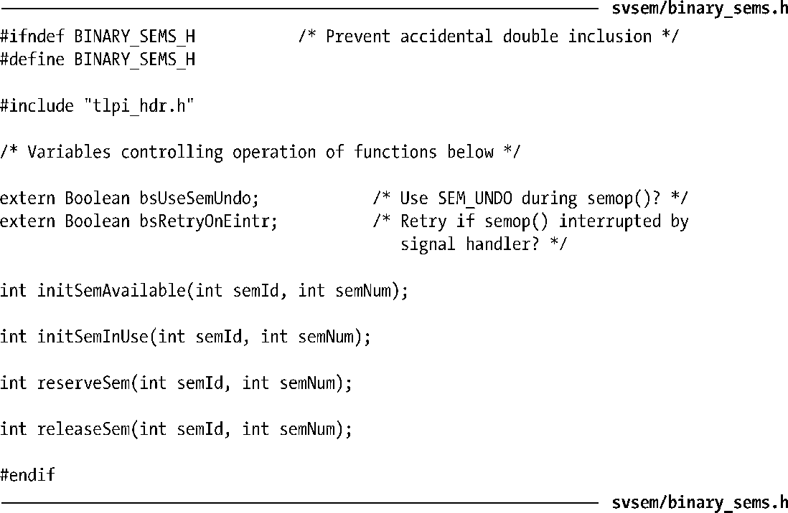
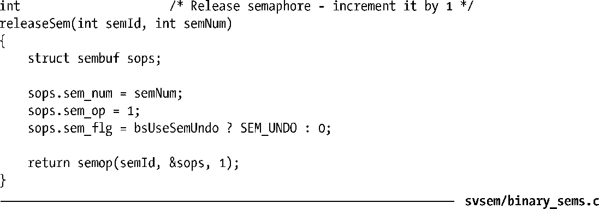

### 47.9　实现一个二元信号量协议

System V信号量的API是比较复杂的，之所以会这样既因为对信号量值的调整量可以是任意的，又因为信号量的分配和操作是以几何为单位的。但也正因为这些特性，System V信号量提供的功能要多于常规应用程序所需的功能，因此以System V信号量为基础实现一个更加简单的协议（APIs）则是非常有用的。

一种常见的协议是二元信号量。一个二元信号量有两个值：可用（空闲）或预留（使用中）。二元信号量有两个操作。

+ 预留：试图预留这个信号量以便互斥地使用。如果信号量已经被另一个进程预留了，那么将会阻塞直到信号量被释放为止。
+ 释放：释放一个当前被预留的信号量，这样另一个进程就可以预留这个信号量了。

> 在学校教授的计算机科学中，这两个操作通常被称为P和V，即这两个操作在荷兰语中的首字母。这种命名方式后来由荷兰计算机科学家Edsger Dijkstra所确定，他完成了很多有关信号量方面的早期理论工作。术语down（减小信号量）和up（增大信号量）也会被用到。POSIX将这两个操作称为wait和post。

有时候还会定义第三个操作。

+ 有条件地预留：非阻塞地尝试预留这个信号量以便互斥地使用。如果信号量已经被预留了，那么立即返回一个状态标示出这个信号量不可用。

在实现二元信号量时必须要选择如何表示可用和预留状态以及如何实现上面的操作。读者稍微思考一下就会发现表示这些状态的最佳方式是使用值1表示空闲和值0表示预留，同时预留和释放操作分别为将信号量的值减1和加1。

程序清单47-9和程序清单47-10给出了使用System V信号量实现二元信号量的一个实现。程序清单47-9中的头文件除了给出了实现中的函数的原型之外还声明了实现将会用到的两个全局布尔变量。bsUseSemUndo变量控制实现是否在semop()调用中使用SEM_UNDO标记。bsRetryOnEintr变量控制实现是否在semop()调用被信号中断之后自动重启该调用。

程序清单47-9：binary_sems.c的头文件

程序清单47-10给出了二元信号量函数的实现。这些实现中的每个函数都接收两个参数，它们分别标识出了信号量集和信号量在该集合中的序号。（这些函数既没有处理信号量集的创建和删除，也没有处理47.5节中描述的竞争条件。）在48.4节中给出的示例程序将会使用这些函数。

程序清单47-10：使用System V信号量实现二元信号量

