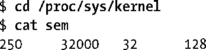
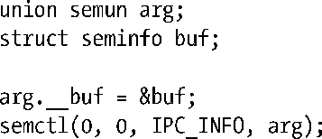

### 47.10　信号量限制

大多数UNIX实现都对System V信号量的操作进行了各种各样的限制。下面列出了Linux上信号量的限制。括号中给出了当限制达到时会受影响的系统调用及其所返回的错误。

##### SEMAEM

在semadj总和中能够记录的最大值。SEMAEM的值与SEMVMX（稍后介绍）的值是一样的。（semop(), ERANGE）

##### SEMMNI

这是系统级别的一个限制，它限制了所能创建的信号量标识符的数量（换句话说是信号量集）。（semget(), ENOSPC）

##### SEMMSL

一个信号量集中能分配的信号量的最大数量。（semget(), EINVAL）

##### SEMMNS

这是系统级别的一个限制，它限制了所有信号量集中的信号量数量。系统上信号量的数量还受SEMMNI和SEMMSL的限制。实际上，SEMMNS的默认值是这两个限制的默认值的乘积。（semget(), ENOSPC）

##### SEMOPM

每个semop()调用能够执行的操作的最大数量。（semop(), E2BIG）

##### SEMVMX

一个信号量能取的最大值。（semop(), ERANGE）

大多数UNIX实现都定义了上面列出的限制。一些UNIX实现（不包括Linux）在信号量撤销操作方面（参见47.8节）还定义了下面的限制。

##### SEMMNU

这是系统级别的一个限制，它限制了信号量撤销结构的总数量。撤销结构是分配用来存储semadj值的。

##### SEMUME

每个信号量撤销结构中撤销条目的最大数量。

在系统启动时，信号量限制会被设置成默认值。不同的内核版本中的默认值可能会不同。（一些内核厂商设置的默认值与vanilla内核设置的默认值可能会不同。）其中一些限制可以通过修改存储在Linux特有的/proc/sys/kernel/sem文件中的值来改变。这个文件包含了四个用空格分隔的数字，它们按序定义了SEMMSL、SEMMNS、SEMOPM以及SEMMNI限制。（SEMVMX和SEMAEM限制是无法修改的，它们的值都被定义成32767。）下面是x86-32系统上Linux 2.6.31定义的默认限制。

> Linux/proc文件系统在三种System V IPC机制上所使用的格式是不一致的。对于消息队列和共享内存，每个可配置的额限制是通过单个文件来控制的。对于信号量则是由一个文件来保存所有可配置的限制。之所以这样是因为在这些API的开发过程中发生了一个历史性意外事件，并且由于兼容性的原因，这种现状已经很难改变了。

表47-1给出了x86-32架构上每个限制所能取的最大值。有关这张表格需要注意下列辅助信息。

<b class="my_markdown">表47-1：System V信号量限制</b>

| 限　　制 | 最大值（x86-32） |
| :-----  | :-----  | :-----  | :-----  |
| SEMMNI | SEMMSL | SEMMNS | SEMOPM | 32768 (IPCMNI) | 65536 | 2147483647 (INT_MAX) | 参见正文 |

+ 可以将SEMMSL的值设置为一个大于65536的值，并且所创建的信号量集中最多可包含该数量的信号量。但无法使用semop()调整集合中第65536个元素之后的元素。

> 由于在当前实现中存在一些限制，因此在实践中建议将一个信号量集容量的上限值设置为8000左右。

+ SEMMNS实际最大值是由系统上可用的RAM来控制的。
+ SEMOPM限制的最大值是由内核所使用的内存分配原语来确定的，建议的最大值是1000。在实际使用中，在单个semop()调用中执行过多的操作没有太大的用处。

Linux特有的semctl() IPC_INFO操作返回一个类型为seminfo的结构，它包含了各种信号量限制的值。

相关的Linux特有的SEM_INFO操作会返回包含与信号量对象实际消耗的资源相关的信息的seminfo结构。本书随带的源代码中svsem/svsem_info.c文件给出了一个使用SEM_INFO的例子。

有关IPC_INFO、SEM_INFO以及seminfo结构的细节信息可以在semctl(2)手册中找到。

