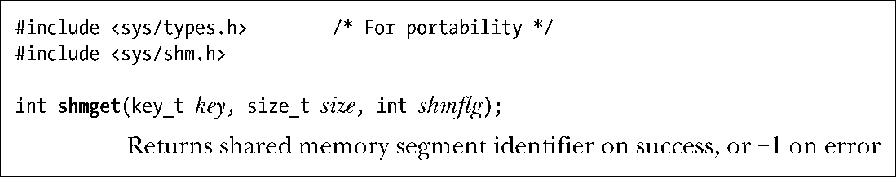

### 48.2　创建或打开一个共享内存段

shmget()系统调用创建一个新共享内存段或获取一个既有段的标识符。新创建的内存段中的内容会被初始化为0。

key参数是使用在45.2节中介绍的其中一种方法（即通常是IPC_PRIVATE值或由ftok()返回的键）生成的键。

当使用shmget()创建一个新共享内存段时，size则是一个正整数，它表示需分配的段的字节数。内核是以系统分页大小的整数倍来分配共享内存的，因此实际上size会被提升到最近的系统分页大小的整数倍。如果使用shmget()来获取一个既有段的标识符，那么size对段不会产生任何效果，但它必须要小于或等于段的大小。

shmflg参数执行的任务与其在其他IPC get调用中执行的任务一样，即指定施加于新共享内存段上的权限或需检查的既有内存段的权限（表15-4）。此外，在shmflg中还可以对下列标记中的零个或多个取OR来控制shmget()的操作。

##### IPC_CREAT

如果不存在与指定的key对应的段，那么就创建一个新段。

##### IPC_EXCL

如果同时指定了IPC_CREAT并且与指定的key对应的段已经存在，那么返回EEXIST错误。

45.1节对上述标记进行了详细的介绍。此外，Linux还允许使用下列非标准标记。

##### SHM_HUGETLB（自Linux 2.6起）

特权（CAP_IPC_LOCK）进程能够使用这个标记创建一个使用巨页（huge page）的共享内存段。巨页是很多现代硬件架构提供的一项特性用来管理使用超大分页尺寸的内存。（如x86-32允许使用4MB的分页大小来替代4KB的分页大小。）在那些拥有大量内存的系统上并且应用程序需要使用大量内存块时，使用巨页可以降低硬件内存管理单元的超前转换缓冲器（translation look-aside buffer，TLB）中的条目数量。这之所以会带来益处是因为TLB中的条目通常是一种稀缺资源。更多信息可参考内核源文件Documentation/vm/ hugetlbpage.txt。

##### SHM_NORESERVE（自Linux 2.6.15起）

这个标记在shmget()中所起的作用与MAP_NORESERVE标记在mmap()中所起的作用一样，具体可参见49.9节。

shmget()在成功时返回新或既有共享内存段的标识符。

