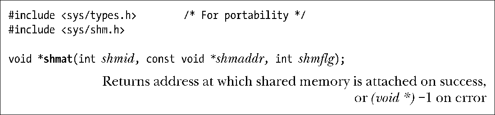
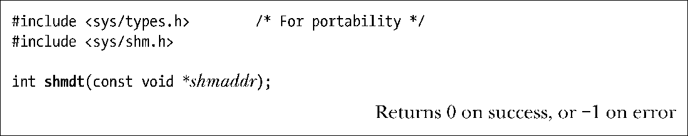

### 48.3　使用共享内存

shmat()系统调用将shmid标识的共享内存段附加到调用进程的虚拟地址空间中。

shmaddr参数和shmflg位掩码参数中SHM_RND位的设置控制着段是如何被附加上去的。

+ 如果shmaddr是NULL，那么段会被附加到内核所选择的一个合适的地址处。这是附加一个段的优选方法。
+ 如果shmaddr不为NULL并且没有设置SHM_RND，那么段会被附加到由shmaddr指定的地址处，它必须是系统分页大小的一个倍数（否则会发生EINVAL错误）。
+ 如果shmaddr不为NULL并且设置了SHM_RND，那么段会被映射到的地址为在shmaddr中提供的地址被舍入到最近的常量SHMLBA（shared memory low boundary address）的倍数。这个常量等于系统分页大小的某个倍数。将一个段附加到值为SHMLBA的倍数的地址处在一些架构上是有必要的，因为这样才能够提升CPU的快速缓冲性能和防止出现同一个段的不同附加操作在CPU快速缓冲中存在不一致的视图的情况。

> 在x86架构上，SHMLBA的值与系统分页大小是一样的，这意味着此类缓冲不一致性不可能在那些架构上出现。

为shmaddr指定一个非NULL值（即上面列出的第二种和第三种情况）不是一种推荐的做法，其原因如下。

+ 它降低了一个应用程序的可移植性。在一个UNIX实现上有效的地址在另一个实现上可能是无效的。
+ 试图将一个共享内存段附加到一个正在使用中的特定地址处的操作会失败。例如，当一个应用程序（可能在一个库函数中）已经在该地址处附加了另一个段或创建一个内存映射时就会发生这种情况。

shmat()的函数结果是返回附加共享内存段的地址。开发人员可以像对待普通的C指针那样对待这个值，段与进程的虚拟内存的其他部分看起来毫无差异。通常会将shmat()的返回值赋给一个指向某个由程序员定义的结构的指针以便在该段上设定该结构（参见程序清单48-2中给出的例子）。

要附加一个共享内存段以供只读访问，那么就需要在shmflg中指定SHM_RDONLY标记。试图更新只读段中的内容会导致段错误（SIGSEGV信号）的发生。如果没有指定SHM_RDONLY，那么就既可以读取内存又可以修改内存。

一个进程要附加一个共享内存段就需要在该段上具备读和写权限，除非指定了SHM_RDONLY标记，那样的话就只需要具备读权限即可。

> 在一个进程中可以多次附加同一个共享内存段，即使一个附加操作是只读的而另一个是读写的也没有关系。每个附加点上内存中的内容都是一样的，因为进程虚拟内存页表中的不同条目引用的是同样的内存物理页面。

最后一个可以在shmflg中指定的值是SHM_REMAP。在指定了这个标记之后shmaddr的值必须为非NULL。这个标记要求shmat()调用替换起点在shmaddr处长度为共享内存段的长度的任何既有共享内存段或内存映射。一般来讲，如果试图将一个共享内存段附加到一个已经在用的地址范围时将会导致EINVAL错误的发生。SHM_REMAP是一个非标准的Linux扩展。

表48-1对shmat()的shmflg参数中能取OR的常量进行了总结。

<b class="my_markdown">表48-1：shmat()的shmflg位掩码值</b>

| 值 | 描　　述 |
| :-----  | :-----  | :-----  | :-----  |
| SHM_RDONLY | SHM_REMAP | SHM_RND | 附加只读段 | 替换位于shmaddr处的任意既有映射 | 将shmaddr四舍五入为SHMLBA字节的倍数 |

当一个进程不再需要访问一个共享内存段时就可以调用shmdt()来讲该段分离出其虚拟地址空间了。shmaddr参数标识出了待分离的段，它应该是由之前的shmat()调用返回的一个值。

分离一个共享内存段与删除它是不同的。删除是通过48.7节中介绍的shmctl() IPC_ RMID操作来完成的。

通过fork()创建的子进程会继承其父进程附加的共享内存段。因此，共享内存为父进程和子进程之间的通信提供了一种简单的IPC方法。

在一个exec()中，所有附加的共享内存段都会被分离。在进程终止之后共享内存段也会自动被分离。

