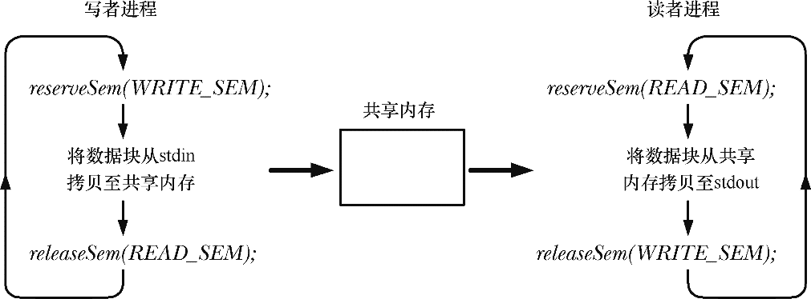
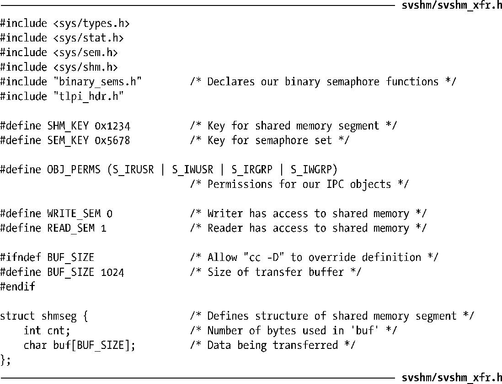
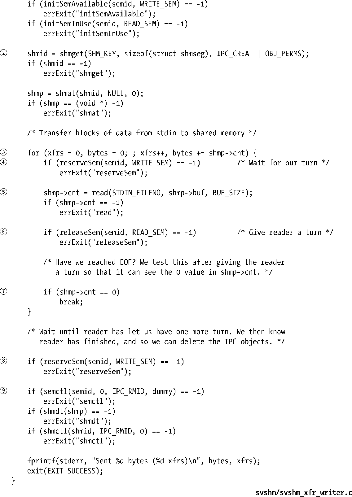
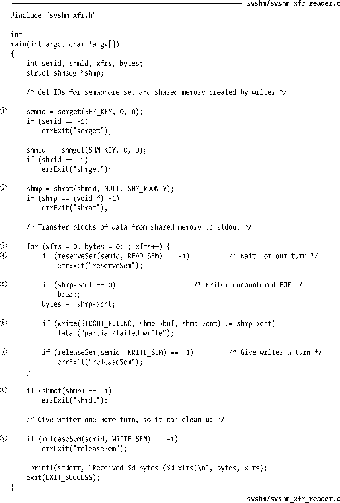
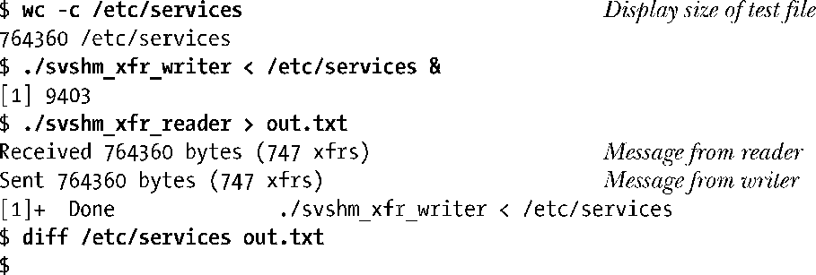

### 48.4　示例：通过共享内存传输数据

下面介绍一个使用System V共享内存和信号量的示例程序。这个应用程序由两个程序构成：写者和读者。写者从标准输入中读取数据块并将数据复制（“写”）到一个共享内存段中。读者将共享内存段中的数据块复制（“读”）到标准输出中。实际上，程序在某种程度上将共享内存当成了管道来处理。

两个程序使用了二元信号量协议（在47.9节中定义的initSemAvailable()、initSemInUse()、reserveSem()以及releaseSem()函数）中的一对System V信号量来确保：

+ 一次只有一个进程访问共享内存段；
+ 进程交替地访问段（即写者写入一些数据，然后读者读取这些数据，然后写者再次写入数据，以此类推）。

图48-1概述了这两个信号量的使用。注意写者对两个信号量进行了初始化，这样它就成为两个程序中第一个能够访问共享内存段的程序了，即写者的信号量初始时是可用的，而读者的信号量初始时是正在被使用中的。

<b class="my_markdown">图48-1：使用信号量确保对共享内存的互斥、交替的访问</b>

这个应用程序的源代码由三个文件构成。第一个文件是由读者程序和写者程序共享的头文件，如程序清单48-1所示。这个头文件定义了shmseg结构，程序使用了这个结构来声明指向共享内存段的指针，这样就能给共享内存段中的字节规定一种结构。

程序清单48-1：svshm_xfr_writer.c和svshm_xfr_reader.c的头文件

程序清单48-2是写者程序。这个程序按序完成下列任务。

+ 创建一个包含两个信号量的集合，写者和读者程序会使用这两个信号量来确保它们交替地访问共享内存段①。信号量被初始化为使写者首先访问共享内存段。由于是由写者来创建信号量集的，因此必须在启动读者之前启动写者。
+ 创建共享内存段并将其附加到写者的虚拟地址空间中系统所选择的一个地址处②。
+ 进入一个循环将数据从标准输入传输到共享内存段③。每个循环迭代需要按序完成下面的任务：
      + 预留（减小）写者的信号量④。
    + 从标准输入中读取数据并将数据复制到共享内存段⑤。
    + 释放（增加）读者的信号量⑥。  
+ 当标准输入中没有可用的数据时循环终止⑦。在最后一次循环中，写者通过传递一个长度为0的数据块（shmp–>cnt为0）来通知读者没有更多的数据了。
+ 在退出循环时，写者再次预留其信号量，这样它就能知道读者已经完成了对共享内存的最后一次访问了⑧。写者随后删除了共享内存段和信号量集⑨。

程序清单48-3是读者程序。它将共享内存段中的数据块传输到标准输出中。读者按序完成了下面的任务。

+ 获取写者程序创建的信号量集合共享内存段的ID①。
+ 附加共享内存段供只读访问②。
+ 进入一个循环从共享内存段中传输数据③。在每个循环迭代中需要按序完成下面的任务。
      + 预留（减小）读者的信号量④。
    + 检查shmp–>cnt是否为0，如果为0就退出循环⑤。
    + 将共享内存段中的数据块写入标准输出中⑥。
    + 释放（增加）写者的信号量⑦。  
+ 在退出循环之后分离共享内存段⑧并释放写者的信号量⑨，这样写者程序就能够删除IPC对象了。

程序清单48-2：将stdin中的数据块传输到一个System V共享内存段中

程序清单48-3：将一个System V共享内存段中的数据块传输到stdout中

下面的shell会话演示了如何使用程序清单48-2和程序清单46-9中的程序。这里在调用读者时将文件/etc/services作为输入，然后调用了读者并将其输出定向到另一个文件中。

diff命令不产生任何输出，这说明读者产生的输出文件中的内容与写者使用的输入文件中的内容是一样的。

