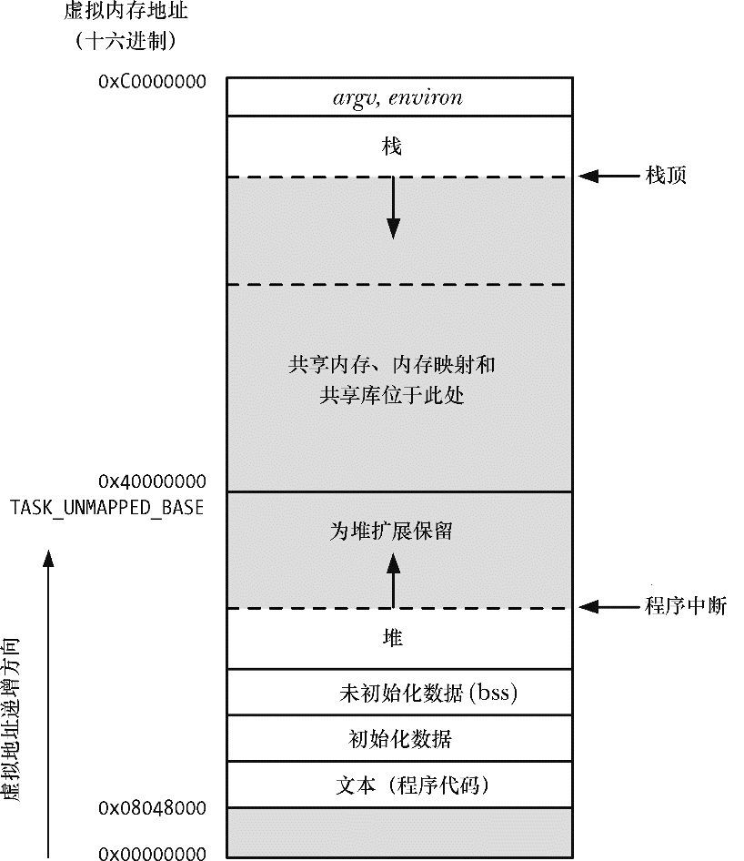
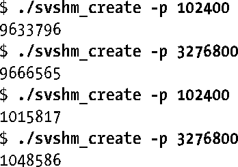
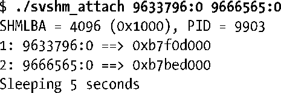
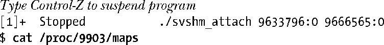
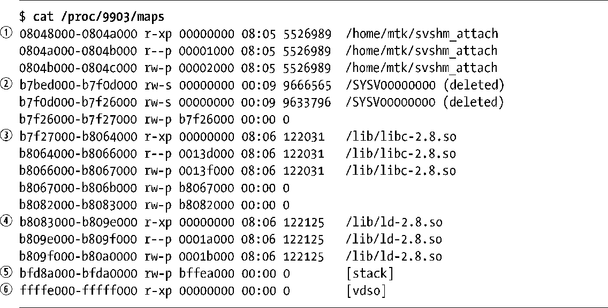

### 48.5　共享内存在虚拟内存中的位置

在6.3节中介绍了一个进程的各个部分在虚拟内存中的布局。现在在介绍附加System V共享内存段的时候重温一下这个主题是比较有帮助的。如果遵循所推荐的方法，即允许内核选择在何处附加共享内存段，那么（在x86-32架构上）内存布局就会像图48-2中所示的那样，段被附加在向上增长的堆和向下增长的栈之间未被分配的空间中。为给堆和栈的增长腾出空间，附加共享内存段的虚拟地址从0x40000000开始。内存映射（第49章）和共享库（第41和42章）也是被放置在这个区域中的。（共享内存映射和内存段默认被放置的位置可能会有些不同，这依赖于内核版本和进程的RLIMIT_STACK资源限制的设置。）

<b class="my_markdown">图48-2：共享内存、内存映射、以及共享库的位置（x86-32）</b>

> 地址0x40000000被定义成了内核常量TASK_UNMAPPED_BASE。通过将这个常量定义成一个不同的值并且重建内核可以修改这个地址的值。
> 如果在调用shmat()（或mmap()）时采用了不推荐的方法，即显式地指定一个地址，那么一个共享内存段（或内存映射）可以被放置在低于TASK_UNMAPPED_BASE的地址处。

通过Linux特有的/proc/PID/maps文件能够看到一个程序映射的共享内存段和共享库的位置，如下面的shell会话所示。

> 从内核2.6.14开始，Linux还提供了/proc/PID/smaps文件，它给出了有关一个进程中各个映射的内存消耗方面的更多信息。更多细节可参考proc(5)手册。

在下面的shell会话中使用了三个在本章中没有给出的程序，读者可以在本书随带的源代码的svshm子目录中找到这三个程序。这些程序执行了下面的任务。

+ svshm_create.c程序创建了一个共享内存段。这个程序与在介绍消息队列（程序清单46-1）和信号量时给出的相应程序接收同样的命令行选项，但它包含了一个额外的用来规定段大小的参数。
+ svshm_attach.c程序附加通过其命令行参数指定的共享内存段。每个参数都由一对用分号隔开的数字构成，两个数字分别是共享内存标识符和附加地址。将附加地址指定为0表示系统应该选择地址。程序会显示出实际附加内存段的地址。此外，为提供更多的有用信息，程序还显示出了SHMLBA常量的值和运行这个程序的进程的进程ID。
+ svshm_rm.c程序删除通过其命令行参数指定的共享内存段。

首先在shell中创建两个共享内存段（大小分别为100kB和3200kB）。

然后启动一个将这两个段附加到由内核选择的地址处的程序。

从上面的输出中可以看出附加这两个段的地址。在程序完成睡眠之前挂起这个程序，然后检查相应的/proc/PID/maps文件中的内容。

程序清单48-4给出了cat命令产生的输出。

程序清单48-4：示例/proc/PID/maps的内容

从程序清单48-4中给出的/proc/PID/maps文件的输出可以看出：

+ 有三行是与主程序shm_attach相关的。它们对应于程序的文本和数据段①，其中第二行是一个保存程序所使用的字符串常量的只读分页。
+ 有两行是与被附加的System V共享内存段相关的②。
+ 有几行与两个共享库的段对应。其中一行是标准C库（libc-version.so）③，其他的则是在41.4.3节中介绍的动态链接器（ld-version.so）④。
+ 一行被标记为[stack]，它对应于进程栈⑤。
+ 一行包含的标签[vdso]⑥。它是用来表示linux-gate虚拟动态共享对象（DSO）的一个条目。这个条目只出现在了2.6.12以及之后的内核中。有关这个条目的更多信息可参考http://www.trilithium.com/johan/2005/08/linux-gate/。

下面是/proc/PID/maps文件中每行所包含的列，其顺序为从左至右。

**1．** 一对用连字符隔开的数字，它们分别表示内存段被映射到的虚拟地址范围（以十六进制表示）和段结尾之后第一个字节的地址。

**2．** 内存段的保护位和标记位。前三个字母表示段的保护位：读（r）、写（w）以及执行（x）。使用连字符（-）来替换其中任意字母表示禁用相应的保护位。最后一个字母表示内存段的映射标记，其取值要么是私有（p），要么是共享（s）。有关这些标记的详细解释可参见第49.2节中对MAP_PRIVATE和MAP_SHARED标记的描述。（System V共享内存段总是被标记为共享。）

**3．** 段在对应的映射文件中的十六进制偏移量（以字节计数）。这个列以及随后的两列的含义在第49章中介绍mmap()系统调用时会变得更加清晰。对于System V共享内存段来讲，偏移量总是为0。

**4．** 相应的映射文件所位于的设备的设备号（主要和次要ID）。

**5．** 映射文件的i-node号或System V共享内存段的标识符。

**6．** 与这个内存段相关联的文件名或其他标识标签。对于System V共享内存段来讲，这一列由字符串SYSV后面接上这个的段的shmget()键（以十六进制表示）构成。在本例中，SYSV后面跟着零，这是因为在创建段时使用了IPC_PRIVATE键（其值为0）。System V共享内存段的SYSV字段后面的字符串（deleted）是共享内存段实现的产物。这种段会被创建成不可见的tmpfs文件系统（14.10节）中的映射文件，然后再被解除链接。共享匿名内存映射也是采用同样的方式实现的。（在第49章中将会介绍映射文件和共享匿名内存映射。）

