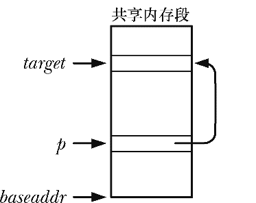
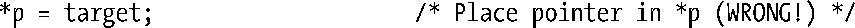
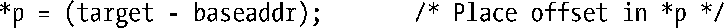

### 48.6　在共享内存中存储指针

每个进程都可能会用到不同的共享库和内存映射，并且可能会附加不同的共享内存段集。因此如果遵循推荐的做法，让内核来选择将共享内存段附加到何处，那么一个段在各个进程中可能会被附加到不同的地址上。正因为这个原因，在共享内存段中存储指向段中其他地址的引用时应该使用（相对）偏移量，而不是（绝对）指针。

例如，假设一个共享内存段的起始地址为baseaddr（即baseaddr的值为shmat()的返回值）。再假设需要在p指向的位置处存储一个指针，该指针指向的位置与target指向的位置相同，如图48-3所示。如果在段中构建一个链表或二叉树，那么这种操作就是非常典型的一种操作。在C中设置*p的传统做法如下所示。

<b class="my_markdown">图48-3：在共享内存段中使用指针</b>

上面这段代码存在的问题是当共享内存段被附加到另一个进程中时target指向的位置可能会位于一个不同的虚拟地址处，这意味着在那个进程中那个策划中存储在*p中的值是是无意义的。正确的做法是在*p中存储一个偏移量，如下所示。

在解引用这种指针时需要颠倒上面的步骤。

这里假设在各个进程中baseaddr指向共享内存段的起始位置（即各个进程中shmat()的返回值）。给定这种假设，那么就能正确地对偏移量值进行解释，不管共享内存段被附加在进程的虚拟地址空间中的何处。

或者如果是将一组固定大小的结构链接起来的话就可以将共享内存段（或部分共享内存段）强制转换成一个数组，然后使用下标数作为“指针”来在一个结构中引用另一个结构。

