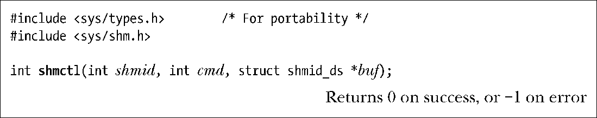

### 48.7　共享内存控制操作

shmctl()系统调用在shmid标识的共享内存段上执行一组控制操作。

cmd参数规定了待执行的控制操作。buf参数是IPC_STAT和IPC_SET操作（稍后介绍）会用到的，并且在执行其他操作时需要将这个参数的值指定为NULL。

在本节余下的部分中将介绍通过cmd可指定的各种操作。

#### 常规控制操作

下列操作与其他System V IPC对象上的操作是一样的。有关这些操作的细节信息，包括调用进程所需的特权和权限，可参考45.3节中的描述。

##### IPC_RMID

标记这个共享内存段及其关联shmid_ds数据结构以便删除。如果当前没有进程附加该段，那么就会执行删除操作，否则就在所有进程都已经与该段分离（即当shmid_ds数据结构中shm_nattch字段的值为0时）之后再执行删除操作。在一些应用程序中可以通过在所有进程将共享内存段附加到其虚拟地址空间之后立即使用shmat()将共享内存段标记为删除来确保在应用程序退出时干净地清除共享内存段。这种做法与在打开一个文件之后立即断开到该文件的链接的做法是类似的。

> 在Linux上，如果已经使用IPC_RMID将一个共享段标记为删除，但因为还存在一些进程仍然附加了该段而没有删除该段，那么其他进程还能够附加该段。但这种行为是不可移植的：大多数UNIX实现会阻止进程将被标记为删除的段附加到自己的地址空间中。（SUSv3并没有对这种情况的处理方式进行规定。）一些Linux应用程序已经依赖了这种行为，这也是Linux为何不改变这种行为以与其他UNIX实现匹配的原因。

##### IPC_STAT

将与这个共享内存段关联的shmid_ds数据结构的一个副本防止到buf指向的缓冲区中。（在48.8节中将介绍这个数据结构。）

##### IPC_SET

使用buf指向的缓冲区中的值来更新与这个共享内存段相关联的shmid_ds数据结构中被选中的字段。

#### 加锁和解锁共享内存

一个共享内存段可以被锁进RAM中，这样它就永远不会被交换出去了。这种做法能够带来性能上的提升，因为一旦段中的所有分页都驻留在内存中，就能够确保一个应用程序在访问分页时永远不会因发生分页故障而被延迟。通过shmctl()可以完成两种锁操作。

+ SHM_LOCK操作将一个共享内存段锁进内存。
+ SHM_UNLOCK操作为共享内存段解锁以允许它被交换出去。

SUSv3并没有规定这些操作，并且所有UNIX实现也都没有提供这些操作。

在版本号小于2.6.10的Linux上只有特权（CAP_IPC_LOCK）进程才能够将一个共享内存段锁进内存。自Linux 2.6.10开始，非特权进程能够在一个共享内存段上执行加锁和解锁操作，其前提是进程的有效用户ID与段的所有者或创建者的用户ID匹配并且（在执行SHM_LOCK操作的情况下）进程具备足够高的RLIMIT_MEMLOCK资源限制，细节信息可参考50.2节。

锁住一个共享内存段无法确保在shmctl()调用结束时段的所有分页都驻留在内存中。非驻留分页会在附加该共享内存段的进程引用这些分页时因分页故障而一个一个地被锁进内存。一旦分页因分页故障而被锁进了内存，那么分页就会一直驻留在内存中直到被解锁为止，即使所有进程都与该段分离之后也不会发生改变。（换句话说，SHM_LOCK操作为共享内存段设置了一个属性，而不是为调用进程设置了一个属性。）

> 因分页故障而加载进内存表示当进程引用了一个非驻留页面时会发生一个分页故障。这时如果分页在交换区域中，那么它将会被重新加载进内存。如果分页是首次被引用，那么在交换文件中就不存在对应的分页。因此内核会在物理内存中分配一个新分页并调整进程的页表以及共享内存段的簿记数据结构。

作为给内存加锁的一种替代方法，可以使用mlock()，它的语义与内存加锁稍微有些不同，50.2节对此进行了介绍。

